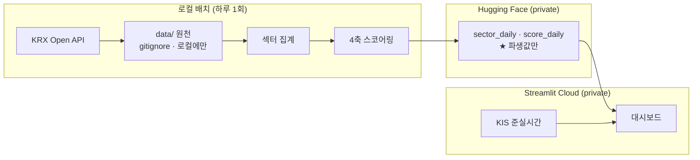

# 섹터 ETF 레이더 — `stock-coin-trade`

> **지금 어느 섹터가 유망한가**를 *근거와 함께* 판단하는 Streamlit 대시보드.
> 키움증권 모의투자 대회용 · 팀 7명 · 비용 0원.

> [!IMPORTANT]
> 🔴 **과거 데이터의 요약이다. 투자 권유가 아니다.**
> 점수와 순위는 공개 데이터를 정해진 수식으로 집계한 결과일 뿐, 미래 수익을 예측하지 않는다.

> [!NOTE]
> **정본은 GitLab 이다** — `gitlab.com/dev-dongwon05253/stock-coin-trade`.
> GitHub 쪽은 **읽기 전용 미러**다. 미러는 force push 로 갱신되므로
> **미러에 직접 커밋하면 다음 동기화 때 사라진다.**

---

## 1. 무엇을 푸는가

대회 기간 약 3개월 동안 팀이 반복해서 묻는 질문은 하나다 — **"이번 주엔 뭘 봐야 하나."**
그 답을 **숫자 하나**로 주는 도구는 많지만, 이 프로젝트가 만드는 것은
**"왜 그 숫자인가"를 끝까지 따라 내려갈 수 있는 화면**이다.

```
점수  →  축 분해  →  원천 시계열
 87      자금흐름 +2.1σ      ETF 상장좌수 20일 추이
```

세 단계를 직접 눌러 내려가면, 1위 섹터가 왜 1위인지 **사람이 스스로 확인한다.**

### 설계 원칙 — 이걸 어기는 기능은 넣지 않는다

| | |
| --- | --- |
| 🔴 **값을 지어내지 않는다** | 취득 실패는 예외이거나 `—` 다. 0·전일값·평균으로 채우지 않는다 ([ADR-SC-0007](docs/decisions/0007-값을-지어내지-않는다.md)) |
| 🔴 **매매 신호 경로에 LLM 이 없다** | 비결정적이고 재현이 안 되며 사전학습 룩어헤드로 오염된다. 화면 문구는 전부 템플릿이다 |
| 🔴 **원천 데이터를 재배포하지 않는다** | KRX 약관 제11조②. 공유하는 것은 파생·집계값뿐 ([ADR-SC-0006](docs/decisions/0006-krx-데이터-제3자-제공-금지.md)) |
| 🔴 **국내 데이터만 쓴다** | 대회가 국내장이다 |
| 🔴 **뉴스를 요약하지 않는다** | 제목·출처·시각·원문 링크만. 감성점수·"호재/악재" 라벨을 만들지 않는다 |

---

## 2. 섹터를 보는 방법 — 2계층 × 2렌즈

사용자의 멘탈 모델은 **GICS 11 대분류**(섹터 로테이션의 국제 표준)이고,
한국에서 실제로 유동성이 있는 것은 **테마 ETF** 다. 둘을 잇는다.

```
GICS 대분류 (11)             ← 경기 사이클 논의의 단위
   └── 한국 테마 섹터 (21)    ← ★ 화면의 주인공. 실제 매수 대상
          ├── ETF 렌즈        이 테마에 실제로 돈이 들어오는가
          └── 구성종목 렌즈    몇 종목이 같이 오르나 · 실제로 뭘 사나
```

🔒 **두 렌즈가 갈라지면 갈라진 채로 보여준다.** 평균 내어 감추지 않는다.
ETF 매매가 대회 규정상 막혀 있어도 구성종목 렌즈로 매매 대상을 찾을 수 있다.

섹터 구성은 `sector/config/sectors.yaml` 에 **사람이 손으로 적는다.**
KRX Open API 에 지수 구성종목·ETF PDF 가 없기 때문이다.
🔒 **모든 섹터에 `note`(왜 이렇게 묶었나)를 1줄 이상 쓴다** — 근거 없는 묶음을 막는 게이트다.

---

## 3. 점수는 어떻게 나오는가 — 4축

| 축 | 가중 | 묻는 것 | 원천 |
| --- | ---: | --- | --- |
| **모멘텀** | 35 | 오르고 있나 | 섹터 지수 20·60일 초과수익 |
| **자금흐름** ★ | 30 | **돈이 들어오나** | ETF 상장좌수(`LIST_SHRS`) 20일 변화 |
| **폭** | 20 | 몇 종목이 같이 오르나 | 구성종목 중 종가 > SMA20 비율 |
| **밸류** | 15 | 너무 올랐나 | SMA120 이격도의 음수 (과열 감점) |

**왜 이 4개인가**

- **자금흐름 축이 이 도구의 존재 이유다.** ETF 상장좌수가 늘었다는 것은 LP 가 설정을 늘렸다는
  뜻이고, 곧 **실제 순유입**이다. 가격과 독립인 정보라 모멘텀 축과 상관이 낮다.
  🔴 순자산총액을 쓰지 않는다 — 순자산 = 좌수 × NAV 라 NAV 변화를 모멘텀 축과 이중 계산하게 된다.
- **밸류 축이 모멘텀 축을 견제한다.** 모멘텀만 있으면 꼭지에서 사는 도구가 된다.
- 🔴 **거래대금을 점수에 넣지 않는다.** Lee & Swaminathan(2000)에 따르면 고회전 종목은 오히려
  **미래 수익률이 낮다.** 양의 가산점으로 넣으면 근거에 반한다.
  → 대신 **유동성 게이트**로 쓴다: 일평균 거래대금 1억 미만이면 경고 배지.
  **못 사는 것을 1위로 올리지 않기 위해서다.**
- 🔴 **뉴스·공시로 관심 축을 만들지 않는다.** 유상증자(악재)와 공급계약(호재)이 같은 점수가 된다.
  **부호가 섞인 지표는 축이 될 수 없다.** 뉴스·공시는 타임라인 맥락으로만 쓴다.

**정규화는 평균·표준편차가 아니라 중앙값·MAD** 를 쓴다. 섹터가 21개뿐이라 한 섹터의 급등이
표준편차를 부풀려 나머지를 전부 0 근처로 눌러버리기 때문이다.

**룩어헤드 방지** — `as_of` 를 기본값 없는 필수 키워드 인자로 두고,
`data[:T+30]` 으로 계산한 `score(T)` 가 `data[:T]` 로 계산한 값과 **정확히 같은지**
테스트한다(`test_asof_monotone`). 이 한 줄이 구조적으로 잡는다.

---

## 4. 실행

```bash
# v3.0 — 정본
streamlit run streamlit_app.py

pytest                                                   # sector/ 골든 테스트
python -m sector.sources.krx_openapi --probe --date 20260910   # 원천 단독 점검
python -m batch.validate_config                          # 섹터 정의 검증
python -m batch.publish --date 20260910 --dry-run        # HF 업로드 리허설
```

`.env.example` 을 `.env` 로 복사해 키를 채운다.
⚠️ **`.env` 가 둘이다** — 루트 `.env`(v3.0) / `backend/.env`(v2.0 Django 가 읽는 유일한 것).
Django 키를 루트에 넣으면 **에러 없이 그냥 무시된다.**

### 데이터 흐름



🔴 **원천은 경계를 넘지 않는다.** KRX 약관 제11조②(제3자 제공 금지) 때문이며,
private 저장소라도 팀원 7명은 제3자다.

---

## 5. 저장소 구조

| 경로 | 무엇 |
| --- | --- |
| `streamlit_app.py` | 앱 진입점 |
| `sector/` | 원천 어댑터 · 섹터 정의 · 스코어링 |
| `batch/` | 집계 · 검증 · HF 업로드 |
| `dashboard/` | 테마 · 차트 · 설명 문구 |
| `docs/decisions/` | ADR — **왜 그렇게 정했는지** |
| `backend/` | v2.0 Django (**동결** — 아래) |
| `api/` · `vercel.json` | Vercel 코드 (재연동 예정 → ADR-SC-0010) |

`AGENTS.md` 가 작업 규칙의 정본이고 `CLAUDE.md` 가 그것을 임포트한다.
현재 어디까지 왔는지는 `세션-시작-프롬프트.md` 가 답한다.

---

## 6. v2.0 Django — 동결

`backend/` (26,597줄 · 테스트 384건)는 동아리 모의투자 **대회 플랫폼**이었다.
목적이 바뀌어 **개발하지 않는다.**

🔒 **"동결"은 방치가 아니다 — 계속 돌아야 한다.**

```bash
cd backend && .venv/bin/pytest       # 골든 23건 · DB 불필요 ← 항상 통과해야 한다

docker compose --profile v2 up -d postgres
cd backend && .venv/bin/python manage.py test    # DB 필요
```

이 조건을 마일스톤 완료 조건에 넣었다. 넣지 않으면 "동결"이 거짓말이 된다.
동결 해제 시점은 대회 종료 후에 다시 판단한다.

**Vercel 배포는 2026-09-11 에 중단했다가 2026-09-12 에 되살리기로 했다.**
중단 원인은 빌드가 아니라 Supabase 무료 티어의 7일 무활동 pause 였는데, 매일 도는
배치가 그것을 해결한다. `api/index.py`·`vercel.json`·`backend/` 가 그대로 남아 있다.

⚠️ **동결은 그대로다.** 되살아나는 것은 *배포*이고, 새로 붙는 섹터 화면은 **새 앱**으로
쓴다 — `contests`·`trading`·`market` 은 계속 개발하지 않는다.
→ [ADR-SC-0010](docs/decisions/0010-두-배포-공존과-쓰기-상태-분리.md)

---

## 7. 이력

이 저장소는 강사님 원본의 fork 로 출발했으나, 2026-09-11 산출물 재지정과 함께
**이력을 orphan 으로 재시작**했고 강사님 코드를 새 이력에 담지 않았다.
경위·백업 위치·대안 비교는 [ADR-SC-0005](docs/decisions/0005-산출물-재지정과-이력-재시작.md) 에 있다.

⚠️ [ADR-SC-0001](docs/decisions/0001-fork-계보-유지.md)·[0002](docs/decisions/0002-체결엔진-원본과-이식.md) 는 **폐기됐다.** 근거로 삼지 않는다.

| ADR | 내용 |
| --- | --- |
| [0005](docs/decisions/0005-산출물-재지정과-이력-재시작.md) | 산출물 재지정과 이력 재시작 |
| [0006](docs/decisions/0006-krx-데이터-제3자-제공-금지.md) | KRX 데이터를 제3자에게 제공하지 않는다 |
| [0007](docs/decisions/0007-값을-지어내지-않는다.md) | 값을 지어내지 않는다 |
| [0008](docs/decisions/0008-배포-streamlit-전환과-원격-재구성.md) | 배포 Streamlit 전환과 원격 재구성 |

---

## 8. 출처

> **한국거래소 통계정보**

시세·지수는 KRX Open API 에서 받는다. 출처 표시는 약관 제10조③의 의무이며
**모든 화면 하단에 상시 표시한다.** 그 밖의 원천과 각각의 이용 제약은
[NOTICE.md](NOTICE.md) 에 정리했다.
