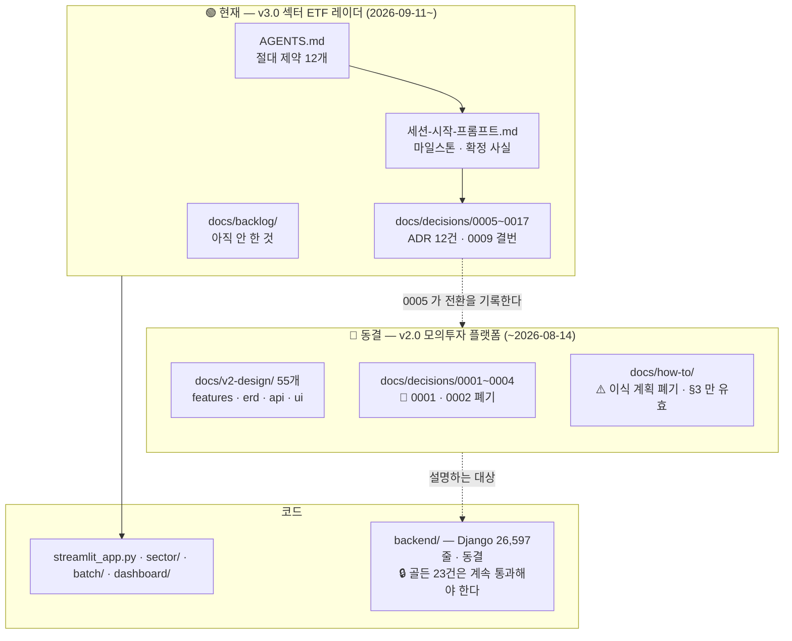

# `docs/` — 이 폴더의 입구

> 🔴 **이 저장소의 현재 제품은 v3.0 «섹터 ETF 레이더» 다.**
> `docs/v2-design/` 55개 문서는 **동결된 v2.0 모의투자 플랫폼**의 설계서이고
> **현재 제품이 아니다.** 그쪽을 먼저 읽으면 프로젝트를 잘못 이해한다.

---

## 0. 🔴 처음 온 사람이 읽는 순서 — 다른 것을 먼저 읽지 마라

| # | 무엇 | 왜 |
|---|---|---|
| 1 | [`../AGENTS.md`](../AGENTS.md) | **작업 규칙의 정본.** 절대 제약 12개가 여기 있다 |
| 2 | [`../세션-시작-프롬프트.md`](../세션-시작-프롬프트.md) | **지금 어디까지 왔나.** 마일스톤·확정 사실·다음 작업 |
| 3 | [`decisions/`](decisions/) | **ADR-SC-0005~** — 되돌리면 안 되는 결정. 0001~0004 는 폐기 |
| 4 | [`프로젝트_문서_마스터인덱스.md`](프로젝트_문서_마스터인덱스.md) | 문서 전체 지도 |

🔒 **`v2-design/` 은 4번 다음이다.** 거기부터 읽으면 이 저장소를 Django 모의투자
플랫폼으로 이해하게 된다 — 그 제품은 2026-09-11 에 동결됐다(→ [ADR-SC-0005](decisions/0005-산출물-재지정과-이력-재시작.md)).

---

## 1. 무엇이 현재이고 무엇이 아카이브인가

---

## 2. 폴더별로 무엇인가

| 폴더 | 상태 | 무엇 | 커밋 |
|---|---|---|---|
| [`decisions/`](decisions/) | 🟢 **현재** | ADR 16건(0001~0017 · 0009 결번). 참조 키는 `ADR-SC-NNNN` | ✅ |
| [`backlog/`](backlog/) | 🟢 **현재** | 아직 하지 않은 것 · 판정된 아이디어 | ✅ |
| [`v2-design/`](v2-design/) | 🧊 **동결** | v2.0 설계 55개 — [입구](v2-design/README.md)를 먼저 읽어라 | ✅ |
| [`how-to/`](how-to/) | ⚠️ 일부 | `quant-core` 이식 계획은 **폐기**. 체결 가정 명세(§3)만 유효 | ✅ |
| [`research/`](research/) | 🟢 현재 | 조사 기록 | ✅ |
| [`private/`](private/) | 🔴 | 재배포 불가 제3자 자료. [README](private/README.md) **하나만** 커밋된다 | ❌ |
| `image/` · `sector/` | — | 벤치마크 캡처 | `image/` ❌ |

---

## 3. 🔒 작업이 끝나면 여기를 갱신한다

문서가 뒤처지면 **다음 세션과 외부 리뷰가 폐기된 결정을 근거로 판단한다.**
실제로 이 인덱스가 2026-08-13 상태로 멈춰 있던 동안 v3.0 전환이 한 줄도
반영되지 않았고, 그 문서 스스로 "세션 시작 시 먼저 읽어라"라고 적고 있었다.

작업 한 건이 끝날 때 고치는 것 —

| 무엇이 바뀌었나 | 어디를 고치나 |
|---|---|
| 되돌리면 안 되는 결정을 내렸다 | `decisions/NNNN-제목.md` 를 새로 쓴다 |
| 옛 결정을 뒤집었다 | 그 ADR 본문에 **«폐기 · 무엇이 대체»** 를 적는다. 🔒 지우지 않는다 |
| 마일스톤·상태가 움직였다 | [`../세션-시작-프롬프트.md`](../세션-시작-프롬프트.md) 최종 갱신 줄 · 마일스톤 표 · 4.5 미조치 |
| 작업 규칙이 바뀌었다 | [`../AGENTS.md`](../AGENTS.md) 를 **먼저** 고친다 (`CLAUDE.md` 는 임포트만) |
| 문서가 늘거나 폐기됐다 | 이 파일 2절 + [마스터인덱스](프로젝트_문서_마스터인덱스.md) |

🔒 **숫자는 실측한 것만 적는다** — "테스트 다 통과" 가 아니라 "`pytest` 987건" 이다.
