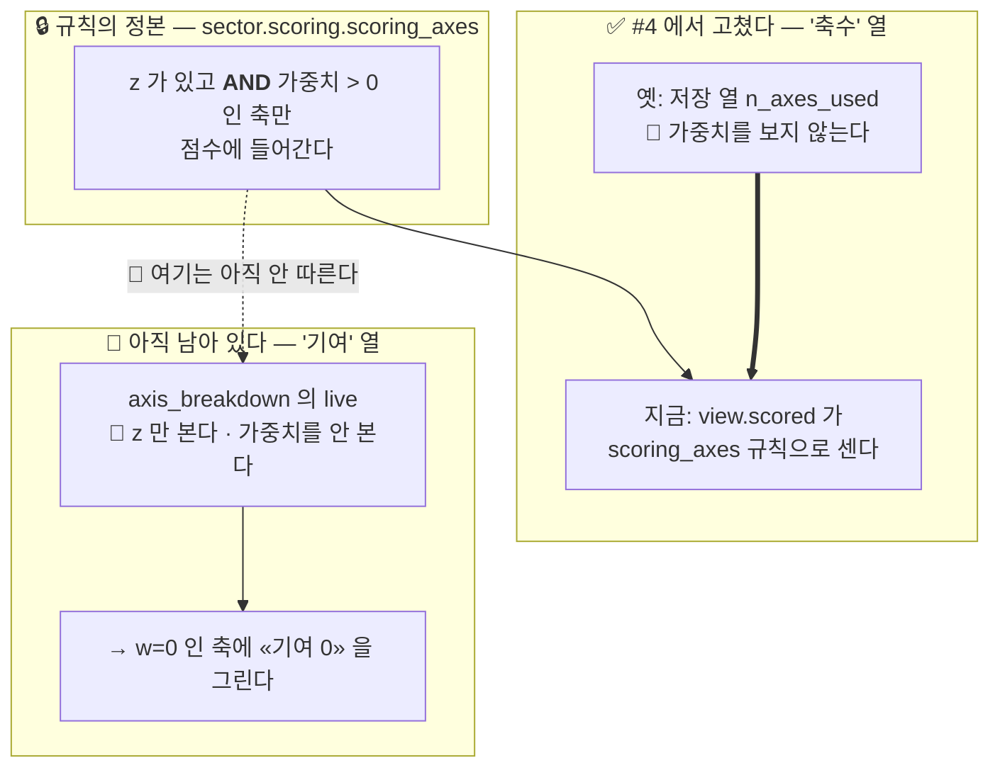

> **읽는 순서** — 0·1절이면 충분하다. #4 와 무엇이 같고 다른지는 2절.

## 0. 쉬운 요약 3줄

1. 가중치를 **0 으로 둔 축**이 축 분해 표에 **«기여 0»** 으로 그려진다 — 그 축은 점수에 **들어가지도 않았다.**
2. **#4 가 '축수' 열에서 고친 것과 똑같은 결함**이 '기여' 열에 그대로 남아 있다. `axis_breakdown` 의 `live` 가 **가중치를 보지 않는다.**
3. "기여 0" 과 "점수에 안 들어감" 은 다른 말이다 — [ADR-SC-0007](docs/decisions/0007-값을-지어내지-않는다.md) 이 0 과 «없음» 을 가르라고 한 바로 그 자리다.

## 1. 한눈에 보기

| | |
|---|---|
| **심각도** | 🟠 표가 점수를 설명하지 못한다 (#4 와 같은 종류) |
| **위치** | `dashboard/view.py:594` — `live = [a for a in AXES if _notna(row.get(f"{_AXIS_PREFIX[a]}_z_bp"))]` |
| **닿는 화면** | 랭킹 «축별 숫자로 보기»(`evidence.py`) · 읽는 법 «③ 가중치를 곱해 더한다»(`arithmetic_table`) · 확정 모달 |
| **언제** | 커스텀 가중치에서 한 축이라도 0 일 때 |
| **관련** | #4 (축수 열 · 닫힘) · #13 (같은 열을 건드린다) · [ADR-SC-0014](docs/decisions/0014-점수-재현성과-가중치-슬라이더의-경계.md) ③ |

## 2. #4 와 무엇이 같고 무엇이 다른가



| | #4 (닫힘) | 이 이슈 |
|---|---|---|
| 열 | **축수** | **기여** |
| 옛 동작 | 저장 열 `n_axes_used` 를 그렸다 (가중치를 안 본다) | `live` 가 `z` 만 본다 (가중치를 안 본다) |
| 증상 | `점수 == M` 인데 **축수 4** | `점수 == M` 인데 **F·B·V 에 기여 0** |
| 고친 방법 | `scoring_axes` 규칙으로 다시 센다 | — |

## 3. 재현

```bash
.venv/bin/python - <<'PY'
import pandas as pd
from dashboard import view
from sector.scoring import scoring_axes, weighted_score_bp

f = pd.read_parquet("data/derived/score_daily.parquet")
sid = f[f.bas_dd == f.bas_dd.max()].sector_id.iloc[0]
only_m = {"M": 100, "F": 0, "B": 0, "V": 0}          # 모멘텀만 쓰는 커스텀 가중치

parts = view.axis_breakdown(f, sid, weights=only_m)
for p in parts:
    print(f"  {p['axis']}  z={p['z_bp']:>7}  w={p['weight']:>3}  기여={p['contribution_bp']}")

z = {p["axis"]: p["z_bp"] for p in parts}
print(f"  scoring_axes = {scoring_axes(z, only_m)!r}")
print(f"  weighted_score_bp = {weighted_score_bp(z, only_m)}")
PY
```

실측 출력 (2026-09-19 · `battery` · 20260910):

```
  M  z= -12181  w=100  기여=-12181
  F  z=   4752  w=  0  기여=0        ← 🔴 점수에 안 들어갔는데 «0» 이라 적는다
  B  z=  -2024  w=  0  기여=0        ← 🔴
  V  z=  16058  w=  0  기여=0        ← 🔴
  scoring_axes = 'M'                  ← 실제로 점수에 들어간 축은 M 하나
  weighted_score_bp = -12181
```

팀원이 보는 화면은 이렇게 된다 — **축수 1** (#4 가 고쳤다) 인데 표에는 **네 줄이 값을 갖고** 있다. 그리고 `V` 축은 z 가 `+16058`(+1.6σ)로 가장 높은데 «기여 0» 이라 적혀 있어, "높은데 왜 0 이지" 를 설명할 방법이 없다.

## 4. 🔴 왜 «0» 이 아니라 «없음» 인가

이 저장소는 이미 같은 구분을 세 곳에서 한다 —

| 자리 | 「0」 | 「없음」 |
|---|---|---|
| 결측 축의 기여 | — | ✅ `None` (`test_결측축은_기여가_0이_아니라_없음이다`) |
| 유동성 | `False` = 미달 | ✅ `None` = 20영업일 창이 안 찼다 |
| 대분류 분포 | — | ✅ `순위없음` 칸을 따로 센다 |

«기여 0» 은 **"이 축이 점수에 들어갔는데 마침 0 만큼 보탰다"** 는 뜻이다. 가중치 0 인 축은 그것이 아니라 **애초에 더해지지 않았다.** 지금 화면은 둘을 같게 그린다.

## 5. 고치는 방향

`live` 를 **`sector.scoring.scoring_axes` 에 맞춘다** — #4 와 같은 방법이다.

```python
# dashboard/view.py  axis_breakdown
live = [a for a in AXES if _notna(row.get(...)) and weights.get(a, 0) > 0]
#                                                  ^^^^^^^^^^^^^^^^^^^^^^ 이것이 빠져 있다
```

🔒 **규칙의 정본은 `scoring_axes` 하나다** (ADR-SC-0014 ③ · `scoring.py` 머리주석이 그렇게 적고 있다). 여기서 조건을 손으로 다시 적으면 #4 를 또 만든다 — `scoring_axes` 를 **부르거나**, 부를 수 없으면 그것과 같은 답인지 테스트로 묶는다.

### 5.1 부수 효과 — 분모가 바뀐다

`total_weight = sum(weights[a] for a in live)` 이므로 `live` 가 줄면 분모가 줄고 기여가 커진다.

⚠️ **총점은 안 바뀐다** — `weighted_score_bp` 의 분모도 `scoring_axes` 로 정해지고, 0 가중치 축은 분자에 0 을 더할 뿐이라 두 분모가 이미 같은 값이다. 즉 이 수정은 **표만 고치고 점수는 건드리지 않는다.** (검증이 완료 조건에 있다)

## 6. 도달 가능성

- 실데이터에 `n_axes_used == 1` 인 행이 **53행** 있다(전부 B 축) — z 결측 경로로도 닿는다
- 커스텀 가중치는 슬라이더로 누구나 만든다. 🔒 커스텀에서는 근거·확정이 안 열리지만 **«축별 숫자로 보기» 표는 열린다**

## 7. 완료 조건

- [ ] 가중치 0 인 축의 기여가 `None` 이다 (화면은 `—`)
- [ ] 🔒 `axis_breakdown` 의 축 선택이 `scoring_axes` 와 **한 글자도 다르지 않다** — #4 의 `test_축수는_scoring_axes_와_한_글자도_다르지_않다` 와 같은 테스트
- [ ] **총점이 한 칸도 안 바뀐다** — 실데이터 5,985행 × 프리셋 3 + 커스텀 몇 벌로 확인
- [ ] `pytest` 987건 이상 · `backend` 골든 23건
- [ ] 🔒 문서 — ADR-SC-0014 ③ 에 이 자리를 덧붙인다 · `세션-시작-프롬프트.md` (AGENTS.md 4.1)

---

🔒 발견 경위 — #13 의 적대적 설계 리뷰. #13 이 손대려는 열이 바로 이 열이라 **함께 고치는 것이 옳다**는 것이 리뷰의 권고다.
