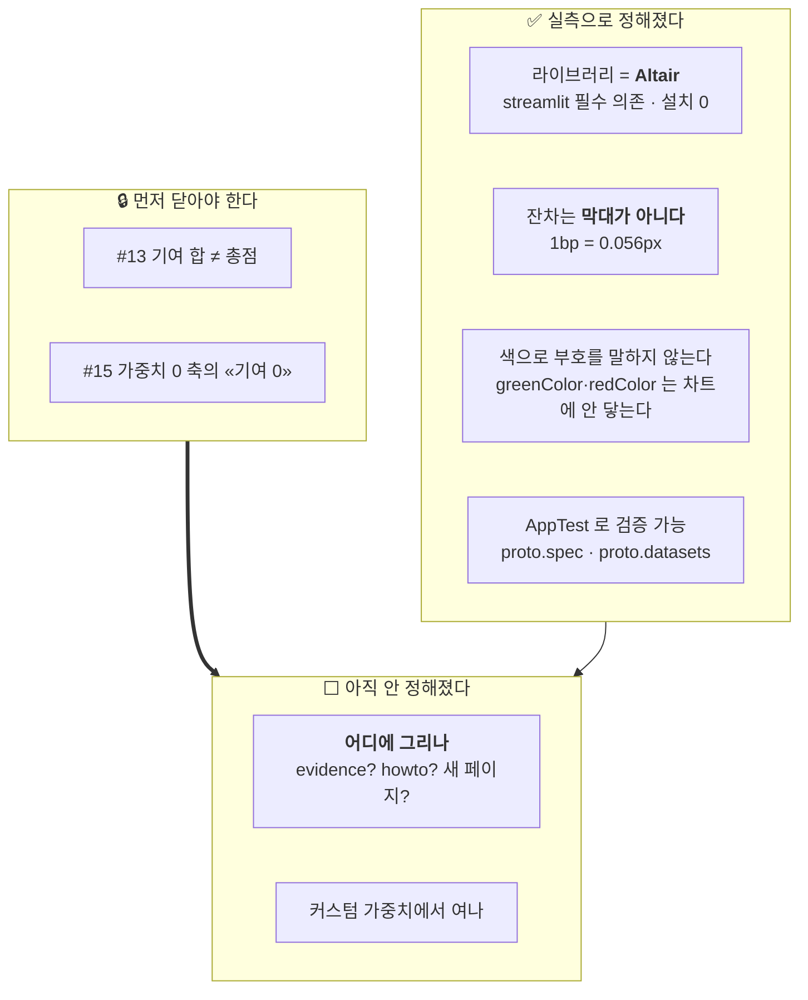

> **읽는 순서** — 이것은 버그가 아니라 **M10 착수 전 설계 노트**다. 0·1절에 결론이 있고, 실측 근거는 3~5절.

## 0. 쉬운 요약 3줄

1. M10 의 ① 워터폴을 그리기 전에 **세 가지가 이미 정해졌다** — 라이브러리는 **Altair**(의존 0), **반올림 잔차를 막대로 그릴 수 없고**(1bp = 0.056px), **색으로 부호를 말하지 않는다.**
2. 🔴 **워터폴은 #13(기여 합 ≠ 총점)의 근거가 아니다.** 워터폴에서는 그 어긋남이 애초에 보이지 않는다 — 그래서 두 작업을 묶지 않는다.
3. **어디에 그릴지가 아직 안 정해졌다.** `evidence.py` 에 넣으면 확정 모달까지 들어가고, 새 페이지를 만들면 `st.navigation` 경로 충돌을 다시 밟는다.

## 1. 한눈에 보기

| | |
|---|---|
| **성격** | 🟡 설계 노트 — M10 착수 시 읽는다 |
| **대상** | 계획서 D-5 ① 워터폴 (`0 → M → F → B → V → 총점`) |
| **선행** | **#13** (기여 합이 총점에 닿지 않는다) · **#15** (가중치 0 축의 기여) |
| **전제** | [ADR-SC-0014](docs/decisions/0014-점수-재현성과-가중치-슬라이더의-경계.md) ③④ — 근거·확정은 **프리셋에서만** 연다 |

## 2. 결정된 것 · 남은 것



## 3. ✅ 라이브러리는 Altair — Plotly 를 넣지 않는다

계획서 D-5 는 `Plotly go.Waterfall` 을 적었다. 🔴 **그대로 하면 의존이 는다.**

```
streamlit 1.63.0 의 의존 (실측)
  altair!=5.4.0,!=5.4.1,<7,>=5.0.0     ← 🟢 필수 의존. 이미 설치돼 있다 (6.2.2)
  plotly>=4.0.0 ; extra == "charts"     ← 🔴 선택. 넣으면 용량이 는다
```

루트 `requirements.txt` 머리주석이 스스로 정한 규칙 — *"requirements 가 바뀌면 Cloud 가 환경을 다시 만들고, 안 쓰는 패키지는 메모리 **2.7GB 한도**를 미리 깎는다."*

🔒 **다만 `altair==6.2.2` 를 `requirements.txt` 에 핀해야 규칙이 일관된다.** 같은 머리주석이 `requests` 를 명시한 이유가 *"직접 import 하는 패키지를 남의 전이 의존에 맡기면, streamlit 이 의존을 정리하는 순간 배포가 깨진다"* 이기 때문이다. 핀하지 않으면 Cloud 가 5.x 를 깔아 스펙이 vega-lite v5 로 내려갈 수 있다.
⚠️ **설치 용량은 늘지 않는다** — 이미 들어온다.

## 4. 🔴 잔차 막대는 그릴 수 없다 — 그리고 워터폴은 #13 을 드러내지 못한다

최신일 `steel` 기준 도메인 `0 ~ 12,522bp`, 차트 폭 700px →

```
1bp = 700px / 12522bp = 0.056px
```

±1~2bp 잔차(#13)는 **0.06~0.11px** 다. "반올림" 라벨만 떠 있고 막대는 없는 상태가 된다 — 화면이 *"여기 무언가 있다"* 고 말하면서 아무것도 안 보여준다.

🔴 **같은 이유로 `V` 막대의 끝과 `총점` 막대의 끝이 같은 픽셀에 찍힌다.** 즉 워터폴에서는 "합이 총점에 안 닿는다" 는 사실이 **애초에 보이지 않는다.**

→ **#13 과 이 작업을 묶지 않는다.** 잔차는 **표의 행** 또는 **조건부 한 문장**이다.

## 5. 🔴 색으로 부호를 말하지 않는다

streamlit 1.63.0 프론트엔드 번들(`styled-components.*.js`)의 Vega 테마 —

```js
range: { category: chartCategoricalColors,
         diverging: chartDivergingColors,
         ramp/heatmap: chartSequentialColors },
mark:  { color: chartCategoricalColors[0] }
```

| | |
|---|---|
| ✅ | 색을 안 주면 막대가 `#5B8FF9`(config.toml 첫 범주색)로 칠해진다. 폰트·배경·축 색도 테마가 넣는다 — **토큰이 한 벌로 남는다**(ADR-SC-0010 ⑦) |
| 🔴 | **`greenColor`·`redColor` 는 차트에 닿지 않는다.** +/− 를 초록/빨강으로 칠하려면 색을 **스펙에 박아야** 하고, 그것은 `theme.py` 머리주석과 ADR-SC-0010 ⑦ 을 어긴다 |
| 🔴 | **한국 관습은 상승=빨강이다.** `.streamlit/config.toml` 에 `⬜ 토글 + query_params 는 아직 없다 → M8 후속` 이 미결로 남아 있다. 팀 7명 중 누군가는 빨강을 "올랐다" 로 읽는다 |
| 🟠 | `chartDivergingColors` 는 프론트가 **정확히 10개**를 요구하고 아니면 **조용히** 기본값으로 폴백한다. config.toml 에 없고, 채우면 F-4 팔레트에 없는 색 10개를 지어내게 된다 |

🔒 **워터폴은 0 에서 출발하는 «위치»가 이미 부호를 말한다.** `theme.py` 의 *"🔒 색으로 순위를 매기지 않는다 — 금·은·동은 '좋다/나쁘다' 를 말하고, 이 도구는 그 말을 하지 않는다"* 와 같은 규율이다.

## 6. ✅ AppTest 로 검증할 수 있다

```
at.get("altair_chart")     -> 0      # 🔴 이런 타입은 없다
at.get("vega_lite_chart")  -> 2      # UnknownElement · .value 는 None
e.proto.spec               -> {"mark":{"type":"bar"}, "encoding":{...},
                               "$schema":".../vega-lite/v6.4.1.json"}
e.proto.datasets[0]        -> {'단계': ['M','F','B','V','총점'], 'start': [...], 'end': [...]}
```

→ 🔒 **"마지막 막대의 끝 == 게시된 총점" 을 테스트로 고정할 수 있다.** 고정하지 않으면 이 화면만 검증 사각지대가 되고, 이 저장소에서 사각지대는 곧 조용한 거짓말이다(#12 의 교훈).

## 7. ⬜ 남은 결정 — 어디에 그리나

| 후보 | 결과 | 문제 |
|---|---|---|
| `dashboard/evidence.py` | 랭킹 · 조 · **확정 모달** 셋 다에 들어간다 | 모달이 무거워진다. ADR-SC-0012 ② 가 모달의 일을 좁게 뒀다 |
| `dashboard/pages/howto.py` | 읽는 법 화면 «③ 가중치를 곱해 더한다» 아래 | 읽는 법이 **상세 분석 화면**이 된다 |
| 랭킹의 `_render_breakdown` 만 | 확정 모달에는 안 들어간다 | `evidence` 가 공유 조각인데 거기만 갈라진다 |
| 새 «섹터 상세» 페이지 | 계획서 D-5 의 원안 | 🔴 `st.navigation` 의 `url_path` 충돌 — 모든 page callable 이 `render` 다(`streamlit_app.py:30` 이 그 사고를 기록한다). 그리고 ADR-SC-0012 ② 가 '섹터 확정' 페이지를 **없앤** 선례가 있다 |

### 7.1 커스텀 가중치에서 여는가 — **안 연다**

⚠️ **근거가 ADR-SC-0014 ④ 와는 다르다.** ④(guard 가 대조할 열 이름이 없다)는 **문장**에 대한 논거이고 워터폴은 숫자다.

진짜 이유 — `view.sector_story` 가 **프리셋 전용**이다(내부에서 `Weighting.preset(profile)` 로 `scored()` 를 한 번 지난다 · `view.py:660`). 커스텀 워터폴은 `sector_story` 를 못 쓰고 `scored()` 열을 따로 읽는 **두 번째 총점 경로**가 필요해진다. 한 화면에 총점 출처가 둘이 되는 순간 ADR-SC-0014 ③ 이 막으려던 상태로 돌아간다.

🔒 **조용히 빼지 않는다** — 왜 없는지 말한다(ADR-SC-0016 ④ 의 규율).

## 8. M10 의 나머지 — 데이터 경계가 필요하다

계획서 D-5 의 ③ 원천 시계열 · ⑤ 렌즈 비교는 **`sector_daily` 를 읽어야** 한다. 지금 앱은 `score_daily` 만 읽는다.

🔴 **그런데 로컬과 HF 의 열이 다르다** —

| | 로컬 `data/derived/sector_daily.parquet` | HF `latest/sector_daily_latest.parquet` |
|---|---|---|
| 좌수 | `etf_shares_sum` (**원천 수준값**) | `etf_shares_idx_bp` (지수 · 기준일 10000) |
| 순자산 | `etf_nav_sum` · `etf_value_sum` | 🔴 **내보내지 않는다** |

`gate.DELIBERATELY_WITHHELD` 가 그 이유를 적는다 — *"ETF 1개 섹터에서 원천과 같아진다"*(ADR-SC-0006 ②). 🔴 **로컬 열을 그대로 그리면 개발 화면이 KRX 원천 수준값을 그리게 된다.**

→ 앱이 `sector_daily` 를 읽을 때 **`gate.project_sector` 를 지나게** 해야 두 경로가 같은 열을 준다. 그것만으로도 #12 급 결정(투영 · 검사 · 캐시 · `conftest._clear_score_cache` 확장)이라 **별도 작업**이다.

## 9. 완료 조건 (M10 ① 을 할 때)

- [ ] #13 · #15 가 먼저 닫혀 있다
- [ ] 화면 계약이 `dashboard/view.py` 의 **순수 함수**이고 골든으로 고정된다
- [ ] `requirements.txt` 에 `altair==6.2.2` 핀
- [ ] 색으로 부호를 말하지 않는다
- [ ] AppTest 로 **"마지막 막대의 끝 == 게시된 총점"** 을 고정한다
- [ ] 커스텀 가중치에서 열지 않고, **왜 없는지 말한다**
- [ ] `pytest` 987건 이상 · `backend` 골든 23건
- [ ] 🔒 문서 — ADR · `세션-시작-프롬프트.md` · 마스터인덱스 (AGENTS.md 4.1)

---

🔒 발견 경위 — M10 착수 전 적대적 설계 리뷰. 리뷰 판정은 **"④(워터폴)를 #13 의 범위에서 빼라 — 지금 `evidence`/`howto` 에 넣으면 M10b 에서 반드시 옮기게 된다"** 였다.
