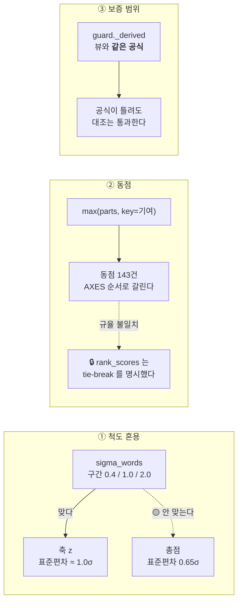

> **읽는 순서** — 세 건이 서로 독립이다. 표만 보고 하나씩 집어도 된다.
> 선례는 #5 · #10 — "잡다한 것" 을 한 이슈에 모은다.

## 0. 한눈에 보기

| # | 무엇 | 심각도 | 한 줄 |
|---|---|---|---|
| ① | `sigma_words` 를 **총점**에 쓴다 | 🟡 | 구간이 **축 z 의 척도**다. 총점은 표준편차가 0.65σ 라 «뚜렷이 높다» 가 실제로는 1.5 표준편차다 |
| ② | `lead_axis` **동점 규칙이 문서에 없다** | 🟡 | 17,955건 중 **143건**이 동점. `max()` 가 AXES 순서로 조용히 가른다 |
| ③ | `guard` 의 **보증 범위**가 적혀 있지 않다 | 🟡 | guard 는 «장부가 공식과 맞는가» 를 보지 «공식이 옳은가» 를 보지 않는다 |



---

## ① `sigma_words` 를 총점에 쓴다 — 척도가 다르다

`dashboard/explain.py:262` (`narrative` ①) —

```python
f"점수 {score_bp/10000:+.2f}σ 는 '{sigma_words(score_bp)}' 는 뜻이다."
```

그런데 `sigma_words` 의 구간(`explain.py:197~203`)은 **축 z 를 기준으로 잡은 것**이다.

| 대상 | 일별 횡단면 표준편차 (285영업일 평균) |
|---|---|
| 축 M | **1.079σ** |
| 축 F | **1.268σ** |
| 축 B | **0.968σ** |
| 축 V | **1.090σ** |
| **총점 `balanced`** | 🟡 **0.654σ** |
| **총점 `momentum`** | 🟡 **0.779σ** |

총점이 축보다 덜 퍼지는 것은 **가중평균이기 때문**이다 — 축들이 완전 상관이 아니면 평균은 분산이 줄어든다.

**결과** — 총점 `+1.0σ` 에 «다른 섹터들보다 뚜렷이 높다» 가 붙는데, 총점 척도에서 그것은 **약 1.53 표준편차**다. 축에서 같은 문구가 붙는 `+1.0σ` 는 **약 0.93 표준편차**다. **같은 문구가 다른 것을 뜻한다.**

실측 — `|총점| ≥ 2.0σ` 인 행이 **57 / 5,586** 실재한다(즉 최상위 구간에 실제로 닿는다). `|축 M| ≥ 1.0σ` 는 1,479 / 4,704.

| 고치는 방향 | 평가 |
|---|---|
| (A) 총점 전용 구간을 따로 둔다 | 🟢 정직하다. 🔴 **guard 의 방향 낱말·문장 대조표를 함께 고쳐야 한다**(ADR-SC-0013) |
| (B) 총점에는 `sigma_words` 를 안 쓰고 **순위로만** 말한다 | 🟢 «21개 중 3위» 는 이미 같은 문장에 있다. 중복이 준다 |
| (C) 그대로 두고 읽는 법 화면에 척도 차이를 적는다 | 🟠 가장 싸지만 문장은 여전히 섞여 있다 |

🔒 **어느 쪽이든 `explain.py` 는 골든이다** — 문구가 바뀌면 diff 로 보여야 한다.

---

## ② `lead_axis` 동점 규칙이 문서에 없다

네 곳이 같은 패턴을 쓴다 —

| 위치 | 코드 |
|---|---|
| `dashboard/explain.py:270` | `best = max(scored, key=lambda p: p["contribution_bp"])` |
| `dashboard/view.py:705` | `best = max(scored, key=lambda p: p["contribution_bp"])` |
| `dashboard/agent/compose.py:303` | 같은 패턴 — 🔒 **여기만 주석이 있다** |
| `dashboard/agent/guard.py:544` | 같은 패턴 |

파이썬 `max()` 는 **먼저 온 것**을 남기므로 동점이면 `AXES = ("M","F","B","V")` 순서상 앞선 축이 이긴다. **어디에도 그렇게 적혀 있지 않다**(compose 제외).

**실측** — 기여 최댓값이 동점인 (행 × 프리셋) **143 / 17,955**:

```
balanced   20250917 retail_ecommerce   동점축 ['F','B']  기여 0
balanced   20250918 retail_ecommerce   동점축 ['F','B']  기여 0
balanced   20250918 transport          동점축 ['F','B']  기여 0
balanced   20251017 construction       동점축 ['M','B']  기여 0
```

⚠️ **지금 실질 피해는 작다** — `narrative` 는 `best["contribution_bp"] > 0` 일 때만 축을 지목하므로 기여 0 동점은 "끌어올린 축이 없다" 로 빠진다. 🔴 그러나 **양수 동점이 나오면 그때는 조용히 갈린다.**

🔒 **이 저장소의 규율과 불일치다** — `sector/scoring.py` 의 `rank_scores` 가 *"🔒 동점은 `(−score_bp, sector_id)` 로 갈라 **tie-break 를 명시한다**"* 라고 적어 놓고, 같은 종류의 동점을 화면 쪽에서는 암묵에 맡긴다.

→ 규칙을 **한 곳에 적고**(`view` 의 헬퍼 하나) 네 곳이 그것을 쓰게 한다. 무엇으로 가를지는 별도 판단 — AXES 순서를 **명시**하는 것도 답이다.

---

## ③ `guard` 의 보증 범위가 적혀 있지 않다

`dashboard/agent/guard.py` 의 `_derived` 는 기여를 `round(Fraction(z·w, W))` 로 **따로** 다시 얻어 문장의 숫자와 대조한다. 그것이 ADR-SC-0013 ④-1 의 핵심이다.

🔴 **그런데 그 공식이 `view.axis_breakdown` 과 같다.** 그래서 —

- **공식 자체가 낳는 오류는 대조를 통과한다.** 실측: 축별 반올림 때문에 `lead_axis` 가 정확값(무한정밀도) 기준과 어긋나는 행이 **2행** 있는데, guard 는 둘 다 통과시킨다.
  ```
  momentum 20260804 media_entertainment  표시 M=349,  V=349   → 정확값 M=348.7, V=348.9  실제 1등은 V
  momentum 20260824 battery              표시 F=1686, B=1686  → 정확값 F=1686.25, B=1686.3  실제 1등은 B
  ```
- #13 의 잔차(기여 합 ≠ 총점)도 같은 이유로 guard 가 못 본다 — 양쪽이 같은 공식을 쓰기 때문이다.

→ 🔒 ADR-SC-0013 에 한 줄을 더한다: **"guard 는 장부가 공식과 맞는지 보지, 공식이 옳은지 보지 않는다."**
이것은 결함이 아니라 **보증 범위**다. 적어 두지 않으면 다음 사람이 guard 를 과신한다.

---

## 완료 조건

- [ ] ① 총점 문구가 척도를 섞지 않는다 — 방향을 정하고 **골든으로 고정**
- [ ] ② 동점 규칙이 **한 곳에 적혀 있고** 네 호출처가 그것을 쓴다 (테스트)
- [ ] ③ ADR-SC-0013 에 guard 보증 범위 한 줄
- [ ] `pytest` 987건 이상 · `backend` 골든 23건
- [ ] 🔒 문서 — `세션-시작-프롬프트.md` (AGENTS.md 4.1)

---

🔒 발견 경위 — #13 의 적대적 설계 리뷰가 `dashboard/` 전체를 훑으며 찾은 비차단 항목들이다. 셋 다 **지금 당장 거짓을 말하지는 않으나** 규율이 갈린 자리다.
