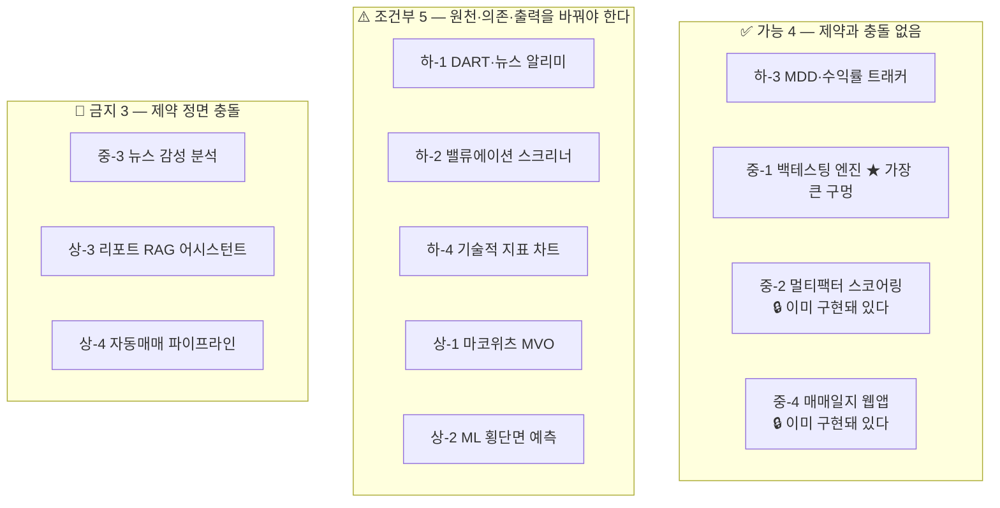

# 외부 제안 기능 12건 — 절대 제약에 비춘 판정

- **날짜**: 2026-09-19
- **출처**: 사용자가 가져온 외부 제안 (투자 동아리용 프로젝트 아이디어 · 난이도 하/중/상 각 4건)
- **판정 기준**: [`../../AGENTS.md`](../../AGENTS.md) 3장 **절대 제약 12개** + 데이터 취득 경로 표 +
  [`../../세션-시작-프롬프트.md`](../../세션-시작-프롬프트.md) 3절 **확정 사실 V1~**
- **성격**: 🔒 **판정이지 계획이 아니다.** ✅ 가 붙었다고 하기로 정한 것이 아니다.
  제약을 어기는 것만 먼저 가려 놓아, 나중에 누가 "이거 해보면 어때요" 라고 할 때
  같은 논의를 다시 하지 않게 한다.

---

## 0. 한눈에

| # | 제안 | 판정 | 한 줄 이유 |
|---|---|---|---|
| 하-1 | DART·뉴스 알리미 | ⚠️ 조건부 | DART 는 ✅ · 뉴스는 **링크만** · 상주 실행기가 제약 6 과 걸린다 |
| 하-2 | 밸류에이션 스크리너 | ⚠️ 조건부 | 🔴 원천 교체 필수(네이버·FDR 금지) · **종목 점수를 만들지 않는다**(V37) |
| 하-3 | MDD·수익률 트래커 | ✅ 가능 | 순수 계산 · 원장과 KIS 가 이미 있다 |
| 하-4 | 기술적 지표 차트 | ⚠️ 조건부 | Plotly → **Altair**(의존 0) · "강조" 가 아니라 표시 |
| 중-1 | 백테스팅 엔진 | ✅ **가능 · 가치 최상** | 룩어헤드 방지가 이미 구조로 있다. **지금 가장 큰 구멍** |
| 중-2 | 멀티팩터 스코어링 | ✅ **이미 있다** | 4축 z-score 가중합이 정확히 이것이다 |
| 중-3 | 뉴스 감성 분석 | 🔴 **금지** | AGENTS.md·계획서 E절이 **이름을 지목해** 금지한다 |
| 중-4 | 매매일지 웹앱 | ✅ **이미 있다** | Supabase 원장 + 확정·근거·코멘트 + RLS |
| 상-1 | 마코위츠 MVO | ⚠️ 조건부 | numpy 로 가능 · 🔴 출력이 **추천 비중**이 되면 안 된다 |
| 상-2 | ML 횡단면 예측 | ⚠️ 조건부 | 신호 경로 **밖** 검증 도구로만 · 재현성(ADR-0014)을 깬다 |
| 상-3 | 리포트 RAG | 🔴 **금지** | 리포트 수집 경로가 막혔고(V8) LLM 유료 API 는 0원이어야 한다 |
| 상-4 | 자동매매 | 🔴 **금지** | "무엇을 사라고 말하지 않는다" 와 정면 충돌 · KIS 실전 키 전제가 무너진다 |

---

## 1. ✅ 가능 — 제약과 충돌하지 않는다

### 하-3. 포트폴리오 수익률 & MDD 트래커 ✅

| | |
|---|---|
| **제안** | 팀원 매수 종목의 일별 평가액 · 누적 수익률 · MDD · 벤치마크 대비 초과수익 |
| **판정** | ✅ **가능.** 제약 위반 없음 |
| **이미 있는 것** | 팀 원장(Supabase `workspace_event`)이 조·참가·확정·근거를 기록한다 |
| **필요한 것** | ① 보유 종목·수량 이벤트 종류 추가 ② 현재가 — **KIS**(M11) ③ 벤치마크 — KRX Open API |
| **걸리는 제약** | 없음. MDD·변동성은 순수 시계열 계산이고 `Decimal` 로 낼 수 있다 |
| **주의** | 🔒 **값을 지어내지 않는다**(제약 8) — 장 마감 전이거나 시세를 못 받으면 `—` 다. 전일 종가로 메우지 않는다 |
| **선행** | M11 (KIS 준실시간) |

### 중-1. 룰 기반 백테스팅 엔진 ✅ ★ 가장 큰 구멍

| | |
|---|---|
| **제안** | 가설을 과거 데이터에 대입해 승률·샤프·손익비 검증 |
| **판정** | ✅ **가능하고 가치가 가장 높다** |
| **왜 가치가 높은가** | 🔴 **이 프로젝트는 4축 점수가 실제로 통했는지 모른다.** 285영업일 파생본이 있고 `test_asof_monotone` 이 룩어헤드를 구조적으로 막고 있는데, "그래서 이 점수를 따랐으면 벌었나" 에 답하는 코드가 **없다.** 대회가 3개월인데 그 답이 없는 채로 쓰고 있다 |
| **이미 있는 것** | ① `score_history(as_of=…)` 가 **그 날짜까지의 자료로만** 채점한다 ② 골든 테스트 `test_asof_monotone` — `data[:T+30]` 과 `data[:T]` 의 `score(T)` 가 **정확히 같다** ③ 285영업일 × 21섹터 파생본 |
| **걸리는 제약** | 🔴 `Backtrader`·`PyAlgoTrade` 를 **넣지 않는다** — 루트 `requirements.txt` 는 4줄이고 Streamlit Cloud 메모리 2.7GB 를 직접 깎는다. 자체 로직이면 의존 0 |
| **주의** | 🔒 거래비용·슬리피지를 **반드시** 넣는다. 안 넣은 백테스트는 "값을 지어낸 것" 과 같은 종류의 거짓이다 · 🔒 ETF 단위다(V37) |

### 중-2. 멀티팩터 스코어링 ✅ **이미 구현돼 있다**

| | |
|---|---|
| **제안** | 가치·모멘텀·퀄리티를 z-score 정규화해 가중 합산 |
| **판정** | ✅ **이미 이것이다.** `sector/scoring.py` 가 정확히 그 구조다 |
| **현재 구현** | **M**(모멘텀 35) · **F**(자금흐름 30) · **B**(폭 20) · **V**(밸류 15) 를 횡단면 z 로 정규화해 가중합. 프리셋 3종 · 슬라이더 |
| **제안과 다른 점** | ① **퀄리티 축이 없다** — 매매 단위가 ETF 라 영업이익률·부채비율이 없다 ② 밸류가 PER/PBR 이 아니라 **이격도의 음수**(−(지수/SMA120−1)) — 같은 이유다 ③ 🔒 **거래대금을 점수에 넣지 않는다**(Lee & Swaminathan 2000 — 고회전은 오히려 미래 수익률이 낮다). 유동성 게이트로만 쓴다 |
| **남은 확장** | **IC · Factor Return 분석** — 각 축이 실제로 미래 수익률을 설명하는가. 중-1 과 한 묶음이다 |

### 중-4. 매매일지 · 포트폴리오 웹앱 ✅ **이미 구현돼 있다**

| | |
|---|---|
| **제안** | 누가 무엇을 왜 샀는지 기록하고 팀 전체 비중을 공유 |
| **판정** | ✅ **이미 있다** (섹터 단위) |
| **현재 구현** | Supabase `workspace_event` **단일 테이블 원장** · append-only(트리거가 지킨다) · RLS 전면 · 쓰기는 **RPC 하나** · passcode 는 원장 **밖**(`workspace_team_secret`) · 근거 링크 첨부 · 확정 모달 · 되돌리기 (→ [ADR-SC-0011](../decisions/0011-팀-원장-supabase-스키마와-rls.md) · [ADR-SC-0012](../decisions/0012-근거-첨부와-확정-모달.md)) |
| **제안과 다른 점** | ① 기록 단위가 **섹터**다(종목이 아니다) ② 사용자 인증 대신 **조 passcode** ③ 파이 차트 없음 |
| **남은 확장** | 종목 단위(M11) · 섹터별 비중 시각화 |
| **주의** | 🔴 **`service_role` 키를 앱 어디에도 두지 않는다** — RLS 를 통째로 우회하고 v2.0 유산 53개 테이블에 닿는다 |

---

## 2. ⚠️ 조건부 — 무언가를 바꾸면 가능하다

### 하-1. DART 공시 + 뉴스 알리미 ⚠️

| | |
|---|---|
| **판정** | ⚠️ **조건부.** DART 는 ✅ · 뉴스는 제한 · 실행 방식이 걸린다 |
| ✅ 되는 것 | **DART OpenAPI** 는 공식 경로다(확정 사실 표 "✅ 공식"). 접수일·유형·링크를 **정규식으로 파싱**(추론이 아니다) |
| 🔴 안 되는 것 | ① **뉴스 본문 저장·가공·재정렬 금지** — 네이버 2026-09-07 특약. 보관 21일. **조회 시점 링크만** ② 🔴 **요약·감성·"호재/악재" 금지**(중-3 과 같은 이유) ③ `finance.naver.com` 계열은 robots `Disallow: /` |
| ⚠️ 실행 방식 | 10분 주기 배치는 **상주 실행기**가 필요하다. 🔴 **GitHub Actions 를 쓰지 않는다**(제약 6 · 계정 리스크 · ADR-SC-0010 이 keep-alive 도 기각했다). AWS 도 안 된다(제약 4). → 로컬 스케줄러(`run_daily.ps1` · M14) 나 수동 실행이 현실적이다 |
| **이미 계획됨** | **M12 «공시·뉴스 (요약 0)»** 가 정확히 이 범위다. 타임라인 마커로 붙인다 |

### 하-2. 밸류에이션 종목 스크리너 ⚠️

| | |
|---|---|
| **판정** | ⚠️ **조건부.** 원천을 바꾸고 출력 단위를 바꿔야 한다 |
| 🔴 원천 교체 | 제안의 **네이버 증권**(robots `Disallow: /`)과 **FinanceDataReader**(네이버·야후를 긁는다)를 **쓸 수 없다.** → **DART OpenAPI**(재무제표) + **KRX Open API** 로 바꾼다 |
| 🔴 단위 충돌 | **종목 단위 점수를 만들지 않는다**(M7 ④ · 확정 사실 V37). 대회의 매매 단위가 ETF 이고, 4축이 종목으로 전이되지 않는다 — B 는 무의미하고 F 는 전이 불가(종목 상장주식수 증가는 **희석**이다) |
| **되는 형태** | 종목 지표를 **근거 화면의 재료**로만 쓴다 — "이 섹터 구성종목 7개의 PER 분포" 같은 맥락. 점수를 매겨 줄 세우지 않는다 |
| **주의** | 🔒 결측을 0·평균으로 채우지 않는다(제약 8). 재무 데이터는 결측이 흔하다 |

### 하-4. 기술적 지표 차트 생성기 ⚠️

| | |
|---|---|
| **판정** | ⚠️ **조건부.** 의존과 표현을 바꾸면 가능 |
| 🔴 의존 | 제안의 **Plotly · Matplotlib 을 넣지 않는다.** 둘 다 streamlit 의 `extra=="charts"` 이고 배포 메모리를 깎는다. → **Altair 를 쓴다** — streamlit 의 **필수 의존**이라 설치 용량이 0 이다(`altair!=5.4.0,!=5.4.1,<7,>=5.0.0`) |
| ⚠️ 표현 | "골든크로스 **강조**" · "과매수 구간 **강조**" 는 판단으로 읽힌다. 이 도구는 **"무엇을 사라고 말하지 않는다".** → 선을 그리되 **색으로 좋다/나쁘다를 말하지 않는다**(`theme.py` 의 "색으로 순위를 매기지 않는다" 와 같은 규율) |
| ⚠️ 차트 색 | 🔴 **CSS 로는 차트 색에 닿지 못한다.** Vega-Lite canvas 라서, 길은 `.streamlit/config.toml` 의 `chartCategoricalColors` **하나뿐**이다 |
| ⚠️ 초점 | 이 제품은 **섹터** 도구다. 종목 캔들차트는 M11 의 종목 페이지에 붙는다 |

### 상-1. 마코위츠 MVO 자산 배분 ⚠️

| | |
|---|---|
| **판정** | ⚠️ **조건부.** 계산은 되고, **출력 문구**가 관건이다 |
| ✅ 되는 것 | 섹터 ETF 5~10개면 공분산 행렬이 10×10 이하다. **numpy 만으로** 최소분산·최대샤프 비중이 나온다(해석해 또는 사영 반복). `cvxpy`·`scipy` 를 **넣지 않아도** 된다 |
| 🔴 출력 | "**최적 비중**" · "이렇게 배분하라" 는 **추천**이다. 절대 제약은 LLM 만 막지만, 이 제품의 정체성이 "고르는 것은 사람이다" 다 → **"이 비중이면 과거 변동성이 이러했다"** 는 사실 서술로 낸다. 효율적 투자선 위의 **한 점**을 보여주는 것이지 지시가 아니다 |
| 🔴 주의 | 기대수익률을 **과거 평균으로 두면 그것이 곧 룩어헤드가 아닌 과최적화**다. MVO 는 입력 추정오차에 극도로 민감하다 — 그 한계를 화면이 말해야 한다(제약 8 의 정신) |
| **선행** | 중-1(백테스팅) — 검증 없이 비중을 내면 근거가 없다 |

### 상-2. ML 횡단면 초과수익률 예측 ⚠️

| | |
|---|---|
| **판정** | ⚠️ **조건부 · 신호 경로 밖에서만** |
| ✅ 좋은 점 | **Purged TimeSeriesSplit** · SHAP 은 이 저장소의 룩어헤드 규율과 방향이 같다 |
| ⚠️ 실행처 | **LightGBM 은 로컬이다** (하이브리드 규약 8.2 판정표 — 배포판이 GPU 빌드가 아니라 코어 수만 좌우한다. 사용자 로컬 22코어). Colab 으로 올리면 오히려 느려진다 |
| 🔴 재현성 | [ADR-SC-0014](../decisions/0014-점수-재현성과-가중치-슬라이더의-경계.md) 가 **"게시된 z 로 점수가 재현된다"** 를 게시 게이트로 강제한다. 모델 가중치는 게시본에 안 들어가므로 **화면 점수로 쓰면 그 보증이 깨진다** |
| 🔴 단위 | 종목 단위 랭킹은 V37 과 충돌(하-2 와 같은 이유) |
| **되는 형태** | **검증 도구**로만 — "4축이 실제로 미래 수익률을 설명하는가"(IC 분석)를 ML 로 교차 확인한다. 🔒 화면의 점수는 여전히 `sector/scoring.py` 가 낸다 |

---

## 3. 🔴 금지 — 제약과 정면으로 충돌한다

### 중-3. 뉴스·리포트 감성 분석 점수화 🔴

> 🔴 **이 저장소가 이름을 지목해 금지한 것이다.** 새로 판단할 여지가 없다.

- [`../../AGENTS.md`](../../AGENTS.md) "하지 않을 것": **«뉴스 요약·감성점수·"호재/악재" 라벨»** → 대신 «제목·출처·시각·원문 링크만»
- 계획서 E절: **«🔴 명시 금지: 감성 점수 · 자동 요약 · "호재/악재" 라벨 · 제목 재작성 · 뉴스 건수 집계»**

금지한 **이유 셋** — 되살리려면 이 셋을 전부 반박해야 한다.

| # | 이유 |
|---|---|
| 1 | **네이버 특약이 저장·가공을 금지한다**(2026-09-07 · 보관 21일 · 재정렬 금지). 감성 점수는 정의상 가공이다 |
| 2 | **부호가 섞인 지표는 축이 될 수 없다.** 같은 논리로 DART 공시 건수도 기각됐다 — 유상증자(악재)와 공급계약(호재)이 같은 점수가 된다 |
| 3 | **사전학습 룩어헤드 오염.** KoNLPy 사전이든 언어모델이든 2025~2026 한국 시장을 이미 알고 있다. `test_asof_monotone` 한 줄로 구조적으로 막아 온 오염이 문장 경로로 되돌아온다 (→ `dashboard/explain.py` 머리주석) |

### 상-3. 증권사 리포트 Q&A RAG 어시스턴트 🔴

| 막는 것 | 근거 |
|---|---|
| 🔴 **리포트 수집 경로가 없다** | 계획서 E절: «리서치 리포트 — 🔴 **크롤링하지 않는다**(V8). 섹터명으로 만든 **검색 링크만** 제공». 애널리스트 PDF 는 배포권이 없다 |
| 🔴 **LLM 유료 API 0원** | 절대 제약 1(강사님 방침). Gemini·Claude API 는 유료다 |
| ⚠️ 분리 조건 | 절대 제약 3 은 RAG 를 **"신호 경로와 물리적으로 분리된 별도 서비스"** 로만 허용한다. 즉 구조는 길이 있으나 **원천과 비용에서 막힌다** |
| 참고 | v2.0 에 `insight` RAG(pgvector)가 실제로 있었고 **동결**됐다 (→ [`../v2-design/README.md`](../v2-design/README.md)) |

**대신 이미 있는 것** — [ADR-SC-0013](../decisions/0013-내부-에이전트-엔진-layer-a.md) 의 내부 에이전트(`dashboard/agent/`).
🔒 **LLM·모델 없이** 규칙으로 거절하고 `Fraction` 문자 n-gram 으로 의도를 가르며,
**guard 가 문장의 모든 숫자를 원천에서 따로 다시 얻어 글자 그대로 대조**한다.
"환각 없이 정확한 정보" 라는 요구를 RAG 없이 만족시키려고 그렇게 지었다.

### 상-4. 오픈 API 연동 자동매매 파이프라인 🔴

| 막는 것 | 근거 |
|---|---|
| 🔴 **제품 정체성** | 이 도구는 **"무엇을 사라고 말하지 않는다. 고르는 것은 사람이다"**. 화면 모든 곳에 «과거 데이터의 요약이다. 투자 권유가 아니다» 를 상시 표시한다. 자동 주문은 그 문장을 거짓으로 만든다 |
| 🔴 **KIS 실전 키 전제가 무너진다** | 시세 **조회 전용**이라 실주문 위험이 없고 유량이 7.5배여서 실전 키를 쓰기로 했다. 주문 경로를 붙이는 순간 그 판단의 근거가 사라진다 |
| 🔴 **대회 계좌가 아니다** | 대회는 **키움** 모의투자다. KIS 모의계좌에 주문해도 대회 성적과 무관하다 |
| ⚠️ 운영 | 상주 데몬 · 웹소켓은 제약 4(클라우드 미사용) · 6(CI/CD 를 필수 경로에 두지 않음)과 걸린다 |

---

## 4. 🔒 다시 논의하지 않으려면

이 판정을 뒤집으려는 제안이 오면 **무엇을 반박해야 하는지**가 위에 적혀 있다.

| 되살리려면 | 반박해야 하는 것 |
|---|---|
| 감성 분석 | 네이버 특약 · 부호 혼재 · 사전학습 오염 **셋 다** |
| RAG 어시스턴트 | 리포트 배포권 · LLM 0원 **둘 다** |
| 자동매매 | 제품 정체성 · KIS 실전 키 전제 · 대회 계좌 **셋 다** |
| 종목 단위 점수 | V37(4축이 종목에 전이되지 않는다) · M7 ④ |
| Plotly · Backtrader 등 | 루트 `requirements.txt` 머리주석 — Cloud 메모리 2.7GB |

🔒 **가장 먼저 할 것을 하나 고른다면 중-1(백테스팅)이다.** 점수가 통했는지 모르는 채로
대회 3개월을 쓰고 있고, 그것을 검증할 재료(285영업일 파생본 · 룩어헤드 방지 구조)가
**이미 전부 있다.** 중-2 의 IC 분석과 상-1·상-2 가 전부 그 뒤에 선다.
