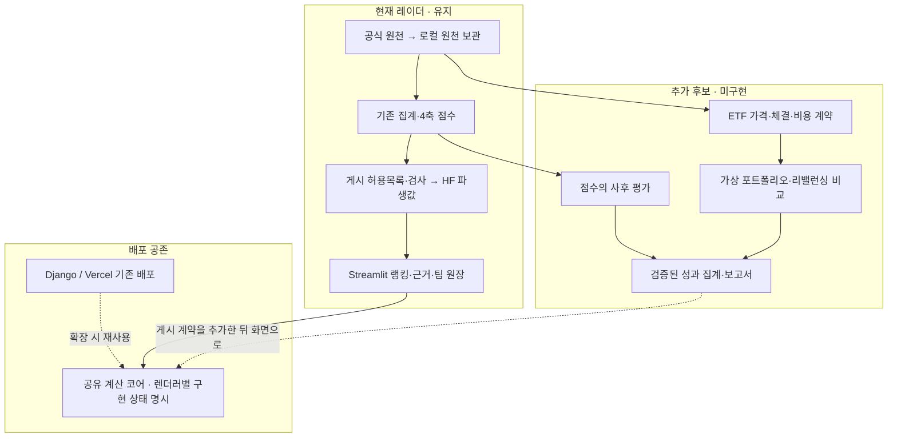

# 확장 요구사항 선별과 산출물 초안

- 작성: 2026-09-23 KST. 사용자 추가 요구사항을 현재 제품에 맞춰 선별한다.
- 상태: **설계 후보 등록 완료 · 기능 구현 미착수**. 일정·전체 구현을 확약하지 않는다.
- 기준: [AGENTS.md](../../AGENTS.md), [기존 아이디어 판정](기능-아이디어-12건.md),
  [ADR-SC-0010](../decisions/0010-두-배포-공존과-쓰기-상태-분리.md).
- 사용자의 목적: 현재 틀을 유지하면서 설계를 보강한다. AWS는 제외한다.
  별도 포트폴리오 프로젝트와 중복되는 전문 자산배분 기능은 최소화한다.
- 첨부 이미지는 이번 대화에서 확인되지 않았다. 아래 산출물 표는 **제안**이며
  강사 권장 산출물 전체를 확인·충족했다는 뜻이 아니다.

## 1. 현황을 직접 확인한 결과

| 확인 | 코드·측정 | 의미 |
|---|---|---|
| 시작 기준선 | `655b843`, main·origin/main·github-est/main 일치, 열린 이슈 3건 | 전달된 인수인계와 일치한다 |
| 기존 변경 | `docs/xlsx/개별 종목 섹터.xlsx` 미추적 | 이번 작업에서 수정·커밋하지 않는다 |
| 데이터 | 갱신 전 최신일 20260918, 6,111행, 291개 고유 기준일 | 점수 행수와 영업일 수를 혼동하지 않는다 |
| Vercel | 2026-09-23 GET `/` HTTP 200, HTML 제목 «모의투자 대회 플랫폼» | 기존 Django 배포가 응답한다. 모든 기능의 정상 동작을 뜻하지 않는다 |
| Vercel 경로 | `vercel.json` → `api/index.py` → `backend/config/wsgi.py` | Streamlit 레이더를 Vercel로 옮겼다는 뜻은 아니다 |
| 설명 기능 | `dashboard/view.py`의 워터폴·축 기여, `explain.py`, `agent/guard.py` | 설명 가능한 규칙 기반 점수가 이미 있다. SHAP 추가가 선행 조건은 아니다 |
| 협업 원장 | `sector/workspace/events.py::KINDS` 7종 | 조·참가·섹터 확정·코멘트·보관·복구다. 매수 수량·체결·배당 원장은 없다 |
| 섹터 집계 | `sector/aggregate.py::SectorDailyRow` | ETF·구성종목 렌즈의 집계 지수다. 특정 ETF의 체결 가격이 아니다 |
| 데이터 경계 | `dashboard/data.py::load_scores`, `gate.project_sector` | 점수 경계는 있고 섹터 시계열의 동일 계약은 다음 M10 작업이다 |

**배포는 추가 개발의 출발점으로 유지한다.** Streamlit은 팀용 레이더,
Django/Vercel은 기존 배포·확장 경로다. 이번 선별 때문에 FastAPI 서버를 추가하거나
동결된 `backend/`를 다시 개발하지 않는다. 배포 대상별 구현 상태를 따로 표시한다.

## 2. 요구사항 대응표

«우선 후보»도 지금 구현됐다는 뜻은 아니다. 아래 ID를 후속 설계·검증 표에서 사용한다.

| ID | 사용자 요구 | 선별 | 이 프로젝트에 맞춘 범위·선행 조건 |
|---|---|---|---|
| R01 | 가격·거래량·재무·뉴스 수집·분류·검색 | 기존 계획 보강 | KRX·KIS·DART 등 승인된 경로별 계약. M11·M12와 연결. 무차별 크롤링 대신 메타데이터·허용된 링크 검색 |
| R02 | 갱신일·문서 버전·캘린더·정기 배치 | 우선 후보 | 기준일·취득시각·게시시각을 분리하고 설정·코드 버전을 기록. M14 로컬 스케줄러, 실패·재시작·중복 실행 점검 |
| R03 | XAI 설명 | 기존 기능 활용 | 게시 z·가중치·축 기여·순위·반론·결측을 설명. 이를 수익 보장이나 인과 설명으로 바꾸지 않는다 |
| R04 | MA·RSI·MACD·볼린저·거래량 지표 | 조건부 후순위 | 일별 자료의 설명 보조부터. 기간·단위·워밍업·결측 명세. 거래량을 기존 점수 축에 추가하지 않는다 |
| R05 | 캔들·지지·저항·돌파·골든크로스 | 보류 | OHLC의 권리변동 처리·패턴 정의부터 필요하다. 종가 기반 파생 지수로 캔들을 만들지 않는다 |
| R06 | 분봉·일봉·주봉 종합 신호·신뢰도 | 보류 | 분봉 이력 경로가 미확정이다. 일봉으로 분봉을 합성하지 않는다. 점수나 순위를 확률로 표시하지 않는다 |
| R07 | 월·분기·연 시간 기반 리밸런싱 | 시뮬레이션 후보 | 사용자가 정한 목표 비중으로 과거 시나리오 비교. 달력과 다음 거래 가능일, 체결 시점을 고정 |
| R08 | 허용 이탈률 기반 리밸런싱 | 시뮬레이션 후보 | 비중 차이의 %p와 상대 이탈률을 구분. 가격 변동 후 비중을 계산하고 회전율·비용을 함께 비교 |
| R09 | 입출금·배당 기반 리밸런싱 | 후순위 | 현금 이벤트·실제 배당 자료·중복 반영 방지 필요. 현금 유입을 투자 수익으로 세지 않는다 |
| R10 | 비용·슬리피지·수익률·MDD·샤프·승률 | 최우선 확장 후보 | 점수 사후 평가와 ETF 체결 백테스트를 구분. 실제 체결 평가에는 ETF 매핑·가격·비용 계약 필요 |
| R11 | 신호를 매수·매도·보유 의견으로 변환 | 보류 | 현재 제품의 판단 보조 범위를 넘는다. 우선 «사용자가 설정한 규칙의 과거 충족 여부»만 연구 대상으로 둔다 |
| R12 | 모의 주문 체결·포트폴리오 운용 | 제한적 후보 | 독립적인 가상 계산부터. 브로커 주문·기존 원장 변경·동결 backend 체결엔진 재개는 별도 범위다 |
| R13 | 지표 조합·손절·익절·포지션 크기 규칙 | 후순위 | R10 검증 계약 이후 별도 실험 설정으로 둔다. 현행 4축 점수 규칙을 덮어쓰지 않는다 |
| R14 | 기간·임계값 최적화 | 보류 | 시계열 분리·검증 구간·시도 횟수 기록이 먼저다. 최적 결과만 고르는 보고를 금지한다 |
| R15 | Pine Script 지표·전략 실습 | 선택 학습 산출물 | 앱의 필수 경로 밖에 둔다. 외부 서비스 가입·유료 기능을 전제하지 않는다 |
| R16 | TradingView와 LEAN 교차 검증 | 후순위 검증 후보 | 데이터·시각·수정 방식·수수료·체결 규칙이 같을 때만 결과 비교. 처음에는 독립 계산+합성 시나리오로 검증 |
| R17 | TradingView 알림·Webhook 전달 | 보류 | 외부 신호 수신·주문 경로를 추가하는 운영 범위다. 서버 상주·자동매매를 이번 계획에 포함하지 않는다 |
| R18 | LEAN 동일 조건 백테스트·성과 분석 | 선택 도구 | 도입 효과와 국내 데이터 어댑터·환경 비용을 조사한 뒤 결정. LEAN·CLI·Docker를 앱 의존성에 추가하지 않는다 |
| R19 | 전략 차트·성과 화면·자동매매 모니터링 | 일부 후보 | 성과·데이터/배치 상태 화면은 후보. 자동매매 감시는 실행 시스템 자체가 없어 보류 |
| R20 | 시각적 포트폴리오·목표 수익률 모의 | 소규모 후보 | 사용자가 정한 가상 ETF 비중·현금·기간·목표선과 과거 경로 비교. 달성 확률·추천 비중은 내지 않는다 |

기술 이름은 기능 요구사항과 분리한다. AWS 서비스는 채택하지 않는다.
RDBMS는 기존 Supabase의 작은 쓰기 상태, 파생 집계는 HF를 유지한다.
그림·표는 기존 Streamlit/Altair를 우선 활용하고 AG Grid·ApexCharts·Airflow는
필요성이 입증되기 전 추가하지 않는다. GitHub Actions는 검증·배치의 필수 경로가 아니다.

## 3. 최소 확장안과 경계

추천 순서는 **M10 데이터 경계 → R10 사후 평가 설계 → R20 가상 포트폴리오 →
R07·R08 리밸런싱 비교**다. M11·M12·M14의 기존 계획과 중복되는 요구는 그쪽에 묶는다.
별도 포트폴리오 프로젝트의 자산배분 최적화·계좌·주문 기능 전체를 가져오지 않는다.

### 3.1 점수가 유효했는지와 실제로 벌었는지는 별개다

- 1차: 날짜별 점수·순위와 이후 섹터 파생 수익률의 관계를 평가한다.
  Spearman 순위 상관(IC), 상하위 그룹 차이, 관측 수·결측 수를 후보로 둔다.
  이것을 ETF 매매 실현 수익률이라고 부르지 않는다.
- 미래 수익률은 평가 전용 결과 열이다. 계산 입력·점수·가중치 선택으로 역류시키지 않는다.
  평가 종료일 이후를 요구하는 표본은 제외하고 제외 수를 보고한다.
- 같은 날 종가로 계산한 점수로 같은 종가에 매수했다고 가정하지 않는다.
  `bas_dd`뿐 아니라 실제 자료 이용 가능 시각·배치 완료 시각 이후의 체결이어야 한다.
- 현행 고정 `sectors.yaml`로 과거를 다시 계산한 결과에는 구성종목 선택 편향이 남는다.
  `test_asof_monotone` 통과만으로 당시 유니버스·공표시각까지 검증됐다고 말하지 않는다.
- 분배금·상장폐지·매매정지·권리변동·수정 방식의 보장 범위를 따로 적는다.
  기존 `FLUC_RT` 체인 지수를 배당 재투자 총수익률이라고 단정하지 않는다.

### 3.2 간단한 포트폴리오의 최소 계약

| 항목 | 후보 계약 |
|---|---|
| 입력 | ETF 식별자, 가상 초기 자금(원 정수), 비중(bp 정수), 현금, 기간, 비용 시나리오 |
| ETF 선택 | 섹터와 ETF는 구분한다. 과거 시점 유효 매핑 없이 오늘 ETF를 과거에 자동 대입하지 않는다 |
| 비중 | 현금 포함 10,000bp, 음수·레버리지 제외. 사용자가 입력한 시나리오로 표시 |
| 계산 | 보유 수량 정수·잔여 현금·반올림 순서 명세. 내부 Decimal, 저장 직전 양자화 |
| 거래 | 결정·주문 가정·체결·평가 시각을 분리. 비용·슬리피지·미체결 정책을 설정 지문에 포함 |
| 비교 | 동일 기간·유니버스·가격 기준의 보유 유지와 리밸런싱 비교, 비용 전후·회전율 표시 |
| 목표 | 사용자가 정한 목표선과 차이만 표시. 예측치·달성 확률·추천 비중으로 표현하지 않는다 |
| 실패 | 가격·비용·분배금이 없으면 영향 범위를 표시하거나 계산 거부. 임의 0원으로 메우지 않는다 |
| 저장 | 첫 버전은 조회용 가상 결과. 원장 이벤트·RLS 변경은 별도 설계와 마이그레이션이 필요 |

### 3.3 성과지표·재현성 계약

- 누적수익률과 MDD는 현금 흐름을 조정한 평가 곡선에서 계산한다.
  MDD 부호·기준 자산·기준점을 명세하고 수익률 곡선과 금액 곡선을 구분한다.
- 샤프는 수익률 빈도·연율화 기준·무위험 기준·표준편차 정의를 명시한다.
  무위험 자료가 없으면 미산출하거나 명시적 가정 시나리오로 둔다. 분산 0·짧은 표본은 없음이다.
- 승률은 청산 거래 기준인지 기간 수익 기준인지 이름에 드러낸다. 미청산 거래와 분모를 보고한다.
- 재현 키: 데이터 지문·설정 지문·코드 버전·기간·유니버스 버전·기준시각·비용·체결 가정.
- 합성 데이터로 상승·하락·횡보·결측·거래정지·비용·현금 유입·분할·분배금을 검증한다.
  독립 수계산과 맞추고 미래 행 추가 전후 과거 결정이 같은지도 확인한다.
- 평가 결과가 새로 HF에 올라가려면 전용 게시 허용목록·스키마·게이트가 먼저다.
  기존 `batch.publish`가 임의 성과 파일을 안전하게 게시한다고 가정하지 않는다.

## 4. 교차 검증과 기각한 대안

| 제안·판단 | 독립 근거 | 결론·기각 이유 |
|---|---|---|
| 체결·슬리피지·비용은 따로 명세 | LEAN 공식 reality models + TradingView 전략 문서 | 엔진 이름이 같아도 조건이 다르면 결과 비교가 무의미하다 |
| 같은 종가로 결정·체결 | TradingView 기본 체결은 다음 이용 가능한 tick + 로컬 KRX 일별 수집/게시 경로 | 자료를 알기 전 가격으로 체결하는 가정은 기각한다 |
| 섹터 지수만으로 ETF 포트폴리오 계산 | `SectorDailyRow` 집계 정의 + `sectors.yaml`의 섹터/ETF 구분 | 매매 가능한 단일 자산·현금·체결 내역을 보장하지 못한다 |
| 기존 원장이 있으니 포트폴리오도 완료 | `events.KINDS` 7종 + `fold.py` 상태 투영 | 섹터 의사결정 기록과 보유·체결 원장은 다르다. 완료 주장을 기각한다 |
| 설명을 위해 SHAP·SageMaker 추가 | `weighted_score_bp` + `view` 기여 분해/guard | 현재 점수는 결정적 가중합이다. 정확한 기여 설명을 재사용한다. AWS는 사용자 제외 조건이다 |
| FastAPI·새 프런트로 재작성 | `vercel.json`·`api/index.py` + 실제 HTTP 200 | 기존 배포와 렌더러가 있다. 이번 요구에 프레임워크 교체를 정당화할 근거가 없다 |
| LEAN·TradingView를 먼저 필수화 | 두 공식 문서의 체결 가정 차이 + 국내 데이터·로컬 검증 제약 | 비교 대상과 데이터 계약을 정하기 전에 도구만 늘리지 않는다. 영구 금지는 아니다 |
| 자동매매·확률형 신뢰도 | 현재 판단 보조 범위 + 분봉·확률 보정 검증 부재 | 실행 시스템과 검증된 확률이 없으므로 이번 확장에서 보류한다 |

공식 근거(2026-09-23 열람):

- [QuantConnect: Reality Modeling][qc-models]
  — 체결·슬리피지·비용 모델을 구분한다. 기본 모델은 높은 유동성을 가정한다.
- [TradingView: Strategies](https://www.tradingview.com/pine-script-docs/concepts/strategies/)
  — 기본 주문 체결 시점, 비용, 미래 정보 유입과 선택 편향의 검증 필요성을 설명한다.

이는 외국 시장 데이터 사용 허가가 아니라 **검증 방법의 참고**다.
성능·메모리·설치 크기는 이번에 재지 않았으므로 숫자를 제시하지 않는다.
Alpha_Stack·lumina-invest의 코드 재사용 적합성도 아직 조사하지 않았다.

## 5. 산출물 추적표 — 이미지 대조 전 제안

| 산출물 | 현재 근거 | 보강할 것·완료 판정 |
|---|---|---|
| 요구사항 정의서 | 이 문서 R01~R20 | 각 ID의 채택 범위·제외 범위·수용 조건·검증 결과 연결 |
| 시스템 구성도 | ADR-SC-0010, 위 흐름도 | 현재/계획·로컬/외부·원천/파생·신호/평가 경계 구분 |
| 데이터 명세·ERD | `SectorDailyRow`, 게시 허용목록, Supabase SQL | 열·단위·결측·공표/취득/게시 시각·버전, 실제 쓰기 스키마 ERD |
| 화면 설계 | 현재 페이지·순수 view 계약 | 성과/포트폴리오 후보 화면의 입력·출력·없음·오류·용어 |
| 인터페이스 명세 | 배치 CLI·데이터 로더·Supabase RPC | HTTP API가 없는 기능에 형식적인 REST API를 신설하지 않는다 |
| 검증 보고서 | 골든·미래 행 불변·guard·동결 회귀 | 요구 ID별 합성 사례·독립 계산·종료 코드·실측 결과·한계 |
| 운영·배포 문서 | `VERCEL.md`, M14 계획 | 두 배포의 역할, 로컬 스케줄, 실패 재실행, 파생 게시·원천 비공개 |
| 시연·최종 발표 자료 | 현재 앱과 ADR | 데이터→점수→근거→판단 기록 흐름. 미구현 후보는 완료 기능과 구분 |

이번 문서는 확장 방향을 남기는 백로그다. 기존 ADR을 뒤집거나 M10을 완료 처리하지 않는다.
구체 구현은 한 작업씩 착수하며, 되돌릴 수 없는 결정이 생기면 해당 ADR을 추가한다.

## 6. 이번 작업의 운영 확인

- 기능 코드·의존성·DB 스키마 변경은 없다. 기존 백로그와 문서 입구·세션 문서를 연결했다.
- 데이터: 20260918 → 20260922, 6,153행·293영업일.
- 수집 → 집계 → 점수 → dry-run → 게시 → 재게시가 모두 RC=0이다.
- 게시 게이트 12개 통과, HF 커밋 `4d649fb9abdd`, 재게시 업로드 0건이다.
- 원천은 로컬 `data/raw/`에만 두고 파생값만 게시했다.
- 갱신 완료 후 세 parquet를 독립적으로 다시 읽어 날짜·행수를 대조했다.
  `gate.project_sector` 실행 결과 `etf_shares_sum`은 없고 `etf_shares_idx_bp`는 있다.

- 검증: 루트 `pytest` **1,030건 통과**(753.48초, RC=0), 동결 backend **23건 통과**
  (0.89초, RC=0). 신규 테스트·기능 코드 변경은 없다. 문서 링크·코드 블록도 확인했다.

[qc-models]: https://www.quantconnect.com/docs/v2/writing-algorithms/reality-modeling/key-concepts
