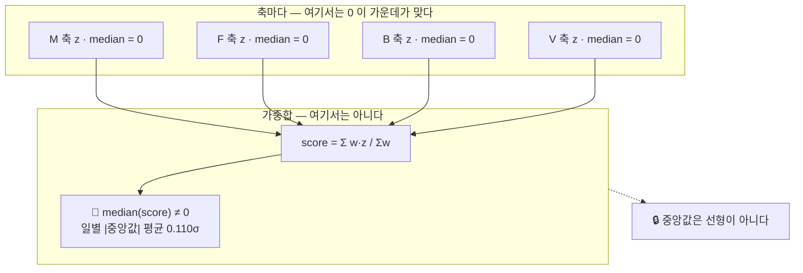

# ADR-SC-0017 — 막대 기준선과 «가운데» 의 정의

- **상태**: 채택
- **날짜**: 2026-09-19
- **관련**: 이슈 #14 · [ADR-SC-0007](0007-값을-지어내지-않는다.md)(절대 제약 8) ·
  [ADR-SC-0014](0014-점수-재현성과-가중치-슬라이더의-경계.md) ⑤⑦ ·
  [ADR-SC-0016](0016-점수-표-검증을-데이터-경계로-올린다.md)(«규칙으로 막지 않고 경로를 없앤다») ·
  이슈 #16(M10 워터폴 — 같은 Altair 경로를 쓴다)
- **개정하지 않는 것**: 4축 정의 · 프리셋 가중치 · 점수 재현성 계약 · 게시 경로 · 원장 ·
  **막대가 그리는 값**(`score_bp` 그대로) · **마이그레이션 0**
- **바꾸는 것**: `view.score_bars()` 의 **반환 타입** · `_render_bars` 의 차트 구현과 문구 ·
  `requirements.txt` 에 `altair` 핀 1줄(**설치 증가 0**)

## 맥락 — 화면이 방향을 반대로 말했다

랭킹의 막대 차트가 「0 이 21개 섹터의 가운데다」라고 적고, 캡션이 「막대가 왼쪽이면
그날 섹터들의 **가운데보다 낮았다**」고 말했다. **둘 다 거짓이다.**

`sector/scoring.py::_standardize` 는 **축마다** 중앙값을 빼므로 각 축의 z 중앙값은 0 이다.
그러나 **중앙값은 선형이 아니다** — `median(a+b) != median(a)+median(b)`. 한 섹터가 네
축에서 동시에 가운데인 일은 드물어서, 가중합의 중앙값은 0 에서 비켜 있다.
`CLIP_Z`(±3σ)가 한쪽 꼬리만 자르는 날도 분포를 비대칭으로 만든다.

## 실측으로 확정된 것 (2026-09-19 · 파생본 266영업일 × 21섹터)

| # | 사실 | 어떻게 확인했나 |
|---|---|---|
| **A** | 🔴 앱은 **언제나 최신일 하루치만** 그린다 — `ranking.py` `as_of = data.latest_day(frame)`. 링크의 `as_of` 는 **보고만** 하고 이동하지 않는다 | 코드 읽기 · `_apply_link` |
| **B′** | 🔒 **세는 규칙** — 「어긋났다」는 `막대 방향(v>0)` 과 `가운데 대비(v>중앙값)` 가 다른 것이다. 즉 `v != 중앙값` **이고** `v != 0`. 양끝을 포함하면 균형 205/266 · 역발상 223/266 으로 더 크게 나온다 — 아래는 **보수적으로** 센 수다 | 정의 |
| **B** | 그래서 노출은 **행이 아니라 날** 기준이다 — 균형 **159/266일(59.8%)** 에 어긋나는 섹터 1개 이상 · 하루 평균 1.03개 · 최대 5개 | 전수 집계 |
| **C** | 역발상은 **188/266일(70.7%)** · 최대 7개 · **최신일에도 3개** — 오늘 살아 있는 버그다 | 전수 집계 |
| **D** | 일별 중앙값 `\|평균\|` **0.110σ** · 범위 −0.338 ~ +0.449σ · 최신일 +0.113σ | 전수 집계 |
| **E** | **중앙값 == 11위 섹터의 점수** — 266일 × 프리셋 3종 = 798조합에서 반례 **0건** | 전수 대조 |
| **F** | 🔴 그러나 **21 은 상수가 아니다.** `F` 단독 커스텀 가중치는 **101일이 k=20**(짝수)이라 중앙값이 어느 섹터의 점수도 아니다 | `Weighting.of` 로 전수 |
| **G** | 🔴 `x_label` 은 `horizontal=True` 에서 **섹터(세로)축** 제목이 되고 `y_label` 이 점수축 제목이 된다. 운영 코드는 `y_label=""` 이라 **점수축에 제목이 없었다** | AppTest 로 운영 호출 재현 |
| **H** | `altair` 는 streamlit 1.63.0 의 **extra 없는 필수 의존**(`altair!=5.4.0,!=5.4.1,<7,>=5.0.0`) → **설치 증가 0** | `importlib.metadata.requires` |
| **I** | 🔴 그래도 핀이 필요하다 — 제약이 **5.x 도 허용**하고 5.x 는 Vega-Lite v5, 6.x 는 v6 를 낸다 | 같은 제약 문자열 |
| **J** | `AppTest` 는 `at.get("vega_lite_chart")[i].proto.spec`(JSON)과 `.proto.datasets`(pyarrow IPC)를 **읽는다** → 기준선 위치를 테스트로 고정할 수 있다. `arrow_vega_lite_chart` 는 0건 | 프로브 |
| **K** | `st.get_option("theme.grayColor")` 가 `config.toml` 값(`#8B93A1`)을 파이썬에서 준다 → **토큰을 중복 정의하지 않는다** | 프로브 |
| **L** | 🔴 `median()` 은 낼 수 없을 때 `None` 이 아니라 **`pd.NA`** 를 준다(열이 `Int64`). `is not None` 은 **참**이다 | 직접 실행 |
| **M** | `st.bar_chart` 는 마지막에 **`.interactive()`** 를 붙인다(`built_in_chart_utils.py:274`) — 옮기지 않으면 줌·팬이 사라진다 | 소스 · 컴파일된 Vega 의 zoom 신호 |
| **N** | 층 차트의 가로축 제목은 두 층이 **같은 문자열**을 주면 **정확히 1개**로 합쳐진다 | `vl_convert` 컴파일 |
| **O** | 층 차트의 x 도메인은 **레이어 합집합**이라 점선이 축 범위를 넓히는 날이 있다 | 컴파일된 Vega 의 `domain.fields` |

## 결정

### ① 막대 값은 그대로 두고 **가운데를 그림으로 말한다**

🔴 «중앙값을 빼서 그린다» 를 **기각했다** — 화면의 숫자가 표·근거·에이전트의
`score_bp` 와 갈린다. ADR-SC-0014 가 막은 바로 그 상태다. 막대는 여전히 `score_bp / 10000`
이고, 그날 **거르지 않은** 전체의 중앙값 자리에 **점선**을 긋는다.

### ② 기준선은 `only` 적용 **전에** 정해진다 — `Bars` 하나로 묶는다

`score_bars()` 가 `DataFrame` 대신 `Bars(table, middle_sigma, graded_n)` 을 돌려준다.

🔒 **규칙을 구조로 바꾼 것이다.** 기준선을 내는 함수를 **따로** 두면 호출부가 걸러진
프레임을 그쪽에 넘기는 **두 번째 입구**가 남고, `_render_bars` 는 바로 윗줄에서
`only=keep` 을 쓰고 있어 그 입구가 손에 닿는 거리에 있다. 한 함수 안에서 `only` 보다
먼저 중앙값을 내면 **그 함수 안에는** 그 입구가 없다.

🔴 **그러나 «경로를 없앴다» 고까지는 말하지 않는다** — ADR-SC-0016 은 `_read_scores` 를
**사유화**해 잘못된 프레임을 얻을 공개 함수를 없앴지만, `score_bars` 는 여전히 공개이고
호출부가 **걸러진 프레임을 통째로** 넘길 수 있다. 적대적 구현 리뷰가 그 돌연변이 3종이
**전부 초록으로 살아남는 것**을 보였다(`only=keep` 제거 · `_bar_chart` 에서 중앙값 재계산 ·
`ranked[isin(keep)]` 을 넘기기). 🔒 그래서 **렌더러가 무엇을 넘기는지 보는 테스트**를
따로 둔다 — `test_막대와_점선은_필터를_따로_따른다` (`test_화면의_대분류_분포가_필터를_따른다`
와 같은 자리다). 구조가 절반, 테스트가 나머지 절반이다.

### ③ «가운데가 몇 위인가» 는 **데이터가 정한다** — `explain.middle_text(k)`

🔴 「가운데(11위)」를 문장에 박지 않는다. 지금 266일이 전부 21개를 채점해 참일 뿐이고,
**F 단독 커스텀 가중치는 101일이 20개**다(실측 F). 짝수이면 중앙값은 10위와 11위의
평균이라 **어느 섹터의 점수도 아니다.** `sectors.yaml` 에 섹터를 더해도 같다.

- k 홀수 → `가운데({(k+1)//2}위)` · k 짝수 → `가운데({k//2}·{k//2+1}위 사이)`
- 🔒 `ranking.py::_window()`(「요청한 20 을 그대로 쓰지 않는다」)와 같은 규율이다.
  이슈 #14 가 고치려는 결함이 «화면이 산수에 대해 거짓을 말한다» 이므로, 고치면서
  **같은 종류의 거짓을 새 자리에 심지 않는다.**

### ④ 기준선을 낼 수 없으면 **차트를 그리지 않는다**

🔴 `median()` 의 `pd.NA` 를 `is not None` 으로 거르면 **값이 `null` 인 점선**이 그려지고
축 제목이 있지도 않은 그 점선을 가리킨다 — 절대 제약 8 이 금지하는 화면이다.
`pd.isna` 로 거르고, 그릴 막대가 하나도 없으면 `_render_podium` 과 **같은 말**
(`ranking.NO_RANKED` — 문자열 하나를 둘이 공유한다)을 한다. 막대 없이 점선만 남으면
«무엇의 가운데인가» 를 말할 수 없다.

🔒 점선 색에 **폴백 상수를 두지 않는다.** `st.get_option("theme.grayColor")` 가 비면
색 없이 그려지는데, 닿지 않는 가지는 테스트가 지킬 수 없다(`_render_consensus` 의 같은
규율). 대신 그 키가 있다는 것을 `test_점선_색은_설정의_토큰에서_온다` 가 **설정 계약**으로
건다 — `data.py` 의 스피너 문구를 `_info.show_spinner` 로 거는 것과 같은 방식이다.
🔒 **의미색을 쓰지 않는다** — `greenColor`·`redColor` 는 뜻을 가진 색이고, 가운데를
가리키는 선은 판단이 아니다. 그 단언도 같은 테스트에 있다.

### ⑤ `st.bar_chart` → Altair 층 차트. **잃는 것이 없어야 한다**

🔒 `st.bar_chart` 가 해 주던 것을 빠짐없이 옮긴다 — x 격자 · y 무격자 · 툴팁 2열 ·
높이 460 · **줌/팬(`.interactive()`)**. 컴파일한 Vega 에서 축·스케일·툴팁이 일치하는
것을 확인했다. 🔒 **색 인코딩을 주지 않는다** — 그래야 프런트엔드의 `theme="streamlit"`
이 `chartCategoricalColors` 를 먹인다(양쪽 스펙에 색이 없다).
🔒 `import altair` 는 **함수 안에서** 한다 — streamlit 은 altair 를 미리 로드하지 않고
(실측 1.5s) 이 모듈은 부팅 때 다른 페이지와 함께 import 된다.

### ⑥ `altair` 를 `requirements.txt` 에 핀한다 — 설치는 0 이 늘어난다

`requests` 블록이 이미 같은 상황에 답을 써 두었다 — 「직접 import 하는 패키지를 남의
전이 의존에 맡기면, streamlit 이 의존을 정리하는 순간 배포가 깨진다」.
🔴 더 큰 이유는 **핀이 없으면 Cloud 가 5.x 를 깔 수 있다**는 것이다(실측 I) — 그러면
`$schema` 부터 다른 스펙이 배포되고 스펙을 단언하는 테스트가 **로컬에서만** 초록이 된다.

🔒 **정직하게 적는다** — 이 핀이 필요한 이유는 «달리 방법이 없어서» 가 아니라
«Altair 를 쓰기로 했기 때문» 이다. 손으로 쓴 dict + `st.vega_lite_chart` 는 의존이
0 이고 차트 생성이 **22.5ms → 0.51ms** 로 빠르다(적대적 구현 리뷰 실측 · 컴파일된 Vega 는
동일). 그래도 Altair 를 고른 이유는 **이슈 #16 의 M10 워터폴**이다 — dict 로 쓰기엔
복잡하고, 페이지 rerun 에서 +15.5ms 는 회차 간 진폭(±25ms)보다 작아 **실측되지 않는다**
(옛 구현 276.8ms · 새 구현 263.6ms · AppTest 실데이터 워밍 후 n=6 중앙값).

### ⑦ 문구 — 세 문장이 전부 참이어야 한다

| 자리 | 문구 | 왜 참인가 |
|---|---|---|
| 축 제목 | `점수(σ) — 점선이 그날 섹터들의 가운데(11위)다` | 점선이 실제로 그 중앙값이고 «11» 은 k 에서 나온다 |
| 캡션 | `점선보다 왼쪽이면 그날 섹터들의 가운데보다 낮았다` | **구조적으로** 참이다 — 근사가 아니다 |
| 캡션 | `0 은 «축마다 가운데였다면 받았을 값» 이다` | 정의상 참 — `Σw·0/Σw = 0` |
| 캡션 | `**중앙값은 선형이 아니라서** 그것을 가중합한 가운데는 대개 0 에서 비켜 있다` | 🔴 **이유절도 검증 대상이다.** 처음에는 「네 축에서 동시에 가운데인 섹터는 드물어」라고 적었는데, 실측상 그런 섹터가 있는 날 **2일**과 중앙값이 0 인 날 **4일**이 **한 번도 겹치지 않는다** — 관찰된 현상의 원인이 아니다 |

🔴 「0 은 가운데가 **아니라**」로 단언하지 않는다. 중앙값이 정확히 0 인 날이 균형 4일 ·
모멘텀 5일 · 역발상 3일 있다. 「가운데는 **대개** 0 에서 비켜 있다」가 266일 전부 참이다.

### ⑦-1 🔴 «읽는 법» 화면도 같은 말을 하고 있었다

`pages/howto.py` 의 「σ 가 무엇인가」가 **`0σ` 는 '가운데'** 라고 가르쳤다. 실측 —
**축 z 의 일별 중앙값이 0 이 아닌 날은 4축 전부 0일**(정확히 참)이지만, **총점**은
균형 **262/266일** · 모멘텀 261일 · 역발상 263일이 0 이 아니다. 그 문단 바로 아래가
총점을 σ 로 보여주는 «예시 하나를 끝까지» 다.

🔒 그래서 **축과 총점을 가른다.** 랭킹만 고치고 이 페이지를 두면 같은 앱의 두 화면이
같은 단위에 대해 반대로 말하고, 팀원은 읽는 법을 **먼저** 읽는다. 적대적 구현 리뷰가
이것을 «이슈가 절반만 닫혔다» 로 잡았다.
🔒 필터 tail 도 고쳤다 — 층 차트의 가로축은 막대와 **점선을 함께** 담으므로(실측 O)
「보이는 섹터들에 맞춰」라고만 적으면 그것이 거짓이 된다.

### ⑧ 행동을 잡는 테스트가 없으면 이 ADR 은 글일 뿐이다

돌연변이 **24종**을 최종 코드에 실제로 넣어 **전부 빨개지는 것**을 확인했다 —
기준선을 `only` 뒤에 내기 · 중앙값을 평균으로 · `pd.isna`→`is not None` ·
`graded_n` 을 전체 행 수로 · `only` 무시(뷰·렌더러 3변종) · `latest_frame` 대신 전체 ·
점선 층 제거 · 옛 거짓 축 제목 복귀 · `sort` 제거 · `.interactive()` 제거 ·
빈 막대에도 차트 그리기 · `strokeDash` 제거 · 툴팁 제거 · 높이 변경 · 격자 끄기 ·
점선 색을 의미색으로 · 캡션의 `total` 을 21 로 박기 · «11위» 하드코딩 ·
`middle_text` 오프셋 어긋내기 · 캡션 분기 뒤집기 · 읽는 법 문구 되돌리기(2변종).
🔒 기댓값은 **화면과 따로** 낸다.

🔴 **검사 자체가 두 번 거짓말을 했다** — 이것도 기록한다.
1차는 없는 `--timeout` 옵션 탓에 pytest 가 `rc=4`(**사용법 오류**)를 냈는데 "죽었다" 로
셌다. 그다음에는 돌연변이를 `"" or "원문"` 으로 만들었는데 파이썬 `or` 가 두 번째를
돌려주어 **화면이 한 글자도 안 바뀌었다** — 살아남은 것처럼 보인 것은 테스트 구멍이
아니라 **무연산 돌연변이**였다. 🔒 종료 코드의 뜻과 돌연변이가 실제로 무엇을 바꾸는지
까지 확인해야 검증이 검증이다 (`AGENTS.md` 4.4).

## 기각한 대안

| 대안 | 왜 아닌가 |
|---|---|
| (C) 막대 값을 `score − median` 으로 그린다 | 🔴 화면 숫자가 표·근거·에이전트의 `score_bp` 와 갈린다 (ADR-SC-0014) |
| (D) 캡션을 지운다 | 오독은 줄지만 막대를 읽는 법을 잃는다 |
| (A) 문구만 사실에 맞춘다 | 가장 싸지만 «어디가 가운데인가» 를 화면이 말하지 못한다 |
| 캡션에 중앙값을 **숫자로만** 적는다 | 참이 되지만 읽는 사람이 `+0.11σ` 를 축에서 눈으로 찾아야 한다 |
| 기준선을 내는 **함수를 따로** 둔다 | ② — 걸러진 프레임을 넘기는 두 번째 입구가 남는다 |
| `plotly` 를 쓴다 | streamlit 의 `extra=="charts"` 라 **설치가 늘어난다.** Altair 로 되는 일이다 |
| 차트에서 **색으로** +/− 를 말한다 | 🔒 **«닿지 않는다» 가 이유가 아니다** — 이 변경 자체가 `st.get_option("theme.grayColor")` 를 mark 색으로 넣어 차트에 닿았고, `greenColor`(`#3DDC97`)·`redColor`(`#FF6B6B`)도 똑같이 읽힌다(실측). 닿지 않는 것은 **CSS** 다. 진짜 이유는 한국 관습(상승=빨강) 토글이 **미결**이라는 것 하나다 |

## 결과 — 무엇이 달라지나

- 랭킹의 막대에 회색 점선 하나가 생기고, 축 제목과 캡션이 그 점선을 가리킨다.
- `view.score_bars()` 의 반환이 `Bars` 다 — 호출부는 운영 1곳 · 테스트 2곳이었다.
- 의존 설치량 변화 **0** · 마이그레이션 **0** · 게시 경로 변화 **0**.
- `pages/howto.py` 의 σ 설명이 **축과 총점을 가른다**(⑦-1).
- 🔒 M10 워터폴(이슈 #16)이 쓸 Altair 경로를 이 변경이 먼저 닦았다.
- 🔒 적대적 리뷰 **2회**(설계 🔴2 🟠6 🟡9 · 구현 🔴1 🟠8 🟡12) — 전부 반영했다.
  구현 리뷰가 잡은 것 중 가장 큰 둘은 **읽는 법 화면의 같은 거짓말**(⑦-1)과
  **필터를 보는 테스트가 없다**(②)는 것이었다.
