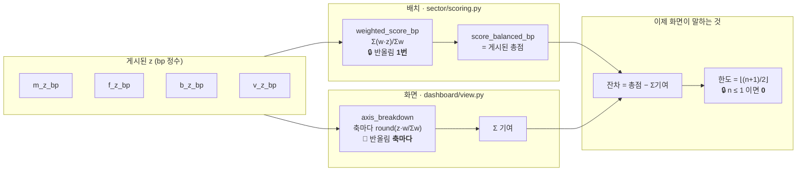

# ADR-SC-0018 — 기여합과 총점의 «잔차» 를 드러낸다

- **상태**: 채택
- **날짜**: 2026-09-20
- **관련**: 이슈 #13 · #15 · [ADR-SC-0007](0007-값을-지어내지-않는다.md)(절대 제약 8) ·
  [ADR-SC-0014](0014-점수-재현성과-가중치-슬라이더의-경계.md) ①②③ ·
  [ADR-SC-0016](0016-점수-표-검증을-데이터-경계로-올린다.md)(«규칙으로 막지 않고 경로를 없앤다») ·
  [ADR-SC-0017](0017-막대-기준선과-가운데의-정의.md)(같은 계열 — 화면이 산수에 대해 하는 말)
- **개정하지 않는 것**: 4축 정의 · 프리셋 가중치 · 점수 재현성 계약 · 게시 경로 ·
  **게시된 점수 값**(한 칸도 안 바뀐다) · 원장 · **마이그레이션 0** · **의존 증가 0**
- **바꾸는 것**: `view.axis_breakdown` 의 «산 축» 규칙 · `view.arithmetic_table` 의 **시그니처** ·
  `view.sector_story` 의 반환 키 1개 · `explain.narrative` 의 선택 인자 1개 ·
  읽는 법 ③ 패널의 문구 · 픽스처 `_AXIS_OFFSET`

## 맥락 — 화면이 등호로 거짓을 말했다

읽는 법 화면은 네 걸음의 세 번째에서 **«④ 열을 세로로 더하면 총점이 정확히 나온다»**
라고 가르치고, 그 아래에 `**합계 +12522 bp = 총점 +1.25σ**` 를 그렸다.

한 줄에 거짓이 **둘** 있었다.

1. **등호가 참이 아니다.** 총점은 한 번, 기여는 축마다 반올림한다 —
   `round(a)+round(b)+round(c)+round(d)` 와 `round(a+b+c+d)` 는 같지 않다.
2. **양쪽 단위가 다르다.** 왼쪽은 bp, 오른쪽은 σ 라 **팀원이 눈으로 검산할 수 있는
   등식이 애초에 아니었다.** 바로 위 표의 ④ 열은 bp 인데 오른쪽 수는 σ 다.

## 실측 (2026-09-20 · `data/derived/score_daily.parquet` 5,985행 · 285영업일 · 21섹터)

| # | 사실 | 수 |
|---|---|---|
| **A** | 「합계 = 총점」이 거짓인 (행×프리셋) | **5,276 / 16,758 (31.5%)** — 균형 1,718(30.8%) · 모멘텀 1,761(31.5%) · 역발상 1,797(32.2%) |
| **B** | 🔴 **그날 1위만** 봐도 | 균형 **74/266일** · 모멘텀 74일 · 역발상 **87/266일** |
| **C** | 잔차(`총점 − Σ기여`) 분포 | `-2` 11 · `-1` 2,584 · `0` 11,482 · `+1` 2,674 · `+2` 7 |
| **D** | 상한 `⌊(n+1)/2⌋` 위반 | **0건** — n=1 최대 0 · n=2 최대 1 · n=3 최대 1 · n=4 최대 2 |
| **E** | 🔴 **`n = 1` 의 참 상한은 1 이 아니라 0** | 가중치 7벌 × `\|z\| ≤ 30000` 전 구간 **60,004 사례 전수 잔차 0** |
| **F** | 프리셋에 `n=1` 인 행 | **53행**(전부 `axes_missing='MFV'`) · `F` 단독 커스텀은 **5,464행** |
| **G** | 🔴 **예시 섹터는 오늘 마침 맞았다** | 최신일 20260910 1위 `steel` 잔차 **0**. 같은 날 어긋나는 섹터는 균형 **6/21** · 모멘텀 7/21 · 역발상 **9/21** |
| **H** | float / `Fraction` / `Decimal` 불일치 | 축-칸 **57,657** 전수 **0건** |
| **I** | 가중치 0 축을 빼도 분모가 변하는 경우 | **0 / 29,925** (행×가중치) — 빠지는 축의 가중치가 0 이다 |
| **J** | 🔴 게시 게이트를 화면 경계로 올릴 때의 비용 | `gate._check_score_reproducible` **1,920~2,052 ms**(3회) vs `view.check_frame` **1.7~2.8 ms** → 약 **1,000배** |

## 결정

### ① 등호를 버리고 **잔차와 한도를 언제나** 적는다

화면은 합계와 총점을 **같은 단위(bp)로 나란히** 적고, 차이와 «반올림으로 설명되는
한도»를 함께 말한다. σ 는 괄호로만 붙인다.

🔒 **경우를 가르지 않는다.** 읽는 법은 그날 1위 하나만 예시로 쓰는데(실측 G) 그
섹터가 마침 맞는 날이 있다. 그때 등호만 보여주면 팀원은 **규칙**을 잘못 배우고,
그 규칙은 같은 날 같은 화면의 다른 6개 섹터에서 거짓이다.

### ② 원인을 단정하지 않는다 — 한도가 그 경계다

잔차에는 두 가지가 섞일 수 있다.

| | 무엇 | 상한 |
|---|---|---|
| (a) | 축마다 bp 로 반올림한 것 | `⌊(n+1)/2⌋` — **구조적** |
| (b) | 🔴 게시된 총점이 게시된 z 와 갈린 것 | **없다** |

(b)를 "반올림" 이라 부르면 **원인을 지어내는 것**이다(ADR-SC-0007). 그래서 한도 안이면
«이 방법은 최대 ±N bp 까지 어긋난다» 는 **방법의 성질**만 말하고, 넘으면
«게시된 총점이 게시된 σ 로 재현되지 않는다 — 파생본을 다시 만들어야 한다» 로 바꾼다.

🔒 **`n ≤ 1` 의 한도는 0 이다.** 축이 하나면 분모 `W = w` 라 기여 `= round(z·w/w) = z`
이고 총점도 `z` 다 — 두 반올림이 같은 자리에서 일어난다(실측 E). `⌊(n+1)/2⌋` 을 그대로
쓰면 단일 축에서 **±1 오염을 «설명됨» 으로 통과시킨다.** ADR-SC-0014 가 *"그 1bp 가
최근 20영업일 창의 첫날에서 순위를 뒤집었다"* 고 기록한 바로 그 크기이고, 실데이터에
닿는 경로다(실측 F).

### ③ 한도를 넘어도 **페이지를 죽이지 않는다** — 대신 기여 기반 단정문을 닫는다

| 대안 | 판정 |
|---|---|
| `ViewError` 를 던진다(ADR-SC-0016 선례) | 🔴 **기각.** 그 검사는 **그 섹터 하나**에 대한 판정이다. 섹터 A 에서 페이지를 죽이고 B 에서는 살리면 그 들쭉날쭉함 자체가 범위에 대한 거짓이 된다. 이 저장소의 치명 검사는 **경계(프레임 전체)** 나 **게시 게이트**에 있다 |
| 데이터 경계(`load_scores`)로 올린다 | 🔴 **기각.** ADR-SC-0014 ①이 *"그 보증은 화면이 아니라 게시 게이트가 선다"* 고 정했고, 비용도 **약 1,000배**다(실측 J). `check_frame` 머리주석도 *"부분 프레임을 잡는 검사이지 파생본의 모든 오염을 잡는 검사가 아니다"* 라고 적고 있다 |
| 경고만 띄우고 나머지는 그대로 | 🔴 **부족.** 같은 화면의 서술이 *"이 축 하나가 총점에 **+N** 만큼 보탰다"* 라고 단언하는데, 총점이 기여의 합으로 설명되지 않는 상태에서는 근거가 없다 — **화면이 스스로 모순된다** |

→ **패널 안에서 말하되, `explain.narrative` 의 ②③(무엇이 밀어올렸나·깎았나)을 닫는다.**

🔴 **그 문장을 붙일 곳을 처음엔 틀리게 골랐다.** `narrative` 를 부르는 곳은 읽는 법
한 페이지뿐인데, **팀이 매일 쓰는 화면은 랭킹**이다. 거기 근거 패널(`evidence.py`
«축별 숫자로 보기»)은 축별 «→ 기여 **+N**» 을 나란히 그리면서 그 합이 총점과 다르다는
것을 **한 글자도 말하지 않았다** — 최신일만 봐도 균형 **6/21** · 모멘텀 7/21 ·
역발상 **9/21** 섹터가 어긋나고 그 21개가 전부 그 패널로 열린다. `sector_story` 가
이미 `arithmetic` 을 싣고 있으므로 같은 문장을 한 줄로 붙였다(적대적 구현 리뷰 ③).

⚠️ **아직 덮지 못하는 곳** — 내부 에이전트의 축 카드(`guard.py` `kind == "axis"` ·
`templates.contrib`)는 여전히 «총점을 +N 만큼 보탰다» 를 무조건 말한다. guard 는
**기여를 z 로 다시 낼 뿐 총점과 대조하지 않기 때문**이다. 같은 자리의 `guard.py`
`… or 0` 이 결측 기여를 0 으로 눙치는 것도 그렇다. 둘 다 guard 의 **보증 범위**
문제(이슈 **#17 ③**)이고 여기서 닫지 않았다.

### ④ 판정은 **자유 함수가 아니라 `sector_story` 의 반환값**으로 나간다

🔒 `parts` 와 `total_bp` 를 호출자가 **짝지어** 넘기는 모양이면 ① 둘이 같은 가중치·같은
날에서 나왔는지 함수가 알 수 없고 ② **부르지 않고 직접 더해 등호를 말하는 경로**가
남는다. 실제로 `pages/howto.py` 가 손으로 더하고 있었다. ADR-SC-0016 과 같은 규율이다 —
규칙으로 막지 않고 경로를 없앤다.

같은 이유로 **`arithmetic_table` 이 `parts` 를 받는다.** 표와 그 아래 문장이 서로 다른
가중치·다른 날의 값을 그릴 길이 사라진다.

🔴 `arithmetic(frame, sector_id, weighting)` 형태는 **기각했다** — 총점의 출처(프리셋=저장
열 / 커스텀=`weighted_score_bp`)를 정하는 자리가 `view.scored` 밖에 하나 더 생겨
ADR-SC-0014 ① 쪽에서 되레 나빠진다.

### ⑤ **`.sum()` 으로 검산하지 않는다**

기여 열에 `None` 이 하나 섞이면 pandas 가 dtype 을 `float64` 로 올리고 `.sum()` 이
결측을 **조용히 건너뛴다**(실측: `[2900, nan, 1425, 1316]` 의 합이 5641 인데 같은 행의
총점은 6060). 옛 테스트가 정확히 그 줄을 쓰고 있었다. 합계는 `Arithmetic` 이 정수로 낸다.

### ⑥ 이슈 #15 — «산 축» 의 정본은 `scoring_axes` 하나다 (ADR-SC-0014 ③ 확장)

`axis_breakdown` 의 `live` 가 **`z` 가 있는지만** 보아, 가중치를 0 으로 내린 축에도
«기여 0» 을 적었다. 그 축은 점수에 **더해지지도 않았다** — 「0 만큼 보탰다」와 「애초에
안 들어갔다」가 화면에서 같아진다. **이슈 #4 가 '축수' 칸에서 고친 것과 같은 결함**이
'기여' 칸에 남아 있었다. → `scoring_axes` 를 그대로 부른다. `guard._derived` 도 같다.

🔒 **순서가 있다** — #15 가 **먼저**다. 옛 규칙은 가중치 0 축까지 세어 `n` 을 부풀리고,
그러면 ②의 한도가 **실재 오염을 흡수한다**(단일 축 커스텀에서 n=4 → 한도 2).

## 🔴 이슈 본문의 전제 넷이 틀렸다 — 재현으로 밝혔다

| 이슈가 적은 것 | 실제 |
|---|---|
| #15 §5.1 「`live` 가 줄면 분모가 줄고 기여가 커진다」 | **거짓.** 빠지는 축은 가중치가 0 이라 분모 불변 — 29,925 전수(실측 I). 이 수정은 **표만** 고친다 |
| #15 「커스텀에서도 «축별 숫자로 보기» 는 열린다」 | **거짓.** `ranking.py` 가 `if chosen and weighting.is_preset:` 로 닫는다. `sector_story`·`arithmetic_table` 도 프리셋 전용 → **오늘 화면에 도달하지 않는 잠복 결함**이다 |
| #13 §6 「`_AXIS_OFFSET` 만 바꿔서는 부족하다」 | **거짓.** 비-100배수 오프셋만으로 81(행×프리셋) 중 **54건** 잔차(결측 섞기는 11건) |
| #13 §5 표의 n=1 이론 상한 `1` | **0 이다**(실측 E). 그대로 두면 검사가 ±1 오염을 통과시킨다 |

🔒 그래도 **#15 를 지금 닫는 것이 옳다** — M10(섹터 상세·워터폴)이 바로 「지금 가중치의
축 분해」를 그리므로, 그날 이 결함이 화면으로 올라온다.

## 테스트 — 픽스처가 성질을 참으로 만들어 놓고 있었다

🔴 옛 픽스처는 `_AXIS_OFFSET` 이 **100 의 배수**라 `w·z/100` 이 정수로 떨어져 잔차가
**구조적으로 0** 이었고, 주석이 그것을 자랑하고 있었다. 그 위에서 「합계 = 총점」을
고정했다. 게다가 그 테스트의 실제 단언은 `<= 1` 이라 **이름부터 거짓**이었고(실데이터
최대 잔차는 2), 머리주석 두 곳이 그 테스트를 「정확히 같다」의 근거로 인용하고 있었다.

| 무엇 | 어떻게 |
|---|---|
| 픽스처가 잔차를 낸다 | `_AXIS_OFFSET` 을 100 의 배수에서 뺀다 — 실측 **556건 중 1건**만 깨지고(그 1건이 고쳐 쓴 테스트다) 순위는 불변, 점수만 +15/+9/+23 bp 상수 이동 |
| 공허해지지 않는다 | `test_픽스처가_잔차를_실제로_낸다` 가 **잔차≠0 조합이 존재함**을 직접 단언한다 |
| 한도 공식을 건드린다 | 🔴 오프셋만으로는 `\|r\|` 가 1 에서 멈춘다 → `frame_with_z` 로 `\|r\|=2` · `n=1` 행을 **명시적으로** 만든다 |
| 문구가 굳는다 | `explain.arithmetic_text` 3경우를 **골든 문자열**로 고정 + 「`bp` 가 두 번 나온다」로 단위 회귀를 막는다 |
| 화면이 규칙을 바로잡는다 | 읽는 법 `AppTest` — **잔차 0 인 섹터가 1위**인 픽스처에서도 한도 문장이 나와야 한다 |
| 랭킹도 말한다 | 랭킹 `AppTest` — 근거 패널에 한도 문장이 있어야 한다(없애는 돌연변이가 **살아남던** 자리다) |
| 픽스처가 계약을 지킨다 | 🔴 **글이 아니라 장치로.** `gate._check_score_axes_consistent`·`_rank_consistent`·`_reproducible` 를 픽스처 4벌에 건다 — 실제로 `axes_missing` 구분자가 계약과 달랐고(`","` vs `""`) 기존 `blank_latest` 도 같은 위반이었는데 **아무도 못 잡았다** |

### 돌연변이 — 검사가 무엇을 잡는지 확인했다

| 살린 돌연변이 | 결과 |
|---|---|
| 옛 `live` 규칙 복원 · w=0 축의 축순위 삭제 · guard 가 규칙을 손으로 다시 적기 | 💀 |
| `bound(4)` 2→1 · `bound(1)` 0→1(옛 공식) · 더한 것 없을 때 `explained` True 로 | 💀 |
| «축이 하나뿐이라…» · «총점이 없어…» 문구 삭제 | 💀 |
| 근거 패널의 잔차 문장 삭제 · `axes_missing` 을 `","` 로 되돌리기 (2곳) | 💀 *(처음엔 **살아남았다** — 그래서 검사를 새로 짰다)* |
| 기여를 `Fraction` → `float` | 🟢 **생존(예상대로)** — 실측 57,657 축-칸 동치라 잡히지 않는 것이 정상이다. 근거는 "결정성" 이 아니라 **규약 일치 + 상한 증명의 전제**다 |
