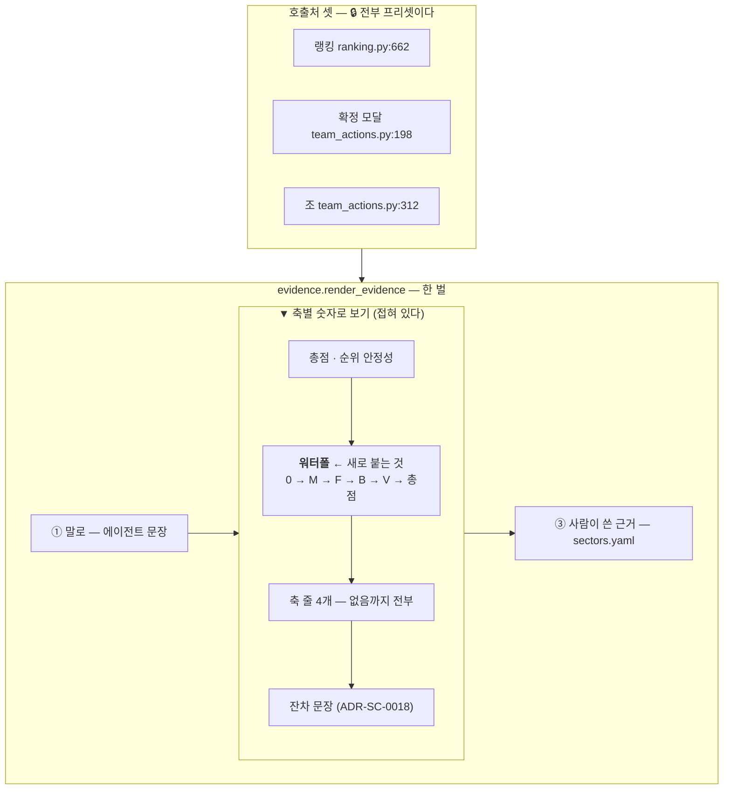

# ADR-SC-0019 — 워터폴은 «근거 패널» 안에 둔다

- **상태**: 채택
- **날짜**: 2026-09-20
- **관련**: 이슈 [#16](https://gitlab.com/mygithub05253/stock-coin-trade/-/issues/16)(설계 노트) ·
  [ADR-SC-0018](0018-기여합과-총점의-잔차를-드러낸다.md)(잔차 · 이 그림이 못 보여주는 것) ·
  [ADR-SC-0014](0014-점수-재현성과-가중치-슬라이더의-경계.md) ③④(프리셋 전용) ·
  [ADR-SC-0012](0012-근거-첨부와-확정-모달.md) ②(모달의 일을 좁게 둔다) ·
  [ADR-SC-0010](0010-두-배포-공존과-쓰기-상태-분리.md) ⑦(팔레트 정본) ·
  [ADR-SC-0016](0016-점수-표-검증을-데이터-경계로-올린다.md)(«조용히 빼지 않는다») ·
  [ADR-SC-0017](0017-막대-기준선과-가운데의-정의.md)(같은 계열 — 화면이 그림으로 하는 말)
- **개정하지 않는 것**: 4축 정의 · 프리셋 가중치 · 점수 재현성 계약 · 게시 경로 ·
  **게시된 점수 값**(한 칸도 안 바뀐다) · 원장 · **마이그레이션 0** · **의존 증가 0** ·
  `st.navigation` 페이지 3개
- **바꾸는 것**: `view` 에 `Waterfall`·`waterfall` 신설 · `explain` 에 문구 2개 ·
  `evidence` 의 «축별 숫자로 보기» 안에 그림 1개 · `ranking.CUSTOM_NOTICE` 한 낱말 ·
  테스트 헬퍼 `_bar_chart_of` → `_chart_by_field`

## 맥락 — 그릴 것은 정해졌고, **어디에** 그릴지가 안 정해졌다

이슈 #16 이 M10 착수 전에 세 가지를 실측으로 닫아 두었다 — 라이브러리는 **Altair**,
**잔차는 막대로 못 그린다**(1bp = 0.056px), **색으로 부호를 말하지 않는다**.
남은 것이 «어디에 그리나» 하나였고, 네 후보가 전부 대가를 달고 있었다.

🔴 그리고 착수해 보니 **이슈 본문의 전제 둘이 이미 낡아 있었다** (AGENTS.md 4.4 — 재현으로 밝혔다).

| 이슈가 적은 것 | 실제 |
|---|---|
| 완료 조건 «`requirements.txt` 에 `altair==6.2.2` 핀» | **이미 있다.** 이슈 #14 에서 들어갔고, 그 주석이 *"이슈 #16 M10 워터폴도 Altair 로 간다"* 고 **미리 적어 두었다** |
| 7절 🔴 «새 페이지는 `st.navigation` 경로 충돌을 다시 밟는다» | **과장이다.** `url_path=` 를 주면 그만이고 기존 3개 페이지가 이미 그렇게 한다(`streamlit_app.py:34`). 새 페이지의 진짜 대가는 **상태 복제**다 |

## 결정

### ① 그림은 `evidence.py` 의 «축별 숫자로 보기» **안**, 축 줄 목록 **위**에 둔다

🔒 **워터폴이 그릴 숫자는 이미 그 칸에 전부 있다.** 그 칸은 축마다
`… · 가중치 35 → 기여 +1,480` 을 나열하고 바로 아래에서 잔차까지 말한다
(ADR-SC-0018). 그림은 **새 사실이 아니라 그 목록의 그림**이다.

«말 → 숫자» 라는 `evidence.py` 머리주석의 순서를 칸 안에서 되풀이한다 —
**모양을 먼저 보이고 자릿수를 뒤에 편다.**

### ② 프리셋 전용(#16 7.1)이 **공짜로** 지켜진다

실측 — `render_evidence` 의 호출처 **셋이 전부 프리셋**이다.

| 호출처 | 프리셋인 이유 |
|---|---|
| `pages/ranking.py:662` | `if chosen and weighting.is_preset:` 블록 안 (`ranking.py:178`) |
| `team_actions.py:198` (확정 모달) | 같은 블록의 `render_sector_actions(profile=weighting.name)` 가 넘긴다 |
| `team_actions.py:312` (조) | 인자를 안 주므로 기본값 `balanced` |

🔒 그래서 «커스텀에서 열지 않는다» 를 **새로 막을 것이 없다.** 그 이유도 화면이
이미 말하고 있어(`CUSTOM_NOTICE`) 낱말 하나(«그림»)만 더했다.

🔴 이것이 새 페이지를 기각한 진짜 이유이기도 하다 — 새 페이지는 자기 가중치
선택기를 갖게 되고, 그 순간 `sector_story` 를 못 쓰는 **두 번째 총점 경로**가
필요해진다(#16 7.1). ADR-SC-0014 ③ 이 막으려던 상태로 그대로 돌아간다.

### ③ «합이 총점에 닿는다» 를 그림이 말할 수 없으면 **그리지 않는다**

워터폴은 *쌓으면 마지막에 닿는다*고 말하는 그림이다. 그 말이 거짓인 상태가 실재한다 —
게시된 총점이 게시된 z 로 재현되지 않으면(`Arithmetic.explained` 가 거짓) 어긋남에
**상한이 없다**(ADR-SC-0014 ①). 그때 그리면 화면이 검산할 수 없는 주장을 한다(절대 제약 8).

⚠️ 반대로 **반올림 잔차(±`bound_bp`)는 그려도 된다.** 상한이 구조적이고, 1bp 는
0.056px 라 애초에 보이지 않으며, 바로 아래 문장이 그 차이를 **숫자로** 말한다.
🔒 **그림이 못 보여주는 것을 글이 말하는 배치**다 — 그래서 #13 과 이 작업을 묶지 않은
이슈 #16 의 판단이 옳았다.

🔒 그리고 **조용히 빼지 않는다**(ADR-SC-0016 ④). 그림이 사라진 자리에
`explain.WATERFALL_ABSENT` 가 «왜 없는지» 를 남기고, **무엇이 어긋났는지는 바로 아래
`arithmetic_text` 가 경우마다 다르게** 말한다(총점이 없다 / 들어간 축이 없다 / 한도를
넘었다). 🔴 여기서 그 셋을 다시 나누면 같은 판정이 두 곳에서 갈릴 자리가 생긴다.

### ④ 마지막 막대는 **게시된 총점**에서 끝난다 — 쌓은 합이 아니다

실측(픽스처 `sec_2`) — 쌓은 합 **6,059** · 게시 총점 **6,060**(잔차 +1 · 한도 2).
쌓은 합까지 그리면 **게시되지 않은 수를 총점이라고 그리게 된다.**

🔒 골든이 이 구분을 잡는다. 잔차가 0 인 픽스처였다면 두 수가 같아서
«쌓은 합을 총점이라 그린다» 는 돌연변이가 살아남는다.

### ⑤ 점수에 들어간 축만 막대가 된다 — **이슈 #15 가 그림으로 올라오는 자리**

기여가 `None` 인 축(결측 z · 가중치 0)은 **0 높이 막대가 아니라 아예 없다.**
0 으로 그리면 「0 만큼 보탰다」와 「애초에 안 들어갔다」가 그림에서 같아진다(ADR-SC-0007).
네 축 전부는 아래 줄 목록과 `arithmetic_table` 이 «없음» 까지 보여준다 —
**그림은 점수의 산수만** 그린다.

### ⑥ 척도는 **bp** 다 — `score_bars` 가 σ 를 고른 것과 반대다

| | `score_bars` (막대) | `waterfall` (이 그림) |
|---|---|---|
| 그림의 일 | 21개 섹터를 **비교**시킨다 | 한 섹터의 산수를 **검산**시킨다 |
| 눈금을 읽나 | 안 읽는다 — 간격만 본다 | **읽는다** |
| 그래서 | σ (`12522` 는 즉시 못 읽는다) | **bp** (같은 칸의 모든 줄이 bp 다) |

🔒 같은 칸에서 그림만 다른 척도를 쓰면 팀원이 눈으로 검산할 수 없다.
⚠️ 이것은 이슈 #17 ①(`sigma_words` 를 총점에 쓴다)과 **다른 문제**다 — 저쪽은 축 z 의
구간을 총점에 쓰는 것이고, 기여와 총점은 애초에 **같은 척도**라 여기엔 혼용이 없다.

### ⑦ 색으로 부호를 말하지 않는다

🔒 **0 에서 출발하는 위치가 이미 부호를 말한다.** 색을 쓰려면 스펙에 박아야 하고
(프런트 테마는 `greenColor`·`redColor` 를 차트에 먹이지 않는다) 그러면 팔레트의 정본을
`config.toml` 하나로 둔 규율이 깨진다(ADR-SC-0010 ⑦). 🔴 게다가 **한국 관습은 상승이
빨강**이라 팀 7명이 같은 색을 반대로 읽는다.

## 기각한 대안

| 대안 | 왜 아닌가 |
|---|---|
| **새 «섹터 상세» 페이지** (계획서 D-5 원안) | `ranking.render` 가 하는 것을 다시 해야 한다 — `load_scores`+`DataUnavailable` · `_apply_link` · `_weight_controls` · `_filters` · **두 번째 섹터 선택 상태** · `share.ParamKey` 추가 · 약관상 의무인 `theme.footer` try/finally. 🔴 무엇보다 **가중치 선택기가 둘**이 되어 랭킹에서 본 표와 다른 가중치의 그림을 볼 수 있다 |
| **랭킹의 `_render_breakdown` 에만** | `evidence.py` 머리주석이 세운 «한 벌» 전제가 깨진다 — *"각자 근거를 그리면 문구가 갈라진다"*. 조 페이지에서 확정한 섹터를 볼 때 그림이 없고, 왜 없는지도 말하지 않는다 |
| **읽는 법 `howto.py` 에만** | 팀이 매일 쓰는 화면은 **랭킹**이다. ADR-SC-0018 이 잔차 문장을 근거 패널에도 붙인 이유가 그대로 적용된다 |
| 잔차를 **막대로** 그린다 | 1bp = **0.056px**. "반올림" 라벨만 뜨고 막대는 없는 상태가 된다 — 화면이 *"여기 무언가 있다"* 고 말하면서 아무것도 안 보여준다 (#16 §4) |
| 마지막 막대를 **쌓은 합**까지 | 게시되지 않은 수를 총점이라고 그리게 된다 (④) |
| w=0 축을 **0 높이 막대**로 | 이슈 #15 를 그림에서 되살린다 (⑤) |
| `.interactive()` (줌·팬) | `_bar_chart` 가 그것을 붙인 이유는 `st.bar_chart` 가 주던 것을 **빠짐없이 옮기려는** 것이었다(ADR-SC-0017 ⑤). 여기는 옮겨 올 원본이 없고 막대가 다섯뿐이라 확대할 것이 없다 |
| 차트를 `key=` 로 식별해 테스트가 가른다 | 🔴 **실측 — 안 된다.** `st.altair_chart(key=…)` 를 줘도 proto 의 `id`·`form_id` 가 **빈 문자열**이라 AppTest 가 볼 식별자가 남지 않는다(streamlit 1.63.0). «무엇을 그리는 차트인가» 로 가른다 |
| `Plotly go.Waterfall` | streamlit 의 `extra=="charts"` 라 **설치가 는다**. Altair 는 필수 의존이라 용량이 0 이다 (#16 §3) |

## 결과

- 🔒 **확정 모달의 일은 넓어지지 않았다**(ADR-SC-0012 ②). 그림은 **이미 접혀 있는**
  expander 안에 들어간다. 실측 — 접힌 expander 도 내용을 실행하고 전송하지만
  그 값이 **spec 215바이트**이고, AppTest 비용은 차트 없음 **4,211~9,245ms** vs
  `vega_lite_chart` **3,335~3,568ms**(각 3회)로 **잡음이 지배**한다.
- 🔴 기존 `_bar_chart_of` 의 `len(charts) == 1` 이 **먼저 빨개졌다.** 그 단언은 정확히
  이 상황(«위쪽에 차트가 하나 생기면 조용히 엉뚱한 것을 검사한다»)을 잡으라고 심어 둔
  것이다. `_chart_by_field(at, 필드)` 로 바꾸되 **«정확히 하나»는 유지**한다.
- **M10 ③⑤(원천 시계열 · 렌즈 비교)는 여전히 별도 작업**이다 — `sector_daily` 데이터
  경계 확장이 먼저다(#16 §8 · 로컬 `etf_shares_sum` 과 HF `etf_shares_idx_bp` 로 열이 다르다).
  ⚠️ 그것이 새 페이지로 가면 이 그림도 함께 옮길지 그때 판단한다. 지금 미리 페이지를
  여는 것은 **쓰지 않을 상태 복제를 먼저 치르는 일**이다.
