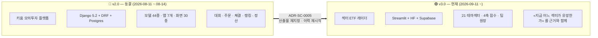

# 🧊 `v2-design/` — 동결된 v2.0 설계서. **현재 제품이 아니다**

> 🔴 **여기 55개 문서는 «키움 모의투자 플랫폼»(Django + DRF)의 설계서다.**
> 그 제품은 **2026-09-11 에 동결**됐다. 이 저장소가 지금 만드는 것은
> **v3.0 «섹터 ETF 레이더»**(Streamlit)이고, 그 문서는 [`../README.md`](../README.md) 에서 시작한다.
>
> 🔒 **여기 적힌 것을 현재 설계의 근거로 삼지 마라.** 모드 4종 · 대회 랭킹 ·
> 주문 체결 엔진 · pg_cron 잡 14종 · 모델 44종은 **전부 동결된 제품의 것**이다.

---

## 1. 왜 지우지 않고 남겼나

`backend/` 26,597줄이 **아직 저장소에 있고 계속 돌아야 하기 때문**이다.

```bash
cd backend && .venv/bin/pytest      # 골든 23건 · DB 불필요 ← 항상 통과해야 한다
```

이 한 줄이 M1·M7·M14 의 완료 조건에 들어 있다(→ [`../../AGENTS.md`](../../AGENTS.md) 1장).
동결은 **방치가 아니라 "개발하지 않으나 계속 돈다"** 는 뜻이고, 그 코드를 건드릴
일이 생기면 설명하는 문서가 여기뿐이다. 그래서 남긴다.

🔒 **입구 하나에만 표시하고 55개 파일은 고치지 않았다.** 파일마다 경고를 다는 것은
규칙으로 막는 일이고, 새 파일이 들어오면 곧 갈라진다. 입구를 지나지 않고 안으로
들어가는 경로를 줄이는 편이 낫다 — [ADR-SC-0016](../decisions/0016-점수-표-검증을-데이터-경계로-올린다.md) 이
«규칙으로 막지 않고 경로를 없앤다» 로 쓴 것과 같은 논리다.

---

## 2. 무엇이 바뀌었나 — 한눈에



| | v2.0 (동결) | v3.0 (현재) |
|---|---|---|
| **무엇** | 모의투자 **플랫폼** — 주문·체결·랭킹 | 섹터 **분석 대시보드** — 판단 근거 |
| **스택** | Django 5.2 · DRF · Postgres · HTMX | Streamlit · pandas · HF · Supabase |
| **데이터** | pykrx · KIS 실호가 | 🔴 **pykrx 금지** · KRX Open API · KIS |
| **사용자** | 대회 참가자 | 팀 7명 — 개발자가 아니다 |
| **코드** | `backend/` 26,597줄 · 테스트 384건 | `sector/` · `batch/` · `dashboard/` |
| **상태** | 🧊 개발하지 않는다. 🔒 골든 23건은 통과해야 한다 | 🟢 개발 중 |

---

## 3. 🔴 여기 문서가 적고 있으나 **지금은 금지된 것**

동결 문서를 읽다 보면 만나게 되는 것들이다. 현재 절대 제약과 **정면으로 충돌**한다.

| v2.0 문서가 적은 것 | 지금 | 근거 |
|---|---|---|
| `pykrx` 로 시세 수집 (F-16) | 🔴 **금지** | KRX FAQ 가 이름을 지목해 IP 차단 경고 (확정 사실 V3) |
| AI 분석 · 감성 점수 (F-14) | 🔴 **금지** | 절대 제약 2 — 매매 신호 경로에 LLM 금지 |
| 지식검색 RAG · pgvector (F-15 · E-06) | ⚠️ **분리 조건** | 절대 제약 3 — 신호 경로와 **물리적으로 분리된** 별도 서비스만 |
| 웹 데이터 수집기 (F-18) | 🔴 **대부분 금지** | 네이버 robots `Disallow: /` · 특약 (확정 사실 V6·V8) |
| pg_cron 잡 14종 (F-20) | ⚠️ | 현재 파이프라인은 로컬 배치 4걸음 |
| KRX 원천을 DB 에 적재 (E-04) | 🔴 **재배포 금지** | [ADR-SC-0006](../decisions/0006-krx-데이터-제3자-제공-금지.md) · 약관 제11조② |

---

## 4. 그래도 여기서 가져온 것

동결은 폐기가 아니다. v3.0 이 실제로 물려받은 것 —

- `templates/base.html` · `_partials/` · Tailwind · HTMX/Alpine **패턴** (→ [ADR-SC-0010](../decisions/0010-두-배포-공존과-쓰기-상태-분리.md))
- `trading/golden_test.py` 의 직렬화 관례(`_j()` — Decimal → `str`)
- **Django + Vercel 배포는 살아 있다** — 확장·쇼케이스용으로 공존한다(ADR-SC-0010).
  🔴 Vercel Root Directory 를 비워 둔다. `backend/` 로 바꾸면 함수 0개로 배포된다

---

## 5. 문서 지도 (동결 시점 그대로)

| 폴더 | 문서 수 | 무엇 |
|---|---|---|
| `features/version2.0/` | 25 | 기능 명세 — `F-00`~`F-21` · 통합본 · 요약본 |
| `erd/version2.0/` | 14 | 데이터 모델 — 모델 44종 · 앱 7개 |
| `api/version2.0/` | 8 | API 계약 — `A-01`~`A-06` |
| `ui/version2.0/` | 6 | 화면 30종 · HTMX 부분갱신 규약 |
| `v1.0-기능-인벤토리.md` | 1 | 강사님 원본 `08a23a7` 의 기능 20종 |

상세 목차는 [마스터인덱스 6절](../프로젝트_문서_마스터인덱스.md)에 있다.
