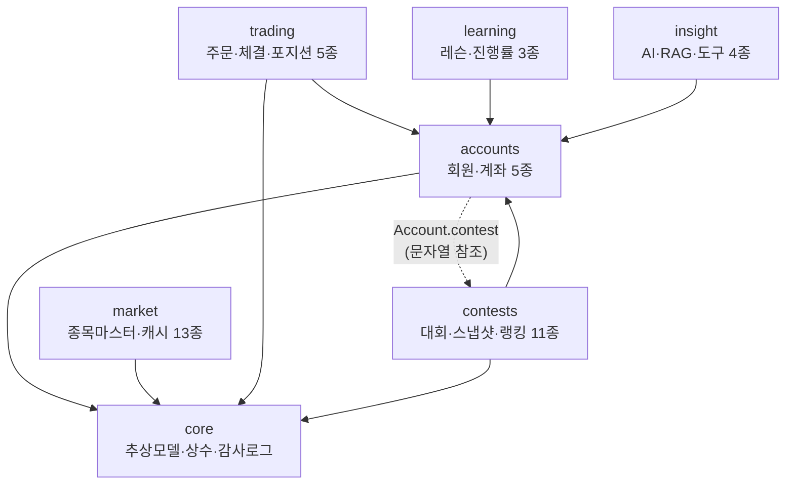
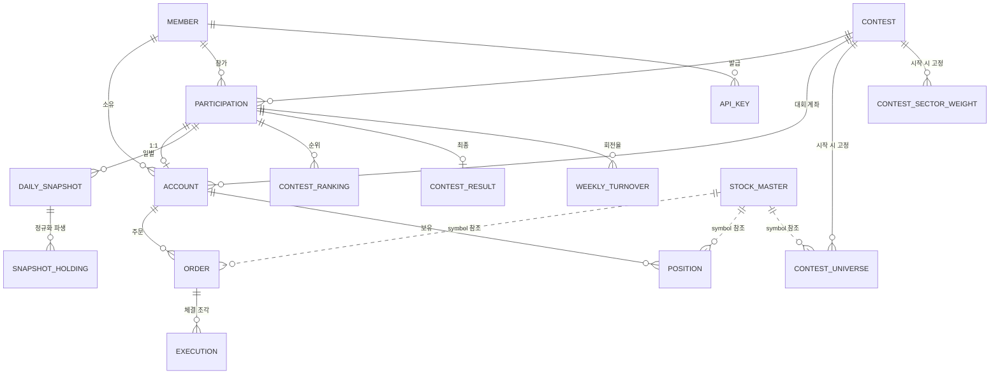

# v2.0 통합 ERD · 데이터 모델

> **문서 버전** v2.0 · **작성일** 2026-08-13 (KST) · **상태** 확정
> **입력** [v2.0 기능 명세 39종](../../features/version2.0/00-통합-기능명세서.md) · [UI](../../ui/version2.0/00-화면목록-라우팅.md) · [API](../../api/version2.0/00-API-전체목록.md)
> **다음** 세션 5 — Django 스캐폴딩 · 마이그레이션

**모델 44종 · 앱 7개.** 이 문서는 전체 지도이고, 상세는 `E-01`~`E-07` 에 있다.

---

## 1. 한 문장 요약

> v1.0 의 **`member.asset` 한 칸**을 **`Account` 여러 행**으로 쪼개고,
> 자산군별로 흩어져 있던 주문·포지션을 **`Order`·`Position` 으로 통합**한 뒤,
> 그 위에 **대회 도메인 11종**과 **일별 스냅샷**을 얹는다.

---

## 2. 앱 7개와 의존 방향



**`accounts` ↔ `contests` 만 양방향**이다. Django 의 문자열 참조(`"contests.Contest"`)로 푼다
(→ [02-공통-설계규약](02-공통-설계규약.md) 1.1).

| 앱 | 모델 | 문서 |
|---|---|---|
| `accounts` | 5 | [E-01](E-01-accounts.md) |
| `contests` | 11 | [E-02](E-02-contests.md) |
| `trading` | 5 | [E-03](E-03-trading.md) |
| `market` | 13 | [E-04](E-04-market.md) |
| `learning` | 3 | [E-05](E-05-learning.md) |
| `insight` | 4 | [E-06](E-06-insight.md) |
| `core` | 3 | [E-07](E-07-core.md) |

---

## 3. 핵심 관계도 (14종)

44개를 한 그림에 넣으면 읽을 수 없다. **거래와 대회의 뼈대만** 그린다.



**점선(`..`)은 FK 가 아니다.** 종목은 문자열 `symbol` 로만 참조한다 — 아래 5장.

---

## 4. 모델 44종 전체 목록

### 4.1 `accounts` — 5

| 모델 | 테이블 | 한 줄 |
|---|---|---|
| `Member` | `member` | `AbstractUser` 상속. `asset` 컬럼 없음 |
| **`Account`** | `account` | **모드별 계좌.** v2.0 의 중심 |
| `ApiKey` | `api_key` | 계좌 고정 · 해시만 저장 |
| `RateLimitCounter` | `rate_limit_counter` | 분당 카운터 (D-9) |
| `Watchlist` | `watchlist` | 관심종목 (구 localStorage) |

### 4.2 `contests` — 11

| 모델 | 테이블 | 한 줄 |
|---|---|---|
| `Contest` | `contest` | 대회 본체 · `rule_set` JSON |
| `Participation` | `participation` | 회원 × 대회 · 별칭 |
| `ContestUniverse` | `contest_universe` | 시작 시 고정된 종목·업종 |
| `ContestSectorWeight` | `contest_sector_weight` | 시장 섹터 비중 고정 |
| **`DailySnapshot`** | `daily_snapshot` | **일별 성과 + JSONB 원본** |
| **`SnapshotHolding`** | `snapshot_holding` | **종목별 정규화 파생** |
| `IntradaySnapshot` | `intraday_snapshot` | 장중 10분 (당일분만) |
| `ContestRanking` | `contest_ranking` | 일자별 순위 |
| `ContestResult` | `contest_result` | 최종 점수·등급 |
| `RuleViolation` | `rule_violation` | 위반 기록 |
| `WeeklyTurnover` | `weekly_turnover` | 주간 회전율 (확정/예상) |

### 4.3 `trading` — 5

| 모델 | 테이블 | 한 줄 |
|---|---|---|
| **`Order`** | `order` | **주식·코인·대체자산 통합** (D-4) |
| `Execution` | `execution` | 체결 조각 · 가정체결 표시 |
| `Position` | `position` | 현재 보유 |
| `AlternativeProduct` | `alternative_product` | 대체자산 11종 (구 하드코딩) |
| `AvgDownSimulation` | `avg_down_simulation` | 물타기 기록 |

### 4.4 `market` — 13

| 모델 | 테이블 | 한 줄 |
|---|---|---|
| `StockMaster` | `stock_master` | pykrx 일배치 · 규칙 판정 근거 |
| `TradingCalendar` | `trading_calendar` | 영업일 |
| `QuoteCache` | `quote_cache` | 현재가 · `is_simulated` |
| `OrderbookCache` | `orderbook_cache` | KIS 실호가 10단계 |
| `ChartCache` | `chart_cache` | 봉 데이터 |
| `IndexCache` | `index_cache` | KOSPI·KOSDAQ |
| `NewsCache` | `news_cache` | KRX 뉴스 |
| `ApiCallBudget` | `api_call_budget` | **KIS 초당 5건 전역 예산** |
| `SubscriptionRegistry` | `subscription_registry` | 폴링 우선순위 |
| `ExternalToken` | `external_token` | KIS 토큰 |
| `UpbitMarket` | `upbit_market` | 업비트 마켓 |
| `CryptoRank` | `crypto_rank` | **KRW 기준 재정의** (D-3) |
| `MarketIndexSnapshot` | `market_index_snapshot` | 지수 종가 시계열 |

### 4.5 `learning` — 3 · `insight` — 4 · `core` — 3

| 모델 | 테이블 | 한 줄 |
|---|---|---|
| `Lesson` | `lesson` | 14레슨 콘텐츠 (구 `analysis.js` 650줄) |
| `LearningProgress` | `learning_progress` | **진행률 서버 저장** |
| `Guide` | `guide` | 가이드 4종 · `last_verified_at` |
| `KnowledgeDocument` | `knowledge_document` | **pgvector** · 승인제 (D-8·D-6) |
| `AiUsageLog` | `ai_usage_log` | AI 쿼터·비용 |
| `SavedSheet` | `saved_sheet` | 수집한 표 |
| `WebFetchLog` | `web_fetch_log` | SSRF 차단 기록 |
| `DataSyncLog` | `data_sync_log` | 배치 관측성 |
| `AdminAuditLog` | `admin_audit_log` | 운영자 조치 감사 |
| `AppSetting` | `app_setting` | 런타임 설정 |

---

## 5. 종목을 FK 로 걸지 않는 이유 ★

`Order.symbol` · `Position.symbol` · `ContestUniverse.symbol` 은 **문자열**이고
`StockMaster` 로 FK 를 걸지 않는다.

| 이유 | |
|---|---|
| **자산군이 섞인다** | 주식 `005930` · 코인 `KRW-BTC` · 대체자산 `FUT-K200` 이 한 컬럼에 온다. 세 마스터 테이블 중 하나로 FK 를 걸 수 없다 |
| **상장폐지가 이력을 막는다** | 종목이 사라져도 과거 주문은 남아야 한다. FK + `PROTECT` 면 마스터 정리가 막히고, `CASCADE` 면 이력이 지워진다 |
| **마스터가 배치로 통째 갱신된다** | pykrx 수집이 FK 제약에 걸려 실패하는 경로를 만들지 않는다 |

**대신 잃는 것**: DB 가 오타 종목코드를 막아주지 않는다.
→ **주문 접수 시 `StockMaster` 조회를 필수 단계로 둔다**([F-04](../../features/version2.0/F-04-대회-규칙엔진.md) 4.1 ③).
규칙 검증이 어차피 마스터를 읽으므로 추가 비용이 없다.

---

## 6. 3대 흐름

### 6.1 주문 → 체결 → 포지션

```
① Account 잠금 (select_for_update)
② 대회면 규칙 검증 — StockMaster · ContestUniverse · ContestSectorWeight · Position
③ OrderbookCache 로 체결 조각 계산 → Execution N행
④ 비용 계산 — Contest.fee_bp / tax_bp (연습은 AppSetting)
⑤ Account.cash 차감 · Position upsert · Order 기록
```

**미체결 잔량은 `PARTIAL` 로 남아** `match_pending_orders` 잡(5초)이 시장 체결을 추종한다.
비동기 워커 없이 타임폴리오 체결을 재현하는 절충안이다.

### 6.2 일별 정산 (매 영업일 15:40)

```
Position + QuoteCache(종가)
   └─▶ DailySnapshot  (upsert, UNIQUE(participation, date))
          ├─▶ SnapshotHolding  (전량 삭제 후 재삽입)
          ├─▶ ContestRanking   (upsert)
          ├─▶ RuleViolation    (한도 초과 상태)
          └─▶ WeeklyTurnover   (주중 누적, is_confirmed=False)
```

**모든 단계가 멱등이다.** 두 번 돌아도 결과가 같다.

### 6.3 시세 캐시

```
SubscriptionRegistry (우선순위)
   └─▶ ApiCallBudget 확인 (KIS 초당 5건)
          └─▶ KIS 호출 → QuoteCache · OrderbookCache upsert
                 └─▶ 화면·체결은 캐시만 읽는다 (외부 호출 없음)
```

---

## 7. 규모 추정

대회 1회(참가자 100명 · 1달 = 20영업일) 기준.

| 테이블 | 행 수 | 근거 |
|---|---|---|
| `Order` | ~2만 | 참가자당 하루 10건 |
| `Execution` | ~4만 | 주문당 조각 2개 |
| `Position` | ~1,500 | 참가자당 15종목 |
| `DailySnapshot` | 2,000 | 100 × 20 |
| **`SnapshotHolding`** | **~3만** | 100 × 15 × 20 |
| `IntradaySnapshot` | 4,000/일 | 100 × 40. **당일분만 보관** |
| `ContestRanking` | 2,000 | |
| `StockMaster` | ~2,700 | 전 상장종목 |
| `QuoteCache` | ~3,000 | 종목 + 코인 |

**전부 인덱스 하나로 처리되는 규모다.** 파티셔닝·샤딩은 필요 없다.
[04-인덱스-쿼리-전략](04-인덱스-쿼리-전략.md)에서 쿼리별로 확인한다.

---

## 8. v1.0 결함이 데이터 모델에서 해소되는 지점

| 결함 | 해소 장치 |
|---|---|
| **D-3** 랭킹 API 3개 미사용 | `ContestRanking`(대회) · `StockMaster.market_cap`(시총) · `CryptoRank`(KRW 재정의) |
| **D-4** 코인 주문 이력 없음 | `Order.asset_class = "CRYPTO"` |
| **D-5** 계좌 초기화가 코인을 안 지움 | `Account` 모드별 분리 + 조건부 유니크 |
| **D-6** 인증 없는 엔드포인트 | `AiUsageLog` 쿼터 · `KnowledgeDocument.is_approved` · `WebFetchLog` |
| **D-8** Qdrant `:memory:` | `KnowledgeDocument.embedding` (pgvector) |
| **D-9** 프로세스 메모리 캐시 | 캐시 테이블 5종 · `ApiCallBudget` · `RateLimitCounter` |

**모델 구조 자체가 결함을 막는다.** 규율에 기대지 않는 것이 이 설계의 목표다.

---

## 9. 기능 명세에서 조정한 것

ERD 를 짜면서 기능 명세와 어긋나거나 구현할 수 없는 지점 **12건**을 발견해 조정했다.
(명세 수정 3 · 필드 보강 8 · 새 결함 1)
→ [06-기능명세-정합성-변경노트](06-기능명세-정합성-변경노트.md)

가장 큰 것은 **`MarketIndexSnapshot.nav` 를 저장할 수 없다**는 것이다
(대회마다 기준일이 달라 한 행에 담기지 않는다).

---

## 10. 문서 목록

| 문서 | 내용 |
|---|---|
| [01-요약본](01-요약본.md) | 1장 요약 |
| **[02-공통-설계규약](02-공통-설계규약.md)** | **타입·명명·`on_delete`·제약·시간 — 먼저 읽을 것** |
| [03-v1.0-스키마-대조표](03-v1.0-스키마-대조표.md) | v1.0 테이블 → v2.0 매핑 |
| [04-인덱스-쿼리-전략](04-인덱스-쿼리-전략.md) | 조회 패턴별 인덱스 근거 |
| [05-마이그레이션-순서와-시드](05-마이그레이션-순서와-시드.md) | 착수 절차 |
| [06-기능명세-정합성-변경노트](06-기능명세-정합성-변경노트.md) | 조정 7건 |
| [E-01](E-01-accounts.md) ~ [E-07](E-07-core.md) | 앱별 상세 + `models.py` |
