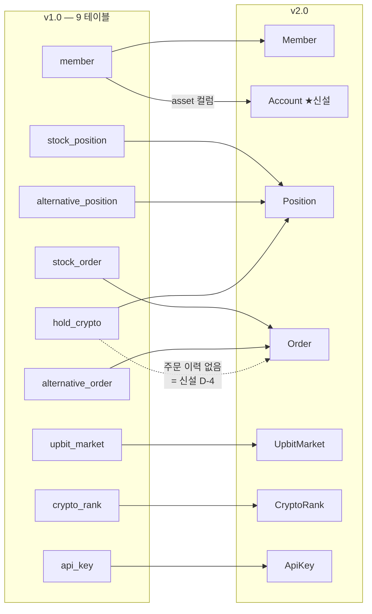

# v1.0 → v2.0 스키마 대조표

> **문서 버전** v2.0 · **작성일** 2026-08-13 (KST) · **상위** [00-통합-ERD](00-통합-ERD.md)
> **v1.0 원본** `database/db.sql` (MySQL/MariaDB · 강사님 원본 `08a23a7` 동결본)

v1.0 은 **테이블 9개**다. v2.0 은 44개다. 이 문서는 **9개가 어디로 갔는지**를 추적한다.

---

## 1. 엔진이 바뀐다 ★

| | v1.0 | v2.0 |
|---|---|---|
| DBMS | **MySQL / MariaDB** (`mockinv` 스키마) | **PostgreSQL** (Supabase) |
| 마이그레이션 | `db.sql` 수동 + `ensure_tables()` 런타임 `CREATE TABLE IF NOT EXISTS` | **Django 마이그레이션** |
| 문자셋 | `utf8mb4` / **일부 `utf8`** (아래 1.1) | UTF-8 단일 |
| PK 이름 | `<테이블>_id` (`member_id`) | `id` (Django 관례) |

### 1.1 v1.0 의 문자셋 불일치 — 잠재 결함

`member` 와 `upbit_market` 만 `CHARSET=utf8`(3바이트)이고 나머지는 `utf8mb4`(4바이트)다.

```sql
`member` ... DEFAULT CHARSET=utf8 COLLATE=utf8_general_ci
`stock_order` ... DEFAULT CHARSET=utf8mb4 COLLATE=utf8mb4_general_ci
```

- **이모지가 들어간 사용자명은 `member` 에 저장할 수 없다** (MySQL `utf8` 은 3바이트라 이모지 불가)
- 서로 다른 콜레이션 간 조인은 MySQL 에서 인덱스를 못 타는 경우가 있다

**Postgres 로 가면 이 문제가 통째로 사라진다.** 문자셋 개념이 데이터베이스 단위 하나뿐이다.
인벤토리 결함 목록에는 없던 항목이라 여기 기록해 둔다.

### 1.2 데이터 이관은 하지 않는다

v1.0 은 **수업 실습용**이고 실제 사용자 데이터가 없다(`member` 1행, `hold_crypto` 2행).
**v2.0 은 빈 DB 에서 시작**하고, 데모 데이터는 `seed_demo` 커맨드로 만든다.

→ 이관 스크립트를 쓰지 않는다. [05-마이그레이션-순서와-시드](05-마이그레이션-순서와-시드.md) 참조.

---

## 2. 테이블 9개의 행선지



| v1.0 테이블 | 행 | v2.0 | 비고 |
|---|---|---|---|
| `member` | 1 | `Member` + **`Account`** | `asset` 컬럼이 계좌로 분리 |
| `stock_position` | — | `Position(asset_class="STOCK")` | |
| `alternative_position` | — | `Position(asset_class="ALT")` | |
| `hold_crypto` | 2 | `Position(asset_class="CRYPTO")` | |
| `stock_order` | — | `Order(asset_class="STOCK")` | |
| `alternative_order` | — | `Order(asset_class="ALT")` | |
| **(없음)** | — | **`Order(asset_class="CRYPTO")`** | **결함 D-4 해소** |
| `upbit_market` | 3 | `UpbitMarket` | PK 를 `market` 문자열로 |
| `crypto_rank` | 100 | `CryptoRank` | **USD → KRW 재정의** |
| `api_key` | — | `ApiKey` | **`account` 고정 추가** |

---

## 3. `member` — 가장 큰 변화 ★

### v1.0

```sql
CREATE TABLE `member` (
  `member_id` bigint(20) NOT NULL AUTO_INCREMENT,
  `asset`     bigint(20) NOT NULL CHECK (`asset` >= 0),   -- ← 현금 한 칸
  `email`     varchar(255) DEFAULT NULL,                   -- ← UNIQUE 아님
  `password`  varchar(255) DEFAULT NULL,                   -- bcrypt
  `username`  varchar(255) DEFAULT NULL,
  PRIMARY KEY (`member_id`)
);
```

### v2.0

| v1.0 컬럼 | v2.0 위치 | 변화 |
|---|---|---|
| `member_id` | `Member.id` | |
| **`asset`** | **`Account.cash` × N행** | **한 칸 → 모드별 계좌** |
| `email` | `Member.email` | **UNIQUE 추가** (v1.0 은 제약이 없어 중복 가입이 가능했다) |
| `password` | `Member.password` | bcrypt 직접 구현 → Django PBKDF2 |
| `username` | `Member.username` + `display_name` | 로그인 ID 와 표시명 분리 |
| — | `is_staff` / `is_active` / `date_joined` / `last_login` | `AbstractUser` 기본 |

### 3.1 `CHECK (asset >= 0)` 는 어디로 갔나

v1.0 은 현금이 음수가 되지 않게 DB 제약을 걸었다. **좋은 판단이라 승계한다.**

```python
# Account
models.CheckConstraint(check=models.Q(cash__gte=0), name="account_ck_cash_nonneg")
```

**다만 v2.0 은 이것만으로 부족하다.** 수수료·세금이 생겨
`cash >= 체결금액 + 수수료` 를 검증해야 한다(→ [F-03](../../features/version2.0/F-03-주문-체결엔진.md) 7.3).
DB 제약은 마지막 방어선이고, 서비스 계층이 먼저 막는다.

---

## 4. 포지션 3종 → `Position` 하나

### 4.1 컬럼 대조

| v1.0 | 컬럼 | v2.0 `Position` |
|---|---|---|
| `stock_position` | `member_id` · `symbol` · `quantity` int · `avg_price` bigint | `account` · `symbol` · `qty` numeric(28,8) · `avg_price` numeric(20,8) |
| `alternative_position` | + `category` varchar(20) | `asset_class` + `AlternativeProduct.category` 로 이동 |
| `hold_crypto` | `buy_average` double · `buy_crypto_count` double · `buy_total_krw` bigint · **`upbit_market_id` FK** | `avg_price` · `qty` · `principal` · `symbol` **문자열** |

### 4.2 세 가지 주의점 ★

**① `hold_crypto` 만 마켓을 FK 로 참조했다**

```sql
`upbit_market_id` bigint(20) DEFAULT NULL,
CONSTRAINT FOREIGN KEY (`upbit_market_id`) REFERENCES `upbit_market` (`upbit_market_id`)
```

v2.0 은 **문자열 `symbol`("KRW-BTC")로 통일**한다. 주식·코인·대체자산이 한 테이블에 살아
세 마스터 중 하나로 FK 를 걸 수 없기 때문이다(→ [00-통합-ERD](00-통합-ERD.md) 5장).

**② `double` 을 쓰던 코인 수량·평단을 `numeric` 으로 바꾼다**

```sql
`buy_average`     double NOT NULL,   -- ← 부동소수점
`buy_crypto_count` double NOT NULL,
```

`double` 은 이진 부동소수점이라 **0.1 + 0.2 ≠ 0.3** 이 된다.
금액 계산에 쓰면 오차가 누적된다. v2.0 은 `numeric(28,8)` / `numeric(20,8)` 을 쓴다.

> 실제로 v1.0 데이터에 `buy_crypto_count = 0.22408274` 같은 값이 들어 있다.
> 이 수량으로 매도 비율을 계산하면 오차가 원 단위 손익에 그대로 흘러든다.

**③ `stock_position.quantity` 는 `int` 다**

주식은 정수 수량이라 맞는 타입이지만, **통합 테이블에서는 코인과 칸을 공유**해야 한다.
`numeric(28,8)` 로 넓히고, 주식 경로에서만 정수로 검증한다.

### 4.3 `UNIQUE(member, symbol)` 은 승계한다

v1.0 이 이미 `uq_stock_position_member_symbol` 을 걸어 두었다. 옳은 설계다.
v2.0 은 주체만 바꿔 **`UNIQUE(account, symbol)`** 로 간다.

---

## 5. 주문 2종 → `Order` 하나 (+ 코인 신설)

| v1.0 컬럼 | v2.0 `Order` |
|---|---|
| `member_id` | `account` |
| `symbol` · `name` | `symbol` (종목명은 `StockMaster` 에서 조인) |
| `order_type` varchar(4) — **`BUY`/`SELL`** | **`side`** ★ 이름이 바뀐다 |
| `quantity` int | `requested_qty` · `filled_qty` numeric |
| `price` bigint | `avg_fill_price` numeric |
| `amount` bigint | `gross_amount` |
| `source` varchar(20) 기본 `WEB` | `source` — **그대로 승계** |
| `created_at` | `created_at` |
| `alternative_order.category` | `asset_class` |
| `alternative_order.multiplier` | `AlternativeProduct.multiplier` 로 이동 |
| — | **신설**: `order_type`(가격유형 5종) · `price_level` · `limit_price` · `stop_price` · `requested_weight_pct` · `fee` · `tax` · `net_amount` · `realized_pnl` · `status` · `execution_mode` · `reject_rule` |

### 5.1 `order_type` 이름 충돌 ★

**v1.0 의 `order_type` 은 매수/매도**(`BUY`/`SELL`)를 담았다.
v2.0 의 `order_type` 은 **가격 유형**(시장가/지정가/상대호가/자기호가/STOP)이다.

**같은 이름이 다른 뜻이다.** 포팅할 때 반드시 걸리는 지점이라 못 박아 둔다.

| | v1.0 | v2.0 |
|---|---|---|
| 매수/매도 | `order_type` | **`side`** |
| 가격 유형 | (없음 — 항상 현재가 즉시 체결) | **`order_type`** |

### 5.2 v1.0 에 없던 것 — 상태

v1.0 주문은 **상태가 없다.** 항상 즉시 전량 체결되므로 필요가 없었다.
v2.0 은 부분체결·예약·거부가 생기므로 `status` 6종이 들어온다.

### 5.3 인덱스는 승계한다

```sql
KEY `idx_stock_order_member_created` (`member_id`,`created_at`)
```

거래이력 화면이 "내 주문 최신순"이라 정확한 인덱스다.
v2.0 은 `(account, -created_at)` 으로 주체만 바꾼다.

---

## 6. `crypto_rank` — 통째로 재정의 ★ (결함 D-3)

### v1.0

```sql
CREATE TABLE `crypto_rank` (
  `crypto_rank_id`    bigint AUTO_INCREMENT,
  `api_crypto_id`     int,              -- CoinMarketCap 의 id
  `name`              varchar(255),
  `market_cap`        decimal(38,2),    -- ← USD
  `percent_change24h` float,
  `percent_change7d`  float,
  `price`             float,            -- ← USD
  `symbol`            varchar(255)      -- 'BTC' (마켓코드가 아니다)
);
```

**문제가 셋이다.**

1. **USD 기준인데 거래는 KRW 로 한다** — 데이터가 연결되지 않는다
2. **`symbol`이 `BTC`** 인데 거래는 `KRW-BTC` 로 한다 — 조인할 키가 없다
3. **어느 화면에서도 쓰지 않는다** — 스케줄러가 매시 채우기만 했다(결함 D-3)

게다가 갱신 방식이 `TRUNCATE` 후 재적재라, **동기화 중에 조회하면 빈 테이블**이 보인다.

### v2.0

| | v2.0 `CryptoRank` |
|---|---|
| 기준 | **업비트 KRW 마켓 24시간 거래대금** |
| 키 | **`market`("KRW-BTC")** — 거래·보유와 같은 키 |
| 소스 | 업비트 (CoinMarketCap API 키 의존 제거) |
| 갱신 | **upsert** (빈 테이블이 보이는 창 제거) |
| 사용처 | **코인 연습 화면에 실제로 표시** |

`price` · `market_cap` 이 `float` 이던 것도 `numeric` 으로 바꾼다.

---

## 7. `upbit_market` · `api_key`

### 7.1 `upbit_market`

| v1.0 | v2.0 |
|---|---|
| `upbit_market_id` bigint PK | **`market` varchar PK** — `KRW-BTC` |
| `market_code` varchar | (PK 로 승격) |
| `korean_name` · `english_name` | 승계 |
| — | `is_warning`(유의 종목) · `is_active` 추가 |

**PK 를 문자열로 바꾸는 이유**: `Position.symbol` · `Order.symbol` 과 같은 값을 쓰게 되어
사람이 읽을 때도 조인할 때도 자연스럽다.

### 7.2 `api_key`

| v1.0 | v2.0 | 변화 |
|---|---|---|
| `label` | `name` | 이름만 |
| `key_prefix` varchar(16) | 승계 | |
| `key_hash` char(64) UNIQUE | 승계 | **평문 미저장 설계는 그대로 좋다** |
| `is_active` | 승계 | soft delete |
| `last_used_at` | 승계 | |
| — | **`account` FK** | **주문 대상 계좌 고정** ★ |
| — | `revoked_at` | |

v1.0 은 회원당 계좌가 하나라 지정이 필요 없었다. v2.0 은 4개 이상이라 **키에 계좌를 못 박는다.**

---

## 8. v1.0 에 없어서 신설되는 것 (35종)

| 영역 | 신설 |
|---|---|
| **계좌** | `Account` |
| **대회** | `Contest` 외 10종 — v1.0 에 대회 개념 자체가 없다 |
| **체결** | `Execution` — v1.0 은 부분체결이 없다 |
| **시장 데이터** | `StockMaster` · `TradingCalendar` · 캐시 5종 · `ApiCallBudget` · `SubscriptionRegistry` · `ExternalToken` · `MarketIndexSnapshot` |
| **대체자산** | `AlternativeProduct` — v1.0 은 파이썬 상수 |
| **학습** | `Lesson` · `LearningProgress` · `Guide` — v1.0 은 JS 파일 + localStorage |
| **AI·지식** | `KnowledgeDocument`(Qdrant 대체) · `AiUsageLog` |
| **도구** | `SavedSheet` · `WebFetchLog` |
| **운영** | `DataSyncLog` · `AdminAuditLog` · `AppSetting` · `RateLimitCounter` · `Watchlist` |

**"v1.0 에 있던 것을 어디에 뒀는가"보다 "없던 것을 왜 만드는가"가 더 많다.**
그중 절반이 **결함 D-6·D-8·D-9(인증·영속성·캐시)**를 구조적으로 막기 위한 테이블이다.

---

## 9. `ensure_tables()` 는 폐기한다 ★

v1.0 은 앱 기동 시 `CREATE TABLE IF NOT EXISTS` 를 실행해
"재배포만으로 새 기능이 동작"하게 했다. 영리한 장치였지만:

| 문제 | |
|---|---|
| **Django 마이그레이션과 충돌** | 두 개의 스키마 권위가 생긴다 |
| **기동 시 부수효과** | `manage.py` 커맨드·테스트에서도 발동한다 |
| 스키마 변경 이력이 없다 | 롤백할 수 없다 |

v2.0 은 **정규 마이그레이션**(`makemigrations` → `migrate`)만 쓴다.

---

## 10. 관련 문서

- 전체 지도 → [00-통합-ERD](00-통합-ERD.md)
- 착수 절차 → [05-마이그레이션-순서와-시드](05-마이그레이션-순서와-시드.md)
- v1.0 기능 인벤토리 → [v1.0-기능-인벤토리](../../v1.0-기능-인벤토리.md)
