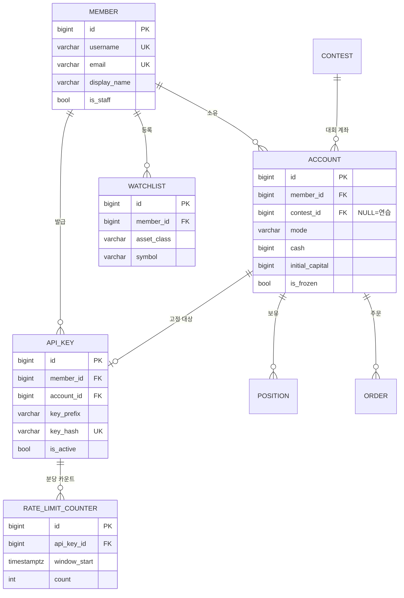

# E-01. `accounts` — 회원 · 계좌 · API 키

> **문서 버전** v2.0 · **작성일** 2026-08-13 (KST) · **전제** [02-공통-설계규약](02-공통-설계규약.md)
> **기능 명세** [F-01 계정·인증](../../features/version2.0/F-01-계정-인증.md) ·
> [F-00 모드 체계](../../features/version2.0/F-00-모드체계와-범위경계.md) ·
> [F-13 Open API](../../features/version2.0/F-13-OpenAPI.md)

**v2.0 데이터 모델에서 가장 큰 변화가 이 앱에 있다** — `member.asset` 한 칸이
`Account` 여러 행으로 쪼개진다.

---

## 1. 모델 5종

| 모델 | 테이블 | 역할 |
|---|---|---|
| `Member` | `member` | 회원 (`AbstractUser` 상속) |
| `Account` | `account` | **모드별 계좌.** v2.0 의 중심 |
| `ApiKey` | `api_key` | Open API 키 (계좌 고정) |
| `RateLimitCounter` | `rate_limit_counter` | API 유량 카운터 (Postgres 기반) |
| `Watchlist` | `watchlist` | 관심종목 (구 `localStorage`) |

---

## 2. 관계도



---

## 3. `Member` — 회원

### 3.1 스키마

| 필드 | 타입 | 제약 | 설명 |
|---|---|---|---|
| `id` | bigint | PK | |
| `username` | varchar(150) | UNIQUE | 로그인 ID (`AbstractUser` 기본) |
| `email` | varchar(254) | **UNIQUE** | `AbstractUser` 기본은 유니크가 아니라 **직접 덮어쓴다** |
| `password` | varchar(128) | | Django PBKDF2 해시 |
| `display_name` | varchar(30) | | 기본 표시명. 대회에서는 별칭을 따로 쓴다 |
| `avatar` | varchar(200) | null | 프로필 이미지 경로 |
| `is_active` | bool | 기본 `true` | **탈퇴 = `false`** (행을 지우지 않는다 → 규약 5.1) |
| `is_staff` / `is_superuser` | bool | | Django Admin 접근 |
| `date_joined` / `last_login` | timestamptz | | `AbstractUser` 기본 |

**`asset` 컬럼은 없다.** 현금은 전부 `Account.cash` 에 있다.

### 3.2 코드

```python
# accounts/models.py
from django.contrib.auth.models import AbstractUser
from django.db import models


class Member(AbstractUser):
    """회원.

    v1.0 은 member 테이블을 직접 정의하고 bcrypt 해싱·Flask 서명쿠키를 손으로 만들었다.
    AbstractUser 를 상속하면 비밀번호 해싱·세션·권한·Admin 연동이 전부 딸려온다.

    Django 관점 — 커스텀 User 모델은 **첫 마이그레이션 전에** 정해야 한다.
    나중에 바꾸려면 기존 FK 를 전부 손봐야 해서 사실상 재구축이다.
    settings.py 에 AUTH_USER_MODEL = "accounts.Member" 를 처음부터 박아둔다.
    """

    # AbstractUser 의 email 은 유니크가 아니다. v1.0 이 이메일 유니크를 전제했으므로 덮어쓴다
    email = models.EmailField(unique=True, verbose_name="이메일")
    display_name = models.CharField(max_length=30, blank=True, verbose_name="표시명")
    avatar = models.ImageField(upload_to="avatars/", null=True, blank=True, verbose_name="프로필 이미지")

    class Meta:
        db_table = "member"
        verbose_name = "회원"
        verbose_name_plural = "회원"

    def __str__(self):
        return f"{self.display_name or self.username}"
```

> **Django 관점** — FastAPI 에서는 `POST /members` 핸들러에서 `bcrypt.hashpw()` 를
> 직접 불렀다. Django 는 `Member.objects.create_user(...)` 가 해싱까지 한다.
> **`create()` 를 쓰면 비밀번호가 평문으로 들어간다** — 이게 초보자가 가장 많이 하는 실수다.

### 3.3 권한 — 이메일 하드코딩 폐기 (결함 D-1)

| 역할 | 판정 |
|---|---|
| 일반 회원 | 로그인 |
| 대회 운영자 | `Group("contest_admin")` |
| 콘텐츠 운영자 | `Group("content_admin")` |
| 관리자 | `is_staff` / `is_superuser` |

그룹은 마이그레이션에서 생성한다 (→ [05-마이그레이션-순서와-시드](05-마이그레이션-순서와-시드.md)).

---

## 4. `Account` — 모드별 계좌 ★

**v2.0 데이터 모델의 심장이다.** 모든 포지션·주문의 소유자가 `member` 에서 `account` 로 바뀐다.

### 4.1 스키마

| 필드 | 타입 | 제약 | 설명 |
|---|---|---|---|
| `id` | bigint | PK | |
| `member_id` | bigint | FK **PROTECT** | 소유자 |
| `contest_id` | bigint | FK PROTECT, **null** | **대회 계좌면 값이 있고, 연습 계좌면 `NULL`** |
| `mode` | varchar(20) | choices | `CONTEST` / `PRACTICE_STOCK` / `PRACTICE_CRYPTO` / `PRACTICE_ALT` |
| `cash` | bigint | ≥ 0 | 현금 (원) |
| `initial_capital` | bigint | | 시작 자본. 수익률 기준선이자 초기화 목표값 |
| `is_frozen` | bool | 기본 `false` | 대회 종료 후 동결 → 주문 불가 |
| `reset_at` | timestamptz | null | 마지막 초기화 시각 |
| `created_at` / `updated_at` | timestamptz | | |

### 4.2 제약 3종 ★

```python
class Meta:
    db_table = "account"
    constraints = [
        # ① 연습 계좌 — 회원당 모드별 1개. contest 가 NULL 인 행만 대상으로 한다.
        #    조건 없이 걸면 NULL != NULL 규칙 때문에 무제한으로 생긴다 (규약 6.1)
        models.UniqueConstraint(
            fields=["member", "mode"],
            condition=models.Q(contest__isnull=True),
            name="account_uniq_practice_mode",
        ),
        # ② 대회 계좌 — 회원당 대회별 1개
        models.UniqueConstraint(
            fields=["member", "contest"],
            condition=models.Q(contest__isnull=False),
            name="account_uniq_contest",
        ),
        # ③ mode 와 contest 가 어긋나지 않게 DB 가 막는다.
        #    "대회 모드인데 대회가 없음" / "연습 모드인데 대회가 붙음" 을 둘 다 차단
        models.CheckConstraint(
            check=(
                models.Q(mode=AccountMode.CONTEST, contest__isnull=False)
                | (~models.Q(mode=AccountMode.CONTEST) & models.Q(contest__isnull=True))
            ),
            name="account_ck_mode_contest_match",
        ),
    ]
```

### 4.3 코드

```python
from core.constants import AccountMode
from core.models import TimeStampedModel

INITIAL_PRACTICE_CAPITAL = 100_000_000        # 1억 — v1.0 INITIAL_ASSET 승계


class Account(TimeStampedModel):
    """모드별 계좌.

    v1.0 은 member.asset 한 칸으로 주식·코인·대체자산을 전부 사고팔았다.
    그래서 "주식 실력"을 따로 측정할 수 없었고, 계좌 초기화가 코인을 안 지우는
    결함(D-5)의 원인이기도 했다. v2.0 은 모드마다 계좌를 분리한다.

    Django 관점 — FastAPI 에서는 member.asset 을 서비스 계층에서 직접 만졌다.
    Django 에서는 member.accounts.get(mode="PRACTICE_STOCK") 처럼 역참조 매니저로 꺼낸다.
    related_name="accounts" 가 그 이름을 만든다.
    """

    member = models.ForeignKey(
        "accounts.Member",
        on_delete=models.PROTECT,          # 회원을 지워도 계좌·거래이력은 남아야 한다
        related_name="accounts",
        verbose_name="회원",
    )
    contest = models.ForeignKey(
        "contests.Contest",                # 문자열 참조 — 순환 임포트를 피한다 (규약 1.1)
        on_delete=models.PROTECT,
        null=True, blank=True,
        related_name="accounts",
        verbose_name="대회",
        help_text="대회 계좌면 값이 있고, 연습 계좌면 비어 있다",
    )
    mode = models.CharField(max_length=20, choices=AccountMode.choices, verbose_name="모드")
    cash = models.BigIntegerField(default=0, verbose_name="현금(원)")
    initial_capital = models.BigIntegerField(
        default=INITIAL_PRACTICE_CAPITAL, verbose_name="시작 자본(원)"
    )
    is_frozen = models.BooleanField(default=False, verbose_name="동결 여부")
    reset_at = models.DateTimeField(null=True, blank=True, verbose_name="마지막 초기화")

    class Meta:
        db_table = "account"
        verbose_name = "계좌"
        verbose_name_plural = "계좌"
        indexes = [
            models.Index(fields=["member", "mode"], name="account_idx_member_mode"),
            models.Index(fields=["contest"], name="account_idx_contest"),
        ]
        constraints = [...]                # 4.2 참조

    @property
    def asset_class(self) -> str:
        """모드가 자산군을 결정한다. 컬럼으로 두지 않는 이유는 규약 8.1 참조."""
        return AccountMode(self.mode).asset_class

    @property
    def is_contest(self) -> bool:
        return self.mode == AccountMode.CONTEST
```

### 4.4 생성 시점

| 계좌 | 생성 시점 | 시작 자본 |
|---|---|---|
| `PRACTICE_STOCK` · `PRACTICE_CRYPTO` · `PRACTICE_ALT` | **회원 가입 시 3개 자동 생성** | 각 1억 |
| `CONTEST` | **참가 승인(`APPROVED`) 시점** | `Contest.initial_capital` |

가입 시 자동 생성은 **시그널이 아니라 서비스 함수**에서 한다.

> **Django 관점** — `post_save` 시그널로 만드는 예제를 흔히 보지만, 시그널은
> `seed_demo` 같은 커맨드·테스트 픽스처에서도 몰래 발동해 디버깅이 어려워진다.
> `accounts/services.py::register_member()` 안에서 `transaction.atomic()` 으로
> **회원 생성과 계좌 3개 생성을 한 트랜잭션에** 묶는 편이 명시적이다.

### 4.5 계좌 초기화 (결함 D-5 해소)

```python
@transaction.atomic
def reset_account(account: Account, *, keep_orders: bool = True) -> None:
    """이 계좌만 초기화한다. 다른 모드 계좌는 건드리지 않는다.

    v1.0 은 주식 초기화가 코인 보유를 안 지워 총자산이 1억을 넘는 결함(D-5)이 있었다.
    계좌가 분리된 v2.0 에서는 "이 계좌만" 이 자연스러운 기본 동작이 된다.
    """
    if account.is_contest:
        raise ValidationError("대회 계좌는 초기화할 수 없습니다.")

    account.positions.all().delete()
    if not keep_orders:                    # 이력 보존이 학습 회고에 유리해 기본은 남긴다
        account.orders.all().delete()
    account.cash = account.initial_capital
    account.reset_at = timezone.now()
    account.save(update_fields=["cash", "reset_at", "updated_at"])
```

---

## 5. `ApiKey` — Open API 키

### 5.1 스키마

| 필드 | 타입 | 제약 | 설명 |
|---|---|---|---|
| `member_id` | bigint | FK PROTECT | 소유자 |
| `account_id` | bigint | FK PROTECT | **주문 대상 계좌 고정** ★ |
| `name` | varchar(50) | | 사용자가 붙이는 이름 |
| `key_prefix` | varchar(16) | index | 목록에 보여주는 앞 16자 |
| `key_hash` | varchar(64) | **UNIQUE** | `sha256(평문)`. **평문은 저장하지 않는다** |
| `is_active` | bool | | 폐기는 soft delete |
| `last_used_at` | timestamptz | null | |
| `revoked_at` | timestamptz | null | |

### 5.2 계좌 고정이 왜 필수인가 ★

v1.0 은 회원당 계좌가 하나뿐이라 지정할 게 없었다. v2.0 은 계좌가 4개 이상이다.

**키에 계좌를 못 박아** 요청마다 지정하는 방식을 쓰지 않는다
(→ [F-13](../../features/version2.0/F-13-OpenAPI.md) 4.1).
봇이 실수로 대회 계좌에 연습용 주문을 쏘는 사고를 원천 차단한다.

```python
class ApiKey(TimeStampedModel):
    """Open API 키. 평문은 발급 시 1회만 보여주고 DB 에는 해시만 남긴다 (v1.0 설계 승계)."""

    member = models.ForeignKey("accounts.Member", on_delete=models.PROTECT, related_name="api_keys")
    account = models.ForeignKey(
        "accounts.Account",
        on_delete=models.PROTECT,
        related_name="api_keys",
        verbose_name="주문 대상 계좌",
        help_text="이 키로 낸 주문은 항상 이 계좌로 들어간다",
    )
    name = models.CharField(max_length=50, verbose_name="키 이름")
    key_prefix = models.CharField(max_length=16, db_index=True, verbose_name="키 접두")
    key_hash = models.CharField(max_length=64, unique=True, verbose_name="키 해시(sha256)")
    is_active = models.BooleanField(default=True, verbose_name="활성")
    last_used_at = models.DateTimeField(null=True, blank=True, verbose_name="마지막 사용")
    revoked_at = models.DateTimeField(null=True, blank=True, verbose_name="폐기 시각")

    class Meta:
        db_table = "api_key"
        indexes = [models.Index(fields=["member", "is_active"], name="api_key_idx_member_active")]
```

**대회가 `CLOSED` 되면 그 대회 계좌에 묶인 키는 `is_active=False` 로 내린다.**
`settle_contest` 잡이 처리한다 (→ [F-20](../../features/version2.0/F-20-스케줄러.md) 잡 10).

---

## 6. `RateLimitCounter` — 유량 카운터 (결함 D-9 해소) ★

v1.0 은 `dict[api_key_id] → [timestamp...]` 였다. **서버리스에서는 인스턴스마다
자기 카운터를 갖게 되어 분당 60회 제한이 인스턴스 5개면 300회가 된다.**

| 필드 | 타입 | 제약 |
|---|---|---|
| `api_key_id` | bigint | FK **CASCADE** |
| `window_start` | timestamptz | 분 단위로 절삭 |
| `count` | int | |
| — | | **UNIQUE(api_key, window_start)** |

```python
class RateLimitCounter(models.Model):
    """고정 윈도우(1분) 호출 카운터.

    잠금이 필요 없다 — INSERT ... ON CONFLICT DO UPDATE ... RETURNING 한 방으로
    증가와 검사를 원자적으로 끝낸다 (F-13 3.2).
    """

    api_key = models.ForeignKey("accounts.ApiKey", on_delete=models.CASCADE, related_name="rate_counters")
    window_start = models.DateTimeField(verbose_name="윈도우 시작(분 절삭)")
    count = models.PositiveIntegerField(default=0)

    class Meta:
        db_table = "rate_limit_counter"
        constraints = [
            models.UniqueConstraint(fields=["api_key", "window_start"], name="rate_limit_uniq_window")
        ]
        indexes = [models.Index(fields=["window_start"], name="rate_limit_idx_window")]
```

`window_start` 단독 인덱스는 **`cleanup` 잡이 지난 윈도우를 지울 때** 쓴다.

> **슬라이딩 윈도우를 버린 이유** — 고정 윈도우는 경계에서 최대 2배까지 통과할 수 있다.
> 교육용 서비스에서 분당 60이 순간적으로 120이 되는 것은 문제가 되지 않고,
> 구현이 SQL 한 줄로 끝난다는 이점이 훨씬 크다.

---

## 7. `Watchlist` — 관심종목 (localStorage 승격)

v1.0 은 관심종목을 브라우저 `localStorage` 에 뒀다. 기기를 바꾸면 사라진다.

| 필드 | 타입 | 제약 |
|---|---|---|
| `member_id` | bigint | FK CASCADE |
| `asset_class` | varchar(10) | `STOCK` / `CRYPTO` / `ALT` |
| `symbol` | varchar(20) | |
| `sort_order` | int | 사용자 정렬 |
| — | | **UNIQUE(member, asset_class, symbol)** |

`asset_class` 를 키에 넣는 이유는 주식 `005930` 과 코인 `KRW-BTC` 가 한 테이블에 살기 때문이다.

---

## 8. v1.0 → v2.0 대조

| v1.0 | v2.0 | 비고 |
|---|---|---|
| `member.asset` | `account.cash` (계좌 여러 개) | **가장 큰 변화** |
| `member` (직접 정의) | `Member(AbstractUser)` | 해싱·세션이 딸려온다 |
| `email == "admin@admin.com"` | `is_staff` / `Group` | 결함 D-1 |
| `api_key` | `ApiKey` + **`account` 고정** | |
| `dict` rate limit | `RateLimitCounter` | 결함 D-9 |
| `localStorage` 관심종목 | `Watchlist` | |

---

## 9. 관련 문서

- 대회 계좌의 생명주기 → [E-02 contests](E-02-contests.md)
- 계좌를 참조하는 주문·포지션 → [E-03 trading](E-03-trading.md)
- 기능 명세 → [F-01](../../features/version2.0/F-01-계정-인증.md) · [F-13](../../features/version2.0/F-13-OpenAPI.md)
