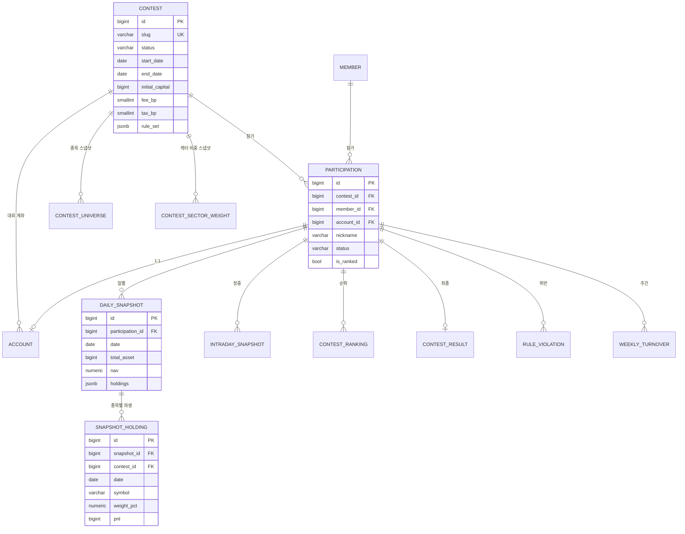

# E-02. `contests` — 대회 · 참가 · 스냅샷 · 랭킹 · 정산

> **문서 버전** v2.0 · **작성일** 2026-08-13 (KST) · **전제** [02-공통-설계규약](02-공통-설계규약.md)
> **기능 명세** [F-02 대회 도메인](../../features/version2.0/F-02-대회-도메인.md) ·
> [F-04 규칙 엔진](../../features/version2.0/F-04-대회-규칙엔진.md) ·
> [F-05 랭킹·정산·스냅샷](../../features/version2.0/F-05-랭킹-정산-스냅샷.md)

가장 큰 앱이다. **모델 11종.**

---

## 1. 모델 11종

| 모델 | 테이블 | 역할 | 쓰는 잡 |
|---|---|---|---|
| `Contest` | `contest` | 대회 본체 · 규칙 JSON | `settle_contest` |
| `Participation` | `participation` | 회원 × 대회 | |
| `ContestUniverse` | `contest_universe` | **시작 시 고정된 종목·업종 스냅샷** | 시작 전이 |
| `ContestSectorWeight` | `contest_sector_weight` | 시장 섹터 비중 고정 | 시작 전이 |
| `DailySnapshot` | `daily_snapshot` | 일별 성과 (JSONB 원본 포함) | `settle_daily` |
| `SnapshotHolding` | `snapshot_holding` | **일별 보유 종목 정규화 파생** ★ | `settle_daily` |
| `IntradaySnapshot` | `intraday_snapshot` | 장중 10분 수익률 | `snapshot_intraday` |
| `ContestRanking` | `contest_ranking` | 일자별 순위 | `settle_daily` |
| `ContestResult` | `contest_result` | 최종 확정 결과 | `settle_contest` |
| `RuleViolation` | `rule_violation` | 위반 기록 | `settle_daily` |
| `WeeklyTurnover` | `weekly_turnover` | 주간 회전율 | `settle_weekly` |

---

## 2. 관계도



---

## 3. `Contest` — 대회 본체

### 3.1 스키마

| 필드 | 타입 | 제약 | 설명 |
|---|---|---|---|
| `name` | varchar(100) | | 대회명 |
| `slug` | varchar(50) | **UNIQUE** | URL 식별자. `/contests/rfm-1/` — id 노출을 피한다 |
| `description` | text | | 마크다운 규칙 안내문 |
| `asset_class` | varchar(10) | 기본 `STOCK` | **1차는 `STOCK` 만 허용.** 필드는 미리 만들어 둔다 |
| `status` | varchar(10) | choices | `DRAFT`/`UPCOMING`/`ONGOING`/`SETTLING`/`CLOSED`/`CANCELLED` |
| `start_date` / `end_date` | date | `start ≤ end` | KST 기준 |
| `entry_deadline` | date | null | 참가 신청 마감. `null` = 종료까지 |
| `capacity` | int | null | 정원. `null` = 무제한 |
| `approval_mode` | varchar(10) | | `AUTO` / `MANUAL` |
| `visibility` | varchar(10) | | `PUBLIC` / `LINK` / `PRIVATE` |
| `portfolio_visibility` | varchar(10) | | `ALL`(기본) / `TOP_N` / `SELF_ONLY` |
| `portfolio_visible_top_n` | int | 기본 50 | `TOP_N` 일 때만 의미 |
| `initial_capital` | bigint | 기본 1억 | |
| `fee_bp` | smallint | 기본 10 | 매매 수수료 (0.10%) |
| `tax_bp` | smallint | 기본 20 | 매도세 (0.20%) |
| `rule_set` | jsonb | | 규칙 전체 (3.3) |
| `entry_requirement` | jsonb | 기본 `{}` | 학습 포인트 게이트 등 |
| `universe_frozen_at` | timestamptz | null | 종목·섹터 스냅샷 시각 |
| `created_by` | FK Member | SET_NULL | 만든 운영자 |

### 3.2 코드

```python
# contests/models.py
class ContestStatus(models.TextChoices):
    DRAFT     = "DRAFT",     "준비중"
    UPCOMING  = "UPCOMING",  "모집중"
    ONGOING   = "ONGOING",   "진행중"
    SETTLING  = "SETTLING",  "정산중"
    CLOSED    = "CLOSED",    "종료"
    CANCELLED = "CANCELLED", "취소"


class PortfolioVisibility(models.TextChoices):
    ALL       = "ALL",       "전체 공개"
    TOP_N     = "TOP_N",     "상위 N명만"
    SELF_ONLY = "SELF_ONLY", "본인만"


class Contest(TimeStampedModel):
    """대회 본체.

    상태 전이는 pg_cron 의 settle_contest 잡이 자동으로 한다(F-02 2장).
    운영자가 매일 손으로 바꾸는 구조는 주말·공휴일에 깨진다.
    """

    name = models.CharField(max_length=100, verbose_name="대회명")
    slug = models.SlugField(max_length=50, unique=True, verbose_name="URL 식별자")
    description = models.TextField(blank=True, verbose_name="규칙 안내(마크다운)")

    asset_class = models.CharField(
        max_length=10, choices=AssetClass.choices, default=AssetClass.STOCK,
        verbose_name="자산군",
        help_text="1차는 STOCK 만 허용한다. 코인·대체자산 대회는 v2.2",
    )
    status = models.CharField(
        max_length=10, choices=ContestStatus.choices,
        default=ContestStatus.DRAFT, db_index=True, verbose_name="상태",
    )

    start_date = models.DateField(verbose_name="시작일")
    end_date = models.DateField(verbose_name="종료일")
    entry_deadline = models.DateField(null=True, blank=True, verbose_name="참가 신청 마감")
    capacity = models.PositiveIntegerField(null=True, blank=True, verbose_name="정원")

    approval_mode = models.CharField(max_length=10, choices=ApprovalMode.choices, default=ApprovalMode.AUTO)
    visibility = models.CharField(max_length=10, choices=Visibility.choices, default=Visibility.PUBLIC)
    portfolio_visibility = models.CharField(
        max_length=10, choices=PortfolioVisibility.choices, default=PortfolioVisibility.ALL,
        verbose_name="포트폴리오 공개 범위",
        help_text="동아리 대회는 ALL 이 기본. 벤치마크의 '50등 이후 조회 불가' 결함에 대한 대응",
    )
    portfolio_visible_top_n = models.PositiveIntegerField(default=50)

    initial_capital = models.BigIntegerField(default=100_000_000, verbose_name="시작 자본(원)")
    fee_bp = models.PositiveSmallIntegerField(default=10, verbose_name="매매 수수료(bp)")
    tax_bp = models.PositiveSmallIntegerField(default=20, verbose_name="매도세(bp)")

    rule_set = models.JSONField(default=default_rule_set, verbose_name="규칙")
    entry_requirement = models.JSONField(default=dict, blank=True, verbose_name="참가 조건")

    universe_frozen_at = models.DateTimeField(null=True, blank=True, verbose_name="유니버스 고정 시각")
    created_by = models.ForeignKey(
        "accounts.Member", on_delete=models.SET_NULL, null=True, related_name="created_contests"
    )

    class Meta:
        db_table = "contest"
        constraints = [
            models.CheckConstraint(
                check=models.Q(end_date__gte=models.F("start_date")),
                name="contest_ck_date_order",
            ),
        ]
        indexes = [models.Index(fields=["status", "start_date"], name="contest_idx_status_start")]
```

### 3.3 `rule_set` — 규칙을 JSON 한 칸에 담는 이유

규칙 항목이 늘 때마다 컬럼을 추가하고 마이그레이션을 돌리는 것보다,
**스키마를 코드에서 검증**하는 편이 낫다 (→ [F-02](../../features/version2.0/F-02-대회-도메인.md) 3.3).

```python
def default_rule_set() -> dict:
    """기본 규칙. 대회 생성 시 이 값을 **복사해** 넣는다.

    복사하는 게 핵심이다. 참조로 두면 기본값을 고쳤을 때
    진행 중인 대회의 규칙이 흔들린다.
    """
    return {
        "position_limit_pct": 15.0,
        "position_limit_exceptions": {"005930": 40.0, "000660": 30.0},
        "sector_limit_multiplier": 2.0,
        "sector_limit_floor_pct": 10.0,
        "sector_limit_floor_threshold_pct": 5.0,
        "small_cap_threshold_krw": 1_000_000_000_000,
        "small_cap_total_limit_pct": 30.0,
        "min_market_cap_krw": 100_000_000_000,
        "min_avg_turnover_krw": 3_000_000_000,
        "new_listing_block_days": 6,
        "block_supervised": True,
        "weekly_turnover_min_pct": 5.0,
        "weekly_turnover_violation_limit": 3,
        "score_weight_return": 0.7,
        "score_weight_management": 0.3,
    }
```

**JSON 검증은 모델 `clean()` 에서** 한다. Django Admin 이 저장 전에 자동으로 호출한다.

> **Django 관점** — FastAPI 였다면 Pydantic 모델로 `rule_set` 을 검증했을 것이다.
> Django 에는 그 자리가 `Model.clean()` 이다. 다만 **`clean()` 은 `save()` 가 자동으로
> 부르지 않는다** — Form/Admin/Serializer 경로에서만 호출된다.
> 배치가 직접 `save()` 하는 경로가 있으므로 `full_clean()` 을 명시적으로 부르거나
> **`rule_set` 검증 함수를 서비스 계층에 두는 편이 안전하다.**

### 3.4 왜 `fee_bp` 만 컬럼이고 나머지는 JSON 인가

수수료·세금은 **주문 한 건마다 곱해지는 값**이라 조회가 잦고 집계에도 쓰인다.
JSON 안에 있으면 SQL 집계에서 매번 꺼내야 한다. **자주 읽히는 값만 컬럼으로 승격**한다.

---

## 4. `Participation` — 참가

| 필드 | 타입 | 제약 | 설명 |
|---|---|---|---|
| `contest_id` | bigint | FK PROTECT | |
| `member_id` | bigint | FK PROTECT | |
| `account_id` | bigint | **O2O** PROTECT, null | 승인 시 생성되는 대회 계좌 |
| `nickname` | varchar(20) | | 랭킹 표시명. 실명 비노출 |
| `status` | varchar(15) | choices | `PENDING`/`APPROVED`/`REJECTED`/`DISQUALIFIED`/`WITHDRAWN` |
| `is_ranked` | bool | 기본 `true` | **실격은 `false` 로만 만든다. 데이터는 지우지 않는다** |
| `joined_at` / `approved_at` / `disqualified_at` | timestamptz | | |
| `disqualified_reason` | varchar(200) | | |
| — | | **UNIQUE(contest, member)** · **UNIQUE(contest, nickname)** | |

```python
class Participation(TimeStampedModel):
    """회원 × 대회.

    실격(DISQUALIFIED)은 is_ranked=False 로만 만든다. 계좌·주문 이력은 그대로 둔다(F-02 4.3).
    지우면 회고가 불가능하고, 판정이 잘못됐을 때 되돌릴 수 없다.
    """

    contest = models.ForeignKey("contests.Contest", on_delete=models.PROTECT, related_name="participations")
    member = models.ForeignKey("accounts.Member", on_delete=models.PROTECT, related_name="participations")
    account = models.OneToOneField(
        "accounts.Account", on_delete=models.PROTECT,
        null=True, blank=True, related_name="participation",
        help_text="승인 시점에 생성된다. PENDING 상태에서는 비어 있다",
    )
    nickname = models.CharField(max_length=20, verbose_name="별칭")
    status = models.CharField(max_length=15, choices=ParticipationStatus.choices,
                              default=ParticipationStatus.PENDING, db_index=True)
    is_ranked = models.BooleanField(default=True, verbose_name="랭킹 포함")
    joined_at = models.DateTimeField(auto_now_add=True)
    approved_at = models.DateTimeField(null=True, blank=True)
    disqualified_at = models.DateTimeField(null=True, blank=True)
    disqualified_reason = models.CharField(max_length=200, blank=True)

    class Meta:
        db_table = "participation"
        constraints = [
            models.UniqueConstraint(fields=["contest", "member"], name="participation_uniq_member"),
            models.UniqueConstraint(fields=["contest", "nickname"], name="participation_uniq_nickname"),
        ]
        indexes = [models.Index(fields=["contest", "status"], name="participation_idx_contest_status")]
```

> **`account` 를 `OneToOneField` 로 둔 이유** — `Account` 에 이미
> `UNIQUE(member, contest)` 가 걸려 있어 참가당 계좌는 논리적으로 하나다.
> O2O 로 선언하면 `participation.account` 와 `account.participation` 양방향이
> 단수로 잡혀서 코드가 읽기 쉬워진다.

---

## 5. `ContestUniverse` · `ContestSectorWeight` — 규칙 스냅샷 ★

> **대회 시작 시점에 종목 업종과 시장 섹터 비중을 얼어붙게 한다** (→ [F-02](../../features/version2.0/F-02-대회-도메인.md) 3.4).
> 기간 중에 업종이 바뀌면 어제 합법이던 포트가 오늘 위반이 된다.

### 5.1 `ContestUniverse`

| 필드 | 타입 | 설명 |
|---|---|---|
| `contest_id` | FK CASCADE | |
| `symbol` | varchar(6) | |
| `name` | varchar(60) | 시작 시점의 종목명 |
| `market` | varchar(10) | KOSPI / KOSDAQ |
| `sector_code` / `sector_name` | varchar | **KRX 업종분류** (GICS 아님) |
| `is_tradable_at_start` | bool | 시작 시점 거래 가능 여부(참고용) |
| `frozen_at` | timestamptz | |
| — | **UNIQUE(contest, symbol)** | |

**시총·거래대금·관리종목 지정은 여기에 넣지 않는다.** 그건 "지금 살 수 있는가"의
판정이라 최신값이 맞고, `market.StockMaster` 가 매일 갱신한다.

### 5.2 `ContestSectorWeight`

| 필드 | 타입 | 설명 |
|---|---|---|
| `contest_id` | FK CASCADE | |
| `sector_code` / `sector_name` | varchar | |
| `market_weight_pct` | numeric(9,4) | 시장 섹터 비중 |
| `limit_pct` | numeric(9,4) | **계산된 허용 한도** — `max(비중 × 2, 10%)` |
| — | **UNIQUE(contest, sector_code)** | |

**`limit_pct` 를 미리 계산해 저장한다.** 주문마다 `rule_set` 을 읽어 재계산하면
규칙을 바꿨을 때 과거 판정과 어긋난다. 시작 시점의 판정 기준을 그대로 굳힌다.

---

## 6. `DailySnapshot` + `SnapshotHolding` — 이중 저장 ★★

**사용자 확정: JSONB 원본과 정규화 파생을 둘 다 둔다.**

### 6.1 왜 둘 다인가

| | 역할 |
|---|---|
| **`DailySnapshot.holdings` (jsonb)** | **감사용 원본.** "그날 그대로"를 한 덩어리로 보존한다. 스키마가 바뀌어도 과거 기록이 훼손되지 않는다 |
| **`SnapshotHolding` (행)** | **조회·집계용.** Top Pick 종목×참가자 매트릭스, 수익 종목 Top N, 섹터 집계가 평범한 SQL 로 나온다 |

행 수는 걱정할 규모가 아니다 — **참가자 100명 × 종목 15개 × 20영업일 ≈ 3만 행.**

### 6.2 정합성 규약 ★ (이중 저장의 대가)

같은 사실을 두 곳에 쓰므로 **어긋나면 안 된다.** 세 가지로 못을 박는다.

1. **같은 트랜잭션에서만 쓴다.** `settle_daily` 잡이 `DailySnapshot` 을 upsert 하면서
   `SnapshotHolding` 을 **통째로 지우고 다시 넣는다**(delete + bulk_create).
   부분 갱신을 허용하지 않는다.
2. **원본은 JSONB 다.** 둘이 어긋난 것이 발견되면 **JSONB 를 정본으로 보고 파생을 재생성**한다.
3. **재생성 커맨드를 둔다.** `python manage.py rebuild_snapshot_holdings [--contest N]` —
   JSONB 로부터 `SnapshotHolding` 을 다시 만든다. 복구 경로를 미리 만들어 두는 것이다.

> **Django 관점** — 이런 파생 갱신을 시그널(`post_save`)로 거는 예제를 흔히 본다.
> **하지 않는다.** 배치가 `bulk_create` 로 스냅샷을 넣으면 시그널이 아예 발동하지 않아
> 조용히 어긋난다. 서비스 함수 하나에서 둘을 함께 쓰는 게 유일한 안전한 방법이다.

### 6.3 `DailySnapshot` 스키마

| 필드 | 타입 | 설명 |
|---|---|---|
| `participation_id` | FK CASCADE | |
| `date` | date | **KST 영업일** |
| `cash` | bigint | 현금 |
| `position_value` | bigint | 보유 평가액 합 |
| `total_asset` | bigint | 순자산 |
| `nav` | numeric(12,4) | **기준가.** 시작자본 = 1000 |
| `daily_return_pct` | numeric(9,4) | 전일 대비 |
| `cumulative_return_pct` | numeric(9,4) | 시작 대비 |
| `position_count` | int | 보유 종목 수 |
| `invested_ratio_pct` | numeric(9,4) | 편입비 |
| `buy_amount` / `sell_amount` | bigint | 당일 매수·매도 (회전율용) |
| `fee_amount` / `tax_amount` | bigint | 당일 비용 |
| `holdings` | jsonb | **원본 스냅샷** |
| `sector_weights` | jsonb | 섹터별 비중 |
| `violations` | jsonb | 그날의 한도 초과 상태 |
| — | **UNIQUE(participation, date)** | **정산 멱등성의 근거** |

```python
class DailySnapshot(models.Model):
    """참가자별 일별 성과. 매 영업일 15:40 KST 에 1행씩 기록한다.

    v1.0 의 투자랭킹은 요청이 올 때마다 전 회원의 전 포지션을 재계산했다.
    참가자가 늘면 무너지는 구조다. 이 테이블 하나가 랭킹·성과지표·회전율·
    관리점수를 전부 가능하게 만든다(F-05 1장).
    """

    participation = models.ForeignKey(
        "contests.Participation", on_delete=models.CASCADE, related_name="daily_snapshots"
    )
    date = models.DateField(verbose_name="영업일(KST)")

    cash = models.BigIntegerField()
    position_value = models.BigIntegerField()
    total_asset = models.BigIntegerField()
    nav = models.DecimalField(max_digits=12, decimal_places=4, verbose_name="기준가(시작=1000)")
    daily_return_pct = models.DecimalField(**PCT, default=0)
    cumulative_return_pct = models.DecimalField(**PCT, default=0)
    position_count = models.PositiveIntegerField(default=0)
    invested_ratio_pct = models.DecimalField(**PCT, default=0, verbose_name="편입비 %")
    buy_amount = models.BigIntegerField(default=0)
    sell_amount = models.BigIntegerField(default=0)
    fee_amount = models.BigIntegerField(default=0)
    tax_amount = models.BigIntegerField(default=0)

    holdings = models.JSONField(default=list, verbose_name="보유 종목 원본")
    sector_weights = models.JSONField(default=list, verbose_name="섹터 비중")
    violations = models.JSONField(default=list, verbose_name="한도 위반 상태")

    created_at = models.DateTimeField(auto_now_add=True)

    class Meta:
        db_table = "daily_snapshot"
        constraints = [
            # 정산이 두 번 돌아도 한 행. upsert 의 충돌 대상이 된다
            models.UniqueConstraint(fields=["participation", "date"], name="daily_snapshot_uniq_pd"),
        ]
        indexes = [models.Index(fields=["date"], name="daily_snapshot_idx_date")]
```

### 6.4 `SnapshotHolding` 스키마 (정규화 파생)

| 필드 | 타입 | 설명 |
|---|---|---|
| `snapshot_id` | FK CASCADE | 부모 |
| **`contest_id`** | FK CASCADE | **비정규 복제** — 아래 6.5 |
| **`participation_id`** | FK CASCADE | **비정규 복제** |
| **`date`** | date | **비정규 복제** |
| `symbol` | varchar(20) | |
| `name` | varchar(60) | |
| `sector_code` | varchar(20) | |
| `qty` | numeric(28,8) | |
| `avg_price` | numeric(20,8) | |
| `close_price` | numeric(20,8) | 그날 종가 |
| `value` | bigint | 평가액 |
| `weight_pct` | numeric(9,4) | 순자산 대비 비중 |
| `pnl` | bigint | 평가손익 |
| `pnl_pct` | numeric(9,4) | |
| — | **UNIQUE(snapshot, symbol)** | |

### 6.5 왜 `contest` · `date` 를 복제하는가 ★

Top Pick 매트릭스는 **"이 대회의 이 날짜, 상위 참가자들의 종목별 비중"**을 묻는다.

```sql
-- 복제가 없다면: snapshot_holding → daily_snapshot → participation → contest  (3중 조인)
-- 복제가 있으면:
SELECT symbol, participation_id, weight_pct
  FROM snapshot_holding
 WHERE contest_id = %s AND date = %s
   AND participation_id = ANY(%s);         -- 수익률 상위 참가자 id 배열
```

`(contest_id, date, symbol)` 복합 인덱스 하나로 끝난다.
**비정규화는 보통 피해야 하지만, 스냅샷은 한 번 쓰고 다시 고치지 않는 불변 데이터**라
갱신 이상(update anomaly)의 위험이 없다. 이 경우에는 정당한 선택이다.

```python
class SnapshotHolding(models.Model):
    """일별 스냅샷의 종목별 보유 내역 — DailySnapshot.holdings(jsonb)의 정규화 파생.

    JSONB 가 정본이고 이 테이블은 조회 편의를 위한 사본이다(6.2 정합성 규약).
    Top Pick 매트릭스·수익 종목 집계·섹터 집계가 여기서 나온다.
    """

    snapshot = models.ForeignKey(
        "contests.DailySnapshot", on_delete=models.CASCADE, related_name="holding_rows"
    )
    # ↓ 조회 성능을 위한 비정규 복제. 스냅샷은 불변이라 갱신 이상이 없다
    contest = models.ForeignKey("contests.Contest", on_delete=models.CASCADE, related_name="+")
    participation = models.ForeignKey("contests.Participation", on_delete=models.CASCADE, related_name="+")
    date = models.DateField()

    symbol = models.CharField(max_length=20)
    name = models.CharField(max_length=60, blank=True)
    sector_code = models.CharField(max_length=20, blank=True)
    qty = models.DecimalField(**QTY)
    avg_price = models.DecimalField(**PRICE)
    close_price = models.DecimalField(**PRICE)
    value = models.BigIntegerField()
    weight_pct = models.DecimalField(**PCT)
    pnl = models.BigIntegerField(default=0)
    pnl_pct = models.DecimalField(**PCT, default=0)

    class Meta:
        db_table = "snapshot_holding"
        constraints = [
            models.UniqueConstraint(fields=["snapshot", "symbol"], name="snapshot_holding_uniq"),
        ]
        indexes = [
            # Top Pick 매트릭스 — 대회 + 날짜 + 종목
            models.Index(fields=["contest", "date", "symbol"], name="snap_hold_idx_contest_date"),
            # 참가자 시계열 — "이 사람이 이 종목을 언제부터 들고 있었나"
            models.Index(fields=["participation", "symbol", "date"], name="snap_hold_idx_part_symbol"),
        ]
```

> **`related_name="+"`** 는 "역참조를 만들지 마라"는 뜻이다.
> `contest.snapshotholding_set` 같은 접근자는 3만 행을 통째로 끌어올 위험만 있고 쓸 일이 없다.

---

## 7. `IntradaySnapshot` — 장중 10분

| 필드 | 타입 | 설명 |
|---|---|---|
| `participation_id` | FK CASCADE | |
| `at` | timestamptz | 10분 간격 (09:00~15:30 → 하루 40행) |
| `return_pct` | numeric(9,4) | |
| `nav` | numeric(12,4) | |
| — | **UNIQUE(participation, at)** | |

**당일분만 보관한다.** `cleanup` 잡(매일 04:00)이 전일분을 지운다.
과거 장중 데이터는 `DailySnapshot` 으로 충분하다 (→ [F-05](../../features/version2.0/F-05-랭킹-정산-스냅샷.md) 2.3).

---

## 8. `ContestRanking` — 일자별 순위

| 필드 | 타입 | 설명 |
|---|---|---|
| `contest_id` | FK CASCADE | |
| `participation_id` | FK CASCADE | |
| `date` | date | |
| `rank` | int | **null = 실격·포기** (화면에는 `-` 로 표시) |
| `prev_rank` | int | null. 등락(`3↑`) 표시용 |
| `nav` | numeric(12,4) | |
| `cumulative_return_pct` / `daily_return_pct` | numeric(9,4) | |
| `position_count` / `invested_ratio_pct` | | 랭킹 표에 함께 나오는 값 |
| — | **UNIQUE(contest, participation, date)** | |

**랭킹 조회는 이 테이블을 그대로 읽는다.** 요청 시점에 정렬·계산하지 않는다
(→ [F-05](../../features/version2.0/F-05-랭킹-정산-스냅샷.md) 7장).

인덱스: `(contest, date, rank)` — 랭킹 목록의 유일한 조회 패턴이다.

### 8.1 `nav` 를 `DailySnapshot` 에서 또 복제하는 이유

랭킹 화면은 **참가자 100명 × 1일**을 한 번에 읽는다.
`DailySnapshot` 을 조인하면 넓은 행(JSONB 3칸 포함)을 100개 끌어온다.
`ContestRanking` 은 좁은 행이라 인덱스만으로 응답할 수 있다.

---

## 9. `ContestResult` — 최종 확정

| 필드 | 타입 | 설명 |
|---|---|---|
| `contest_id` / `participation_id` | FK | **UNIQUE(contest, participation)** |
| `final_rank` | int | |
| `return_score` | numeric(9,4) | 원점수 (= 누적 수익률) |
| `return_percentile` | numeric(9,4) | 백분위 |
| `management_score` | numeric(9,4) | 관리 점수 원점수 |
| `management_percentile` | numeric(9,4) | |
| `port_hhi` / `pnl_hhi` | numeric(9,6) | **산식 근거를 남긴다** |
| `final_score` | numeric(9,4) | 백분위 가중합 |
| `grade` | varchar(3) | `A+` ~ `F` |
| `confirmed_at` | timestamptz | |

**`port_hhi` · `pnl_hhi` 를 저장하는 이유**: 관리 점수 산식은 v2.0 의 제안이며
1회 대회 후 조정을 전제한다 (→ [F-04](../../features/version2.0/F-04-대회-규칙엔진.md) 6.2).
**중간 값을 남겨두면 산식을 바꿨을 때 과거 대회를 재계산해 비교할 수 있다.**
점수만 저장하면 왜 그 점수가 나왔는지 되짚을 수 없다.

---

## 10. `RuleViolation` — 위반 기록

| 필드 | 타입 | 설명 |
|---|---|---|
| `participation_id` | FK CASCADE | |
| `rule` | varchar(30) | `POSITION_LIMIT` / `SECTOR_LIMIT` / `SMALL_CAP_LIMIT` / `WEEKLY_TURNOVER` |
| `date` | date | 발생 영업일 |
| `severity` | varchar(10) | `WARN`(가격 변동에 의한 초과) / `BLOCK`(주문 거부) |
| `detail` | jsonb | 현재 비중·한도·초과분 |
| `is_resolved` | bool | 해소 여부 |
| `resolved_at` | timestamptz | null |
| — | **UNIQUE(participation, rule, date)** — 하루에 같은 규칙은 1행 | |

**자동 실격 처리는 하지 않는다** (회전율 4회 제외).
"적극적으로 해소하려 노력했는가"는 정성 판단이라, 시스템은 **운영자에게 근거를 주는 선까지**가
역할이다 (→ [F-04](../../features/version2.0/F-04-대회-규칙엔진.md) 3.4).

---

## 11. `WeeklyTurnover` — 주간 회전율

| 필드 | 타입 | 설명 |
|---|---|---|
| `participation_id` | FK CASCADE | |
| `week_start` | date | **그 주 월요일 (KST)** |
| `buy_amount` / `sell_amount` | bigint | |
| `avg_asset` | bigint | 기간 평균 운용금액 |
| `turnover_pct` | numeric(9,4) | `(매수+매도) / 평균운용 × 0.5 × 100` |
| `is_violation` | bool | 기준 미달 |
| **`is_confirmed`** | bool | **확정 / 예상** ★ |
| `violation_seq` | int | 확정 위반 누적 횟수 |
| — | **UNIQUE(participation, week_start)** | |

### 11.1 `is_confirmed` 가 필요한 이유 ★

타임폴리오 화면이 **"확정 위반"과 "예상 위반"**을 나눠 보여준다.
같은 테이블에 두고 플래그로 구분한다.

| | |
|---|---|
| `is_confirmed = True` | 지난 주들. 더 이상 변하지 않는다 |
| `is_confirmed = False` | **이번 주 현재 시점 기준** 잠정치. 매일 `settle_daily` 가 덮어쓴다 |

> *"새로운 주가 시작하는 월요일 아침 장시작 전에는 매매가 있을 수 없으므로
> 금주의 예상값은 1회 위반으로 보이는 게 정상입니다."*
> — 이 안내 문구를 화면에 그대로 넣는다. 안 그러면 월요일마다 문의가 들어온다.

`settle_weekly` 잡(월 06:00)이 지난 주 행을 `is_confirmed=True` 로 굳히고
누적 4회면 `Participation.status = DISQUALIFIED` 로 만든다.

---

## 12. 정산 멱등성 — 이 앱의 관통 원칙 ★

**모든 정산 잡은 두 번 돌아도 결과가 같아야 한다.**

| 테이블 | 멱등 장치 |
|---|---|
| `DailySnapshot` | `UNIQUE(participation, date)` + upsert |
| `SnapshotHolding` | 부모 스냅샷 기준 **전량 삭제 후 재삽입** |
| `ContestRanking` | `UNIQUE(contest, participation, date)` + upsert |
| `WeeklyTurnover` | `UNIQUE(participation, week_start)` + upsert |
| `ContestResult` | `UNIQUE(contest, participation)` + upsert |

```python
# Django 의 upsert — bulk_create 의 update_conflicts
DailySnapshot.objects.bulk_create(
    rows,
    update_conflicts=True,
    unique_fields=["participation", "date"],       # 충돌 판정 기준
    update_fields=["cash", "position_value", "total_asset", "nav", ...],
)
```

> **Django 관점** — SQLAlchemy 에서는 `postgresql.insert(...).on_conflict_do_update()` 를
> 직접 조립했다. Django 4.1+ 는 `bulk_create(update_conflicts=True)` 가 같은 SQL 을 만든다.
> **`unique_fields` 에 적은 조합과 실제 `UniqueConstraint` 가 일치해야** 동작한다.

---

## 13. v1.0 대조

| v1.0 | v2.0 |
|---|---|
| (대회 개념 없음) | `Contest` · `Participation` 외 9종 |
| `investor_rankings` API — 요청마다 전 회원 재계산 | `ContestRanking` 을 미리 쌓고 읽기만 |
| (성과 이력 없음) | `DailySnapshot` · `IntradaySnapshot` |
| `crypto_rank` `TRUNCATE` 후 재적재 | **전 테이블 upsert 원칙** |

---

## 14. 관련 문서

- 계좌 → [E-01 accounts](E-01-accounts.md)
- 주문·포지션 → [E-03 trading](E-03-trading.md)
- 종목 마스터·지수 → [E-04 market](E-04-market.md)
- 인덱스 근거 → [04-인덱스-쿼리-전략](04-인덱스-쿼리-전략.md)
