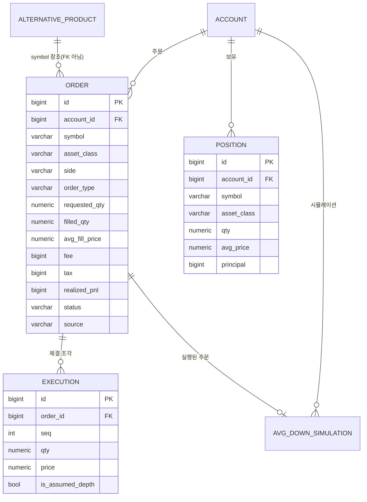

# E-03. `trading` — 주문 · 체결 · 포지션

> **문서 버전** v2.0 · **작성일** 2026-08-13 (KST) · **전제** [02-공통-설계규약](02-공통-설계규약.md)
> **기능 명세** [F-03 주문·체결 엔진](../../features/version2.0/F-03-주문-체결엔진.md) ·
> [F-08 대체자산](../../features/version2.0/F-08-대체자산-연습모드.md) ·
> [F-11 물타기](../../features/version2.0/F-11-물타기-시뮬레이터.md)

**v1.0 의 테이블 5개가 여기서 3개로 합쳐진다.**

---

## 1. 모델 5종

| 모델 | 테이블 | 역할 |
|---|---|---|
| `Order` | `order` | **주식·코인·대체자산 통합 주문** ★ |
| `Execution` | `execution` | 체결 조각 (부분 체결마다 1행) |
| `Position` | `position` | 현재 보유 |
| `AlternativeProduct` | `alternative_product` | 대체자산 카탈로그 11종 (구 하드코딩) |
| `AvgDownSimulation` | `avg_down_simulation` | 물타기 시뮬레이션 기록 |

---

## 2. 자산군 통합 ★ (결함 D-4 해소)

| v1.0 | v2.0 |
|---|---|
| `stock_order` | `Order(asset_class="STOCK")` |
| `alternative_order` | `Order(asset_class="ALT")` |
| **(없음)** | **`Order(asset_class="CRYPTO")`** ← 신설 |
| `stock_position` / `alternative_position` / `hold_crypto` | `Position(asset_class=…)` |

v1.0 은 **코인 주문 이력 테이블이 아예 없었다**(결함 D-4). `hold_crypto`(현재 보유)만
있어 "언제 얼마에 샀는지"를 복원할 수 없었다.

통합의 실익은 [F-10 거래이력](../../features/version2.0/F-10-거래이력.md)이
**쿼리 한 번으로 전 자산군 이력**을 뽑는다는 것이다.

---

## 3. 관계도



---

## 4. `Order` — 통합 주문

### 4.1 스키마

| 필드 | 타입 | 제약 | 설명 |
|---|---|---|---|
| `account_id` | bigint | FK **PROTECT** | 소유 계좌 |
| `symbol` | varchar(20) | index | 주식 `005930` · 코인 `KRW-BTC` · 대체 `FUT-K200` |
| `asset_class` | varchar(10) | choices | 조인 없이 필터하려고 저장한다 |
| `side` | varchar(4) | `BUY`/`SELL` | |
| `order_type` | varchar(12) | choices | `MARKET`/`LIMIT`/`RELATIVE`/`OWN`/`STOP` |
| `price_level` | smallint | null, 1~10 | 상대·자기호가 단계 |
| `limit_price` | numeric(20,8) | null | 지정가 |
| `stop_price` | numeric(20,8) | null | STOP 발동가 |
| **`requested_weight_pct`** | numeric(9,4) | null | **대회 전용 — 순자산 대비 %** |
| `requested_qty` | numeric(28,8) | | 환산된 요청 수량 |
| `filled_qty` | numeric(28,8) | 기본 0 | 체결 수량 |
| `avg_fill_price` | numeric(20,8) | 기본 0 | 가중평균 체결가 |
| `gross_amount` | bigint | | 체결금액 (수수료 전) |
| `fee` / `tax` | bigint | | **사후 재계산하지 않는다** |
| `net_amount` | bigint | | 정산금액 (비용 반영 후) |
| `realized_pnl` | bigint | null | **매도 시 실현손익** ★ |
| `status` | varchar(15) | choices, index | 6종 |
| `source` | varchar(10) | choices | `WEB`/`PINE`/`OPENAPI`/`ADMIN`/`DEMO_SEED` |
| `execution_mode` | varchar(10) | 기본 `IMMEDIATE` | `SLICED` 는 v2.1 자리만 |
| `reject_rule` / `reject_message` | varchar | | 어느 규칙에 걸렸는지 |
| `created_at` / `accepted_at` / `filled_at` / `cancelled_at` | timestamptz | | |

### 4.2 코드

```python
# trading/models.py
class OrderStatus(models.TextChoices):
    PENDING_OPEN = "PENDING_OPEN", "장 시작 대기"
    ACCEPTED     = "ACCEPTED",     "접수"
    PARTIAL      = "PARTIAL",      "부분체결"
    FILLED       = "FILLED",       "체결완료"
    CANCELLED    = "CANCELLED",    "취소"
    REJECTED     = "REJECTED",     "거부"


class OrderType(models.TextChoices):
    MARKET   = "MARKET",   "시장가"
    LIMIT    = "LIMIT",    "지정가"
    RELATIVE = "RELATIVE", "상대호가"     # 매수면 매도n호가 — 공격적
    OWN      = "OWN",      "자기호가"     # 매수면 매수n호가 — 소극적
    STOP     = "STOP",     "STOP"


class OrderSource(models.TextChoices):
    WEB       = "WEB",       "웹"
    PINE      = "PINE",      "Pine 전략"
    OPENAPI   = "OPENAPI",   "Open API"
    ADMIN     = "ADMIN",     "운영자"
    DEMO_SEED = "DEMO_SEED", "샘플"


class Order(models.Model):
    """주문 — 주식·코인·대체자산 통합.

    v1.0 은 stock_order / alternative_order 가 따로 있었고 코인은 이력 자체가 없었다(D-4).
    v2.0 은 한 테이블로 합치고 asset_class 로 구분한다.

    Django 관점 — SQLAlchemy 에서 테이블을 나눠 두고 UNION 으로 합치던 조회가
    여기서는 그냥 필터 하나가 된다. 대신 **필드가 자산군마다 다르게 쓰인다**는 부담이
    생기므로(코인은 price_level 이 무의미) 어떤 조합이 유효한지 서비스에서 검증한다.
    """

    account = models.ForeignKey(
        "accounts.Account", on_delete=models.PROTECT, related_name="orders"
    )
    symbol = models.CharField(max_length=20, db_index=True)
    asset_class = models.CharField(max_length=10, choices=AssetClass.choices)
    side = models.CharField(max_length=4, choices=OrderSide.choices)

    order_type = models.CharField(max_length=12, choices=OrderType.choices)
    price_level = models.PositiveSmallIntegerField(
        null=True, blank=True, verbose_name="호가 단계",
        help_text="상대호가·자기호가일 때만 1~10",
    )
    limit_price = models.DecimalField(**PRICE, null=True, blank=True)
    stop_price = models.DecimalField(**PRICE, null=True, blank=True)

    requested_weight_pct = models.DecimalField(
        **PCT, null=True, blank=True, verbose_name="주문 비중 %",
        help_text="대회 모드는 수량이 아니라 순자산 대비 %로 주문한다(F-03 3.1). 연습은 NULL",
    )
    requested_qty = models.DecimalField(**QTY, verbose_name="요청 수량")
    filled_qty = models.DecimalField(**QTY, default=0, verbose_name="체결 수량")
    avg_fill_price = models.DecimalField(**PRICE, default=0, verbose_name="가중평균 체결가")

    gross_amount = models.BigIntegerField(default=0, verbose_name="체결금액")
    fee = models.BigIntegerField(default=0, verbose_name="수수료")
    tax = models.BigIntegerField(default=0, verbose_name="매도세")
    net_amount = models.BigIntegerField(default=0, verbose_name="정산금액")
    realized_pnl = models.BigIntegerField(
        null=True, blank=True, verbose_name="실현손익",
        help_text="매도 체결 시 (체결가-평단)×수량-비용. 사후 계산 없이 합산할 수 있게 저장한다",
    )

    status = models.CharField(
        max_length=15, choices=OrderStatus.choices,
        default=OrderStatus.ACCEPTED, db_index=True,
    )
    source = models.CharField(max_length=10, choices=OrderSource.choices, default=OrderSource.WEB)
    execution_mode = models.CharField(
        max_length=10, default="IMMEDIATE",
        help_text="SLICED(시간분할)는 v2.1. 컬럼만 미리 만들어 둔다",
    )
    reject_rule = models.CharField(max_length=30, blank=True, verbose_name="위반 규칙")
    reject_message = models.CharField(max_length=200, blank=True)

    created_at = models.DateTimeField(auto_now_add=True, db_index=True)
    accepted_at = models.DateTimeField(null=True, blank=True)
    filled_at = models.DateTimeField(null=True, blank=True)
    cancelled_at = models.DateTimeField(null=True, blank=True)

    class Meta:
        db_table = "order"
        indexes = [
            # 거래이력 화면 — 계좌별 최신순
            models.Index(fields=["account", "-created_at"], name="order_idx_account_recent"),
            # 거래이력 필터 — 자산군·매매구분
            models.Index(fields=["account", "asset_class", "side"], name="order_idx_account_class"),
            # 체결 추종 잡 — 미체결 주문만 스캔 (부분 인덱스)
            models.Index(
                fields=["symbol", "status"],
                name="order_idx_open",
                condition=models.Q(status__in=["ACCEPTED", "PARTIAL", "PENDING_OPEN"]),
            ),
        ]
        constraints = [
            models.CheckConstraint(check=models.Q(filled_qty__lte=models.F("requested_qty")),
                                   name="order_ck_filled_le_requested"),
        ]
```

### 4.3 `order` 는 예약어다 ★

`ORDER` 는 SQL 예약어(`ORDER BY`)라 테이블명으로 쓰면 인용부호가 필요하다.
Django ORM 은 항상 `"order"` 로 따옴표를 붙여 내보내므로 **ORM 경로는 문제가 없다.**

**직접 SQL 을 쓰는 pg_cron 잡에서는 반드시 따옴표를 친다.**

```sql
-- 틀림:  SELECT * FROM order WHERE ...        → 구문 오류
-- 맞음:  SELECT * FROM "order" WHERE ...
```

> 대안으로 `db_table = "trade_order"` 를 쓸 수도 있다. 이 문서는 **`"order"` 유지 + 따옴표 규약**을
> 택한다 — 도메인 용어를 비틀지 않는 편이 읽기에 낫고, 인용은 잡 SQL 몇 줄에만 필요하다.

### 4.4 `realized_pnl` 을 저장하는 이유

[F-10](../../features/version2.0/F-10-거래이력.md) 2.4 가 거래이력 상단에 **실현손익 합계**를
요구한다. 매도 시점에 계산해 넣어두면 `SUM(realized_pnl)` 한 줄로 끝난다.

사후에 계산하려면 그 시점의 평단을 알아야 하는데, **`Position` 은 현재 상태만 갖고 있어
과거 평단을 복원할 수 없다.** 체결 시점에 남기는 것이 유일하게 정확한 방법이다.

```
매도 실현손익 = (체결가 - 매도 직전 평단) × 체결수량 - 수수료 - 매도세
```

---

## 5. `Execution` — 체결 조각

호가 단계마다 체결가가 다르므로 **조각별로 남긴다.** `Order.avg_fill_price` 는 이 조각들의
가중평균이고, 검증이 필요할 때 여기서 되짚는다.

| 필드 | 타입 | 설명 |
|---|---|---|
| `order_id` | FK CASCADE | |
| `seq` | int | 조각 순번 |
| `qty` | numeric(28,8) | |
| `price` | numeric(20,8) | |
| `amount` | bigint | |
| `price_level` | smallint | null. **몇 호가에서 체결됐나** |
| **`is_assumed_depth`** | bool | **10호가를 넘어 가정 체결된 조각** ★ |
| `executed_at` | timestamptz | |
| — | **UNIQUE(order, seq)** | |

### 5.1 `is_assumed_depth` — 정직성 컬럼 ★

[F-03](../../features/version2.0/F-03-주문-체결엔진.md) 5.1 4단계:

> 지정가가 상대 10호가를 넘는 경우, 1~10호가의 평균 잔량이 1틱 간격으로 11호가부터
> 형성되어 있다고 **가정**하고 계속 체결한다. (실제 시장보다 유리한 가정)

**이 가정으로 체결된 조각은 표시한다.** v2.0 의 관통 원칙 ②
"화면에 보이지 않는 사실은 없는 것과 같다"의 적용이다. 체결 상세에서
"11호가 이후는 추정 잔량으로 체결됨" 배지를 띄운다.

---

## 6. `Position` — 현재 보유

| 필드 | 타입 | 설명 |
|---|---|---|
| `account_id` | FK **CASCADE** | 계좌를 지우면 포지션도 사라진다 |
| `symbol` | varchar(20) | |
| `asset_class` | varchar(10) | |
| `qty` | numeric(28,8) | 주식은 정수값, 코인은 8자리 |
| `avg_price` | numeric(20,8) | 평단 |
| `principal` | bigint | 매수원금 |
| `opened_at` / `updated_at` | timestamptz | |
| — | **UNIQUE(account, symbol)** | |

```python
class Position(models.Model):
    """현재 보유. 계좌 × 종목당 1행.

    수량이 0 이 되면 행을 삭제한다(F-03 7.2). 과거 보유 이력이 필요하면
    contests.SnapshotHolding(일별) 과 Order.realized_pnl(체결별)에서 복원한다.
    """

    account = models.ForeignKey("accounts.Account", on_delete=models.CASCADE, related_name="positions")
    symbol = models.CharField(max_length=20)
    asset_class = models.CharField(max_length=10, choices=AssetClass.choices)
    qty = models.DecimalField(**QTY, default=0)
    avg_price = models.DecimalField(**PRICE, default=0)
    principal = models.BigIntegerField(default=0, verbose_name="매수원금")
    opened_at = models.DateTimeField(auto_now_add=True)
    updated_at = models.DateTimeField(auto_now=True)

    class Meta:
        db_table = "position"
        constraints = [
            models.UniqueConstraint(fields=["account", "symbol"], name="position_uniq_account_symbol"),
            models.CheckConstraint(check=models.Q(qty__gte=0), name="position_ck_qty_nonneg"),
        ]
        indexes = [models.Index(fields=["symbol"], name="position_idx_symbol")]
```

### 6.1 왜 "0이면 삭제"인가 — 그리고 무엇으로 보완하는가

| | |
|---|---|
| **삭제하는 이유** | v1.0 동작이고, `UNIQUE(account, symbol)` 아래에서 0 행을 남기면 "보유 종목 수" 집계마다 `qty > 0` 조건을 달아야 한다. 빠뜨리면 조용히 틀린다 |
| **잃는 것** | "예전에 이 종목을 들고 있었다"는 사실 |
| **보완** | ① `Order.realized_pnl` — 종료 거래의 손익 ② `SnapshotHolding` — 매 영업일의 보유 전체 |

**대회의 "수익 종목 Top N" 은 `SnapshotHolding` 과 `Order` 에서 나온다.**
`Position` 은 순수하게 "지금 무엇을 갖고 있는가"만 답한다.

### 6.2 `position_idx_symbol` 의 용도

시세 폴링 우선순위 결정 — **"대회 참가자가 보유 중인 종목"**을 뽑을 때 쓴다
(→ [F-16](../../features/version2.0/F-16-시장데이터-파이프라인.md) 2.5 우선순위 2).

---

## 7. `AlternativeProduct` — 대체자산 카탈로그

v1.0 은 11종을 **파이썬 상수로 하드코딩**했다. 테이블로 옮겨 운영자가 Admin 에서 고칠 수 있게 한다.

| 필드 | 타입 | 설명 |
|---|---|---|
| `symbol` | varchar(20) | **PK** — `FUT-K200` 등 |
| `name` | varchar(50) | |
| `category` | varchar(20) | 선물/옵션/파생상품/금/은/부동산 |
| `base_price` | bigint | 기준가 |
| `multiplier` | int | 승수 |
| `unit_label` | varchar(20) | `1계약` · `1g` · `1구좌` |
| `margin_rate_pct` | numeric(9,4) | 증거금률 |
| `volatility_pct` | numeric(9,4) | 일간 진폭 — 옵션·파생 1.8 / 나머지 0.9 |
| `point_scale` / `actual_multiplier` | int | null. `FUT-K200` 실계약 규모 안내용 |
| `map_lat` / `map_lng` | numeric | null. 부동산 Leaflet 마커 |
| `is_active` / `sort_order` | | |

`symbol` 을 PK 로 두면 `Order.symbol` · `Position.symbol` 과 문자열로 자연스럽게 맞물린다
(FK 는 걸지 않는다 — 4.1 참조).

### 7.1 대체자산은 대회 대상이 아니다

가격이 `sin(오늘의 서수 × 0.71 + 심볼문자합)` 기반 **결정론적 수식**이고 저장소가 Public 이라
**참가자가 내일 가격을 미리 계산할 수 있다** (→ [F-08](../../features/version2.0/F-08-대체자산-연습모드.md) 2장).
그래서 `Contest.asset_class` 는 1차에서 `STOCK` 만 허용한다.

---

## 8. `AvgDownSimulation` — 물타기 기록

| 필드 | 타입 | 설명 |
|---|---|---|
| `account_id` | FK CASCADE | |
| `symbol` | varchar(20) | |
| `params` | jsonb | 입력값 (보유수량·평단·추가매수가·수량/금액) |
| `result` | jsonb | 산출값 (새 평단·본전 상승률·잔여현금) |
| `executed_order_id` | FK **SET_NULL** null | 주문으로 이어졌으면 연결 |
| `created_at` | timestamptz | |

**1차에는 저장만 하고 회고 화면은 v2.1** 로 미룬다
(→ [F-11](../../features/version2.0/F-11-물타기-시뮬레이터.md) 3.4).
계산 자체는 클라이언트(Alpine.js)에서 하고, 저장 요청만 서버로 온다.

---

## 9. 체결 트랜잭션 — 이 앱의 핵심 흐름 ★

```python
@transaction.atomic
def execute_order(account_id: int, payload: OrderPayload) -> Order:
    """주문 접수 → 즉시 체결 시도 → 잔고·포지션 갱신.

    v1.0 의 검증된 흐름을 그대로 따르고 주체만 member → account 로 바꾼다.
    """
    # ① 계좌 잠금 — transaction.atomic 안에서만 유효하다 (규약 9장)
    account = Account.objects.select_for_update().get(pk=account_id)

    # ② 대회 계좌면 규칙 검증 (F-04 4.1 파이프라인) — 하나라도 걸리면 REJECTED
    if account.is_contest:
        check_contest_rules(account, payload)      # 실패 시 RuleViolationError

    # ③ 포지션 잠금 — 같은 종목에 동시 주문이 들어올 수 있다
    position = (Position.objects
                .select_for_update()
                .filter(account=account, symbol=payload.symbol)
                .first())

    # ④ 호가로 체결 조각 만들기 (F-03 5.1)
    fills = match_against_orderbook(payload, position)

    # ⑤ 비용 계산 — floor 절사. 대회 요율은 Contest 에서 읽는다(하드코딩 금지)
    fee, tax = calc_trading_cost(account, fills)

    # ⑥ 현금·포지션 갱신 → 주문·체결 기록
    ...
```

**검증 순서가 곧 [F-04](../../features/version2.0/F-04-대회-규칙엔진.md) 4.1 의 7단계다.**
하나라도 실패하면 즉시 중단하고 **첫 번째 이유만** 반환한다.

---

## 10. v1.0 대조

| v1.0 | v2.0 | 결함 |
|---|---|---|
| `stock_order` · `alternative_order` · (코인 없음) | `Order` 통합 | **D-4** |
| `stock_position` · `alternative_position` · `hold_crypto` | `Position` 통합 | |
| 소유자 `member_id` | `account_id` | **D-5** |
| 수수료·세금 없음 | `fee` · `tax` · `net_amount` | |
| 체결 = 현재가 전량 즉시 | `Execution` 조각 + `is_assumed_depth` | |
| 대체자산 11종 하드코딩 | `AlternativeProduct` | |

---

## 11. 관련 문서

- 계좌 → [E-01 accounts](E-01-accounts.md)
- 규칙 판정 데이터 → [E-02 contests](E-02-contests.md) 5장 · [E-04 market](E-04-market.md)
- 인덱스 근거 → [04-인덱스-쿼리-전략](04-인덱스-쿼리-전략.md)
