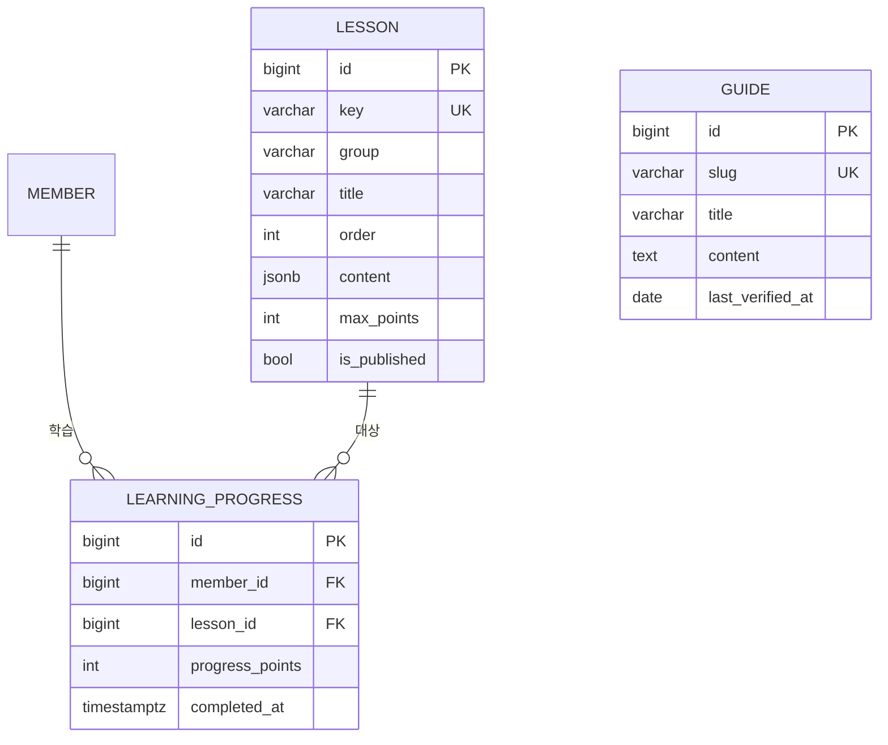

# E-05. `learning` — 레슨 · 진행률 · 가이드

> **문서 버전** v2.0 · **작성일** 2026-08-13 (KST) · **전제** [02-공통-설계규약](02-공통-설계규약.md)
> **기능 명세** [F-17 학습 콘텐츠](../../features/version2.0/F-17-학습콘텐츠.md)

**모델 3종.** 가장 단순하지만 **결함 하나와 확정 사항 하나**가 여기서 해소된다.

---

## 1. 모델 3종

| 모델 | 테이블 | 역할 |
|---|---|---|
| `Lesson` | `lesson` | 투자분석 14레슨 (구 `analysis.js` 650줄) |
| `LearningProgress` | `learning_progress` | **진행률 서버 저장** (구 `localStorage`) ★ |
| `Guide` | `guide` | 학습가이드 4종 |



---

## 2. `Lesson` — 콘텐츠를 DB 로 뺀다 ★

v1.0 은 `analysis.js` **650줄(단일 JS 최대)**에 레슨 텍스트·예제 코드·데이터 표·
렌더링 로직이 뒤엉켜 있었다. 그대로 옮기면 유지보수가 안 된다.

| 대상 | v2.0 위치 |
|---|---|
| 레슨 텍스트 · 예제 코드 · 예시 데이터 표 | **DB (`Lesson.content`)** |
| 렌더링 · 인터랙션 | Django 템플릿 + Alpine.js |
| SVG 일러스트 8종 | 정적 자산 |

**콘텐츠를 DB 로 빼면 운영자가 Django Admin 에서 레슨을 고칠 수 있다.**
강사님이 수업 자료를 갱신할 때 코드 배포 없이 반영된다.

| 필드 | 타입 | 설명 |
|---|---|---|
| `key` | varchar(50) | **UNIQUE** — `macro-indicators` 등. URL·진행률 키 |
| `group` | varchar(30) | 매크로/산업/기본적/기술적/일자별/도구 |
| `title` | varchar(100) | |
| `order` | int | 그룹 내 정렬 |
| `content` | jsonb | 이론·팁·예제코드·데이터표·해설 |
| `max_points` | int | 이 레슨의 최대 획득 포인트 |
| `is_published` | bool | 초안 숨김 |

```python
class Lesson(TimeStampedModel):
    """투자분석 학습 레슨.

    content(jsonb) 구조 — v1.0 의 레슨 한 개가 갖던 구성 요소를 그대로 담는다:
      {"theory": [...3줄], "tip": "...", "code": "...python...",
       "sample_data": {...표...}, "explain": "...결과 해설..."}

    Django 관점 — 텍스트를 마크다운 파일로 두는 방법도 있다. DB 를 택한 이유는
    Django Admin 이 편집 화면을 공짜로 주기 때문이다. 파일이면 배포가 필요하다.
    """

    key = models.SlugField(max_length=50, unique=True, verbose_name="레슨 키")
    group = models.CharField(max_length=30, db_index=True, verbose_name="그룹")
    title = models.CharField(max_length=100)
    order = models.PositiveSmallIntegerField(default=0)
    content = models.JSONField(default=dict, verbose_name="본문")
    max_points = models.PositiveSmallIntegerField(default=10)
    is_published = models.BooleanField(default=True)

    class Meta:
        db_table = "lesson"
        ordering = ["group", "order"]
```

### 2.1 인터랙티브 3종은 DB 에 넣지 않는다

퀀트 모델링(5일차)의 **백테스트 성과 지표 · 시장 계절성 · Pine Script 기초**는
사용자가 값을 바꿀 때마다 즉시 반응해야 하는 계산이다.
**클라이언트(Alpine.js) 계산을 유지**하고, `Lesson.content` 에는 설명과 초기 파라미터만 둔다.

---

## 3. `LearningProgress` — localStorage 승격 ★ (확정 사항 3)

### 3.1 v1.0 의 문제

`localStorage` 키 `edumgt-investment-academy-progress-v1` 에만 저장했다.

- **기기를 바꾸면 사라진다**
- 브라우저 데이터를 지우면 사라진다
- **대회 참가 조건으로 쓸 수 없다**

| 필드 | 타입 | 설명 |
|---|---|---|
| `member_id` | FK CASCADE | |
| `lesson_id` | FK **PROTECT** | 레슨을 지우면 진행률이 고아가 된다 |
| `progress_points` | int | 획득 포인트 |
| `completed_at` | timestamptz | null |
| `updated_at` | timestamptz | |
| — | **UNIQUE(member, lesson)** | |

```python
class LearningProgress(models.Model):
    """레슨별 진행률. 전역 목표 100포인트(v1.0 승계).

    저장 시점 — 입력칸 변경·실행 버튼 클릭 시 디바운스 후 서버에 쓴다.
    HTMX 로는 hx-trigger="change delay:1s" 한 줄이다.
    """

    member = models.ForeignKey("accounts.Member", on_delete=models.CASCADE, related_name="learning_progress")
    lesson = models.ForeignKey("learning.Lesson", on_delete=models.PROTECT, related_name="progress_rows")
    progress_points = models.PositiveSmallIntegerField(default=0)
    completed_at = models.DateTimeField(null=True, blank=True)
    updated_at = models.DateTimeField(auto_now=True)

    class Meta:
        db_table = "learning_progress"
        constraints = [
            models.UniqueConstraint(fields=["member", "lesson"], name="learning_progress_uniq"),
        ]
```

### 3.2 `lesson_key` 가 아니라 FK 로 둔 이유

[F-17](../../features/version2.0/F-17-학습콘텐츠.md) 4.2 는 `lesson_key` 문자열로 적혀 있다.
**FK 로 승격한다.**

| | |
|---|---|
| 문자열 키 | 레슨을 지우거나 이름을 바꾸면 진행률이 조용히 고아가 된다 |
| **FK (채택)** | `PROTECT` 가 삭제를 막고, "총 진행률 / 총 가능 포인트" 집계가 조인 하나로 나온다 |

`Lesson.key` 는 그대로 남는다 — URL 과 `localStorage` 이관에 쓴다.

### 3.3 기존 데이터 이관

첫 로그인 시 브라우저에 `localStorage` 값이 있으면 **서버로 1회 병합**한다.
`lesson_key` → `Lesson` 조회로 매핑하고, 이미 서버 값이 더 크면 덮어쓰지 않는다.

### 3.4 대회 참가 조건과의 연결

```python
Contest.entry_requirement = {"min_learning_points": 30}
```

**"학습 30포인트 이상 달성 후 참가 가능"** 게이트를 걸 수 있다.
1차에는 **필드만 만들고 기본값은 제한 없음**(`{}`)으로 둔다.

---

## 4. `Guide` — 학습가이드 4종

| 필드 | 타입 | 설명 |
|---|---|---|
| `slug` | varchar(50) | **UNIQUE** — `kis-developers` 등 |
| `title` | varchar(100) | |
| `content` | text | 마크다운 |
| `last_verified_at` | date | **"2026-08-11 기준"** 표시용 ★ |
| `order` / `is_published` | | |

| slug | 내용 |
|---|---|
| `kb-securities` | KB증권 모의투자 |
| `kis-developers` | 한국투자증권 KIS Developers |
| `tradingview-pine` | TradingView Pine |
| `pine-basics` | Pine 안내 (구 `/trade/pine-guide.html`) |

### 4.1 `last_verified_at` 이 필요한 이유

외부 서비스의 UI 를 설명하는 문서라 **원본이 바뀌면 낡는다.**

- 각 가이드 상단에 "2026-08-11 기준" 표시
- **6개월 경과 시 Admin 대시보드에 갱신 알림 배너**

강사님이 최근 커밋(`08a23a7` · `5d21c54`)으로 직접 보강한 자산이라
낡은 채로 방치되지 않게 하는 장치다.

---

## 5. 결함 D-2 해소 — GNB 노출

v1.0 은 `/trade/pine-guide.html` 이 `common.js` 의 `navGroups` 에 없어
**사실상 발견되지 않는 기능**이었다.

v2.0 은 학습 콘텐츠를 `/learn/` 아래로 통합하고 **GNB 에 "학습" 메뉴로 정식 노출**한다.
`Guide` 테이블에 `pine-basics` 가 다른 가이드와 나란히 들어가는 것이 그 반영이다.

---

## 6. 관련 문서

- 회원 → [E-01 accounts](E-01-accounts.md)
- 대회 참가 조건 → [E-02 contests](E-02-contests.md) 3장 (`entry_requirement`)
- 기능 명세 → [F-17](../../features/version2.0/F-17-학습콘텐츠.md)
