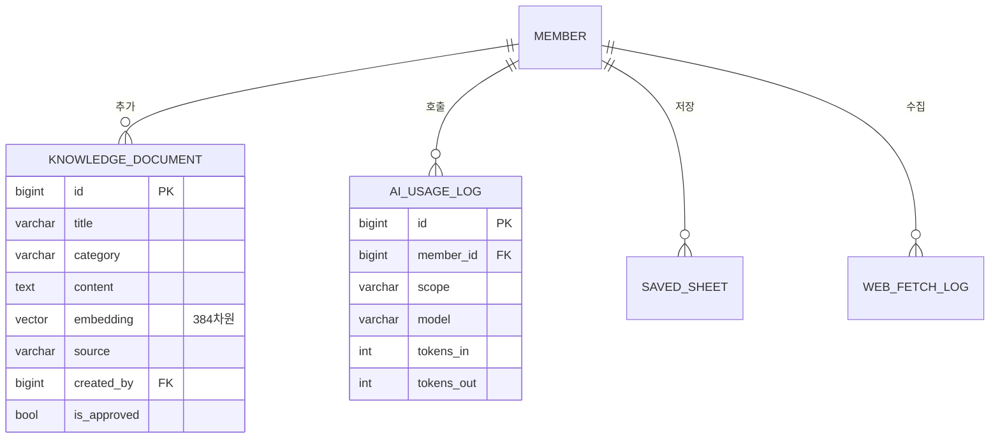

# E-06. `insight` — AI · RAG 지식 · 도구

> **문서 버전** v2.0 · **작성일** 2026-08-13 (KST) · **전제** [02-공통-설계규약](02-공통-설계규약.md)
> **기능 명세** [F-14 AI 분석](../../features/version2.0/F-14-AI분석.md) ·
> [F-15 지식검색 RAG](../../features/version2.0/F-15-지식검색-RAG.md) ·
> [F-18 웹 데이터 수집기](../../features/version2.0/F-18-웹데이터-수집기.md)

**모델 4종.** v1.0 결함 **D-6(인증 없이 열린 엔드포인트)**·**D-8(Qdrant `:memory:`)**을
데이터 모델 수준에서 막는다.

---

## 1. 모델 4종

| 모델 | 테이블 | 역할 | 해소 결함 |
|---|---|---|---|
| `KnowledgeDocument` | `knowledge_document` | RAG 지식 (**pgvector**) | **D-8** · D-6 |
| `AiUsageLog` | `ai_usage_log` | AI 호출 쿼터·비용 집계 | **D-6** |
| `SavedSheet` | `saved_sheet` | 수집한 표 저장 | — |
| `WebFetchLog` | `web_fetch_log` | 외부 URL 호출 로그 | D-6 계열 |



---

## 2. `KnowledgeDocument` — Qdrant → pgvector ★

### 2.1 왜 바꾸는가 (결함 D-8)

| | v1.0 (Qdrant) | v2.0 (pgvector) |
|---|---|---|
| 저장소 | Qdrant, **기본값 `:memory:`** | Supabase Postgres |
| 영속성 | **재기동 시 사용자 추가 문서 소실** | 영속 |
| 인프라 | 벡터 DB 별도 운영 | 이미 쓰는 DB 안 |
| 비용 | 별도 | 0 |

Supabase Postgres 를 쓰기로 확정한 이상 **벡터 DB 를 따로 운영할 이유가 없다.**

### 2.2 스키마

| 필드 | 타입 | 설명 |
|---|---|---|
| `title` | varchar(200) | |
| `category` | varchar(30) | 6종 (아래 2.4) |
| `content` | text | 본문 (사용자 입력은 2000자 제한) |
| `embedding` | **`vector(384)`** | `paraphrase-multilingual-MiniLM-L12-v2` |
| `source` | varchar(10) | `SEED` / `USER` / `BATCH` |
| `created_by` | FK **SET_NULL** null | 누가 추가했는가 |
| **`is_approved`** | bool 기본 `false` | **운영자 승인 전에는 검색에 안 나온다** ★ |
| `approved_by` / `approved_at` | | |
| `created_at` | timestamptz | |

```python
# insight/models.py
from pgvector.django import VectorField, HnswIndex


class KnowledgeDocument(models.Model):
    """RAG 지식 문서.

    v1.0 은 Qdrant 기본값이 :memory: 라 재기동하면 사용자가 추가한 지식이
    통째로 사라졌다(D-8). 게다가 POST /add 가 인증 없이 열려 있어
    누구나 지식 베이스를 오염시킬 수 있었다(D-6).

    Django 관점 — pgvector 는 django ORM 에 기본 내장이 아니다.
    pip install pgvector 후 VectorField 를 쓰고, 확장 설치는 마이그레이션에서
    VectorExtension() 오퍼레이션으로 한다(05 문서 참조).
    """

    title = models.CharField(max_length=200)
    category = models.CharField(max_length=30, db_index=True)
    content = models.TextField()
    embedding = VectorField(dimensions=384, null=True, blank=True)

    source = models.CharField(max_length=10, choices=KnowledgeSource.choices, default=KnowledgeSource.USER)
    created_by = models.ForeignKey(
        "accounts.Member", on_delete=models.SET_NULL, null=True, blank=True, related_name="knowledge_docs"
    )
    is_approved = models.BooleanField(
        default=False, db_index=True, verbose_name="승인",
        help_text="검토 대기 상태(false)인 문서는 검색 결과에 나오지 않는다",
    )
    approved_by = models.ForeignKey(
        "accounts.Member", on_delete=models.SET_NULL, null=True, blank=True, related_name="approved_docs"
    )
    approved_at = models.DateTimeField(null=True, blank=True)
    created_at = models.DateTimeField(auto_now_add=True)

    class Meta:
        db_table = "knowledge_document"
        indexes = [
            # 코사인 유사도 HNSW 인덱스. 문서가 적어도 붙여두면 늘어나도 안전하다
            HnswIndex(
                name="knowledge_hnsw_cosine",
                fields=["embedding"],
                m=16, ef_construction=64,
                opclasses=["vector_cosine_ops"],
            ),
        ]
```

### 2.3 `is_approved` — 오염 방지선 ★ (결함 D-6)

> v1.0 은 Qdrant 4종 API 가 인증 없이 열려 있었고, **문서 추가(`POST /add`)까지
> 인증 없이 가능**했다.

| 동작 | v2.0 권한 |
|---|---|
| 검색 · 목록 조회 | 로그인 필수 |
| **지식 추가** | 로그인 필수 + **`is_approved=False` 로 저장** |
| 수정·삭제 | 본인 것 또는 운영자 |
| `source="SEED"` 문서 | 운영자만 |

**검색 쿼리는 항상 `is_approved=True` 로 필터한다.** 매니저에 기본값으로 박아둔다.

```python
class ApprovedManager(models.Manager):
    def get_queryset(self):
        return super().get_queryset().filter(is_approved=True)


class KnowledgeDocument(models.Model):
    ...
    objects = models.Manager()          # 전체 (Admin·운영용)
    approved = ApprovedManager()        # 검색은 이것만 쓴다
```

> **Django 관점** — `objects` 를 승인분만 반환하도록 덮어쓰는 방법도 있지만,
> **첫 번째로 정의된 매니저가 기본 매니저**가 되어 Admin 목록에서 미승인 문서가
> 사라지는 사고가 난다. `objects` 는 전체로 두고 **검색 경로에서 `approved` 를 쓰는 규약**이 안전하다.

### 2.4 시드 지식 21건

카테고리 6종. **코드 하드코딩 → 시드 마이그레이션**으로 옮긴다.

| 카테고리 | 건수 |
|---|---|
| `technical_analysis` | 5 |
| `market_structure` | 4 |
| `sector_analysis` | 5 |
| `investment_strategy` | 4 |
| `risk_management` | 1 |
| `fundamental_analysis` | 2 |

시드 문서는 `source="SEED"`, `is_approved=True` 로 들어간다.

### 2.5 임베딩 생성 시점

fastembed 는 모델 파일(수십~수백 MB)을 로드한다.
**서버리스 콜드스타트마다 로드하면 응답이 크게 느려진다.**

| 대상 | 시점 |
|---|---|
| **문서 임베딩** | **배치** — `embedding IS NULL` 인 행을 pg_cron 잡이 채운다 |
| 검색 쿼리 임베딩 | 동기 (짧은 문장이라 부담이 작다) |

`embedding` 을 `null=True` 로 둔 이유가 이것이다. **문서는 먼저 저장되고 벡터는 나중에 붙는다.**
벡터가 없는 문서는 검색에 나오지 않으므로 승인 대기와 자연스럽게 맞물린다.

---

## 3. `AiUsageLog` — 쿼터와 비용 (결함 D-6) ★

> v1.0 은 `/api/ai/analyze` 가 **인증 없이 열려 있었다.**
> Claude API 비용이 발생하는 엔드포인트가 누구에게나 열려 있던 것이다.

| 필드 | 타입 | 설명 |
|---|---|---|
| `member_id` | FK PROTECT | |
| `scope` | varchar(20) | `CRYPTO`/`STOCK`/`MARKET`/`MY_PORTFOLIO`/`CONTEST` |
| `model` | varchar(40) | `claude-haiku-4-5-20251001` 등 |
| `tokens_in` / `tokens_out` | int | |
| `latency_ms` | int | |
| `is_error` | bool | **실패는 쿼터를 차감하지 않는다** |
| `created_at` | timestamptz | index |

```python
def remaining_quota(member: Member) -> int:
    """오늘 남은 AI 분석 횟수. 기본 1일 20회.

    실패한 호출(is_error)은 세지 않는다 — 우리 쪽 장애로 사용자가 손해를 보면 안 된다.
    """
    used = AiUsageLog.objects.filter(
        member=member,
        created_at__date=today_kst(),
        is_error=False,
    ).count()
    return max(0, DAILY_AI_QUOTA - used)
```

인덱스: `(member, created_at)` — 쿼터 조회가 유일한 패턴이다.

**모델명을 컬럼에 저장하는 이유**: Haiku 와 Sonnet 의 비용이 다르고,
심층 분석은 쿼터를 더 크게 차감한다. 사후 비용 집계에도 쓴다.
**모델명은 설정값으로 빼고 코드에 하드코딩하지 않는다.**

---

## 4. `SavedSheet` — 수집한 표 저장

v1.0 은 새로고침하면 수집 결과가 사라져 실용성이 떨어졌다.

| 필드 | 타입 | 설명 |
|---|---|---|
| `member_id` | FK CASCADE | |
| `title` | varchar(100) | |
| `source_url` | text | 어디서 긁었는가 |
| `data` | jsonb | 헤더 + 행 배열 (편집된 상태 그대로) |
| `created_at` / `updated_at` | | |

---

## 5. `WebFetchLog` — 오남용 추적

외부 URL 을 **우리 서버가 대신 호출**해 주는 기능이라 오남용 위험이 있다.
v1.0 은 `/api/ai-sheet/crawl` 이 인증 없이 열려 있었다.

| 필드 | 타입 | 설명 |
|---|---|---|
| `member_id` | FK PROTECT | |
| `url` | text | |
| `status_code` | int | null |
| `size_bytes` | int | 2MB 제한 |
| `elapsed_ms` | int | |
| **`is_blocked`** | bool | SSRF 방어에 걸렸는가 |
| `block_reason` | varchar(50) | `PRIVATE_IP` / `SCHEME` / `PORT` / `REDIRECT` / `CONTENT_TYPE` / `SIZE` |
| `created_at` | timestamptz | index |

### 5.1 `is_blocked` 를 남기는 이유 ★

SSRF 방어에 **걸린 시도**야말로 기록해야 한다.
사설망 주소를 반복해서 넣는 사용자가 있으면 그게 신호다.

| 방어 (v1.0 그대로 포팅) | |
|---|---|
| scheme | `http` / `https` 만 |
| port | 80 / 443 만 |
| 자격증명 | URL 에 user/password 있으면 거부 |
| **DNS** | 모든 A/AAAA 레코드가 global 주소인지 검증 |
| **리디렉션** | **최종 URL 도 다시 검증** — 흔히 빠뜨리는 지점 |
| Content-Type | `html` 없으면 415 |
| 크기 | 2MB 초과 413 |

**사용량 제한**: 회원당 1일 50회. `WebFetchLog` 로 센다.

> **이 기능을 살린 이유가 SSRF 방어 로직의 가치다** (→ 확정 사항 4번).
> 직접 다시 짜면 실수하기 쉬운 영역이라 그대로 옮길 값어치가 크다.
> 이름만 "AI Sheet" → **"웹 데이터 수집기"**로 바꾼다(결함 D-11).

---

## 6. 이 앱이 지키는 원칙

| 원칙 | 반영 |
|---|---|
| **비용이 드는 엔드포인트는 반드시 로그인 + 쿼터** | `AiUsageLog` · `WebFetchLog` |
| **사용자 입력 데이터는 승인 전까지 격리** | `KnowledgeDocument.is_approved` |
| **실패는 사용자에게 청구하지 않는다** | `is_error` 는 쿼터 미차감 |
| **막은 시도도 기록한다** | `is_blocked` |

---

## 7. 관련 문서

- 회원 → [E-01 accounts](E-01-accounts.md)
- AI 컨텍스트가 읽는 데이터 → [E-02 contests](E-02-contests.md) · [E-03 trading](E-03-trading.md)
- 기능 명세 → [F-14](../../features/version2.0/F-14-AI분석.md) · [F-15](../../features/version2.0/F-15-지식검색-RAG.md) · [F-18](../../features/version2.0/F-18-웹데이터-수집기.md)
