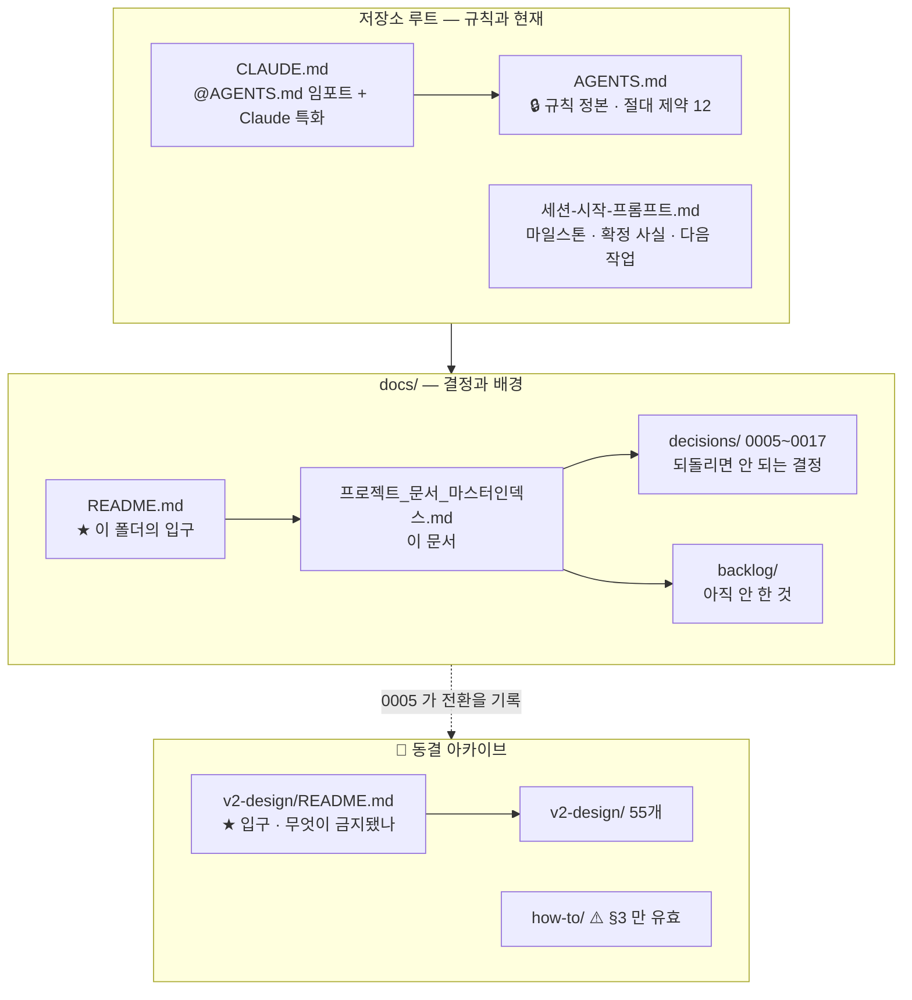
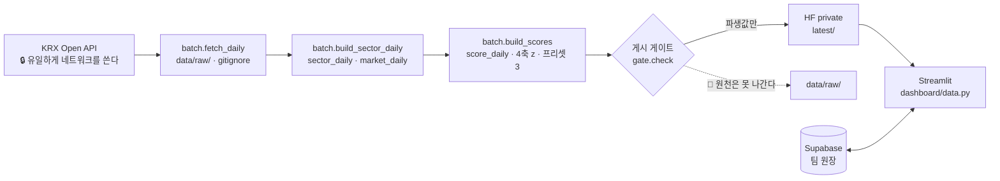

# stock-coin-trade 프로젝트 문서 마스터 인덱스

> **최종 갱신** 2026-09-19 (KST)
> **현재 제품** 🟢 **v3.0 «섹터 ETF 레이더»** (Streamlit) — 2026-09-11 전환
> **동결** 🧊 v2.0 «모의투자 플랫폼» (Django) — 개발하지 않으나 골든 23건은 계속 통과해야 한다
>
> 🔴 **이 인덱스는 2026-08-13 부터 2026-09-19 까지 v2.0 상태로 멈춰 있었다.**
> 그동안 v3.0 전환이 한 줄도 반영되지 않았고, 그 사이 이 문서를 읽은 외부 리뷰가
> 이 저장소를 **모의투자 플랫폼으로 오판**했다. 문서가 뒤처지면 판단이 오염된다 —
> 그래서 이제 **작업 완료 조건에 «문서 갱신» 이 들어간다**(→ [`README.md`](README.md) 3절).

---

## 0. 🔴 읽는 순서 — 다른 것을 먼저 읽지 마라

| # | 무엇 | 왜 |
|---|---|---|
| 1 | [`../AGENTS.md`](../AGENTS.md) | **작업 규칙의 정본** — 절대 제약 12개 |
| 2 | [`../세션-시작-프롬프트.md`](../세션-시작-프롬프트.md) | **지금 어디까지 왔나** — 마일스톤 · 확정 사실 V1~ · 다음 작업 |
| 3 | [`decisions/`](decisions/) | ADR-SC-0005~0017 — 되돌리면 안 되는 결정 |
| 4 | 이 문서 3~5절 | v3.0 문서·코드 지도 |
| 5 | [`v2-design/README.md`](v2-design/README.md) | 🧊 동결된 v2.0 을 건드려야 할 때만 |

---

## 1. 현재 버전 상태

### 1.1 🟢 v3.0 — 섹터 ETF 레이더 (현재 제품)

| 도메인 | 상태 | 위치 |
|---|---|---|
| **작업 규칙** | ✅ 정본 | [`../AGENTS.md`](../AGENTS.md) — 절대 제약 12개 |
| **현재 상태·마일스톤** | ✅ 상시 갱신 | [`../세션-시작-프롬프트.md`](../세션-시작-프롬프트.md) |
| **결정 기록 (ADR)** | ✅ 0005~0017 · 12건 (0009 결번) | [`decisions/`](decisions/) |
| **백로그** | ✅ | [`backlog/`](backlog/) |
| **전체 계획서** | — | `~/.claude/plans/wondrous-conjuring-horizon.md` (저장소 밖) |
| 상세 설계 문서 | ⬜ **없다** | 🔒 ADR + 코드 머리주석이 그 역할을 한다 (아래 2.2) |

**코드 기준선**: 이력 재시작 `2026-09-11` (orphan) · 강사님 코드 미포함
**테스트**: 루트 `pytest` **987건** · `backend` 골든 **23건** (2026-09-19 실측)

### 1.2 🧊 v2.0 — 모의투자 플랫폼 (동결)

| 도메인 | 버전 | 상태 | 위치 |
|---|---|---|---|
| 기능 명세 | v2.0 | 🧊 동결 (2026-08-11 확정) | `v2-design/features/version2.0/` |
| UI 설계 | v2.0 | 🧊 동결 (2026-08-11) | `v2-design/ui/version2.0/` |
| API 설계 | v2.0 | 🧊 동결 (계약 수준) | `v2-design/api/version2.0/` |
| ERD · 데이터 모델 | v2.0 | 🧊 동결 (2026-08-13) · 모델 44종 | `v2-design/erd/version2.0/` |
| v1.0 인벤토리 | v1.0 | 🧊 완료 (2026-08-11) | `v2-design/v1.0-기능-인벤토리.md` |

🔴 **입구를 먼저 읽어라** → [`v2-design/README.md`](v2-design/README.md)
거기에 «지금은 금지된 것»(pykrx · 감성분석 · 네이버 크롤링) 표가 있다.

---

## 2. 문서 구조

### 2.1 전체 지도

### 2.2 🔒 v3.0 은 왜 상세 설계 문서를 따로 두지 않는가

v2.0 은 문서 55개를 먼저 쓰고 코드를 썼다. v3.0 은 그러지 않는다 — 이유가 둘이다.

1. **개발자가 1인이고 대회가 도는 중이다.** 문서와 코드가 갈리면 갈린 것을 아무도
   못 잡는다. 실제로 이 인덱스가 5주 동안 갈려 있었다.
2. **이 저장소의 판단은 «왜 그렇게 정했나» 에 있다.** 그것은 명세서가 아니라
   **ADR + 코드 머리주석**에 적힌다. `dashboard/view.py` 한 파일에 실측 수치와
   기각한 대안이 주석으로 들어 있고, 골든 테스트가 그것을 고정한다.

→ 새 결정은 **ADR 로**, 계약은 **테스트로**, 배경은 **머리주석으로** 남긴다.
   별도 명세서를 되살리려면 그 유지 비용을 먼저 감당할 사람이 있어야 한다.

---

## 3. v3.0 결정 기록 (ADR)

참조 키는 **`ADR-SC-NNNN`**. 파일은 [`decisions/NNNN-제목.md`](decisions/).

### 3.1 🟢 유효

| ADR | 제목 | 날짜 | 한 줄 |
|---|---|---|---|
| [0005](decisions/0005-산출물-재지정과-이력-재시작.md) | 산출물 재지정과 이력 재시작 | 09-11 | **v2.0 → v3.0 전환.** orphan 으로 이력 재시작 · 강사님 코드 미포함 |
| [0006](decisions/0006-krx-데이터-제3자-제공-금지.md) | KRX 데이터 제3자 제공 금지 | 09-11 | 약관 제11조② · HF 에는 **파생값만** · 좌수는 지수화 |
| [0007](decisions/0007-값을-지어내지-않는다.md) | 값을 지어내지 않는다 | 09-11 | 🔴 **절대 제약 8.** 취득 실패는 예외이거나 `—` |
| [0008](decisions/0008-배포-streamlit-전환과-원격-재구성.md) | Streamlit 전환과 원격 재구성 | 09-11 | ⚠️ **② ③ 은 폐기** (→0010). ① ④ ⑤ 만 유효 |
| [0010](decisions/0010-두-배포-공존과-쓰기-상태-분리.md) | 두 배포 공존 · 쓰기 상태 분리 | 09-12 | Streamlit=팀 정본 · Django/Vercel=확장. 원장 Supabase · 파생 HF |
| [0011](decisions/0011-팀-원장-supabase-스키마와-rls.md) | 팀 원장 Supabase 스키마와 RLS | 09-12 | 원장 1테이블 · RLS 전면 · passcode 는 원장 **밖** · 쓰기는 RPC 하나 |
| [0012](decisions/0012-근거-첨부와-확정-모달.md) | 근거 첨부와 확정 모달 | 09-14 | 링크를 **서버가 부르지 않는다**(SSRF 0) · 사람 글은 HTML 블록 |
| [0013](decisions/0013-내부-에이전트-엔진-layer-a.md) | 내부 에이전트 엔진 (Layer A) | 09-14 | 🔒 **LLM 없음.** 규칙이 거절 · guard 가 모든 숫자를 원천과 대조 |
| [0014](decisions/0014-점수-재현성과-가중치-슬라이더의-경계.md) | 점수 재현성과 슬라이더의 경계 | 09-17 | 게시된 z 로 점수가 재현된다 · 프리셋은 **저장 열을 읽는다** |
| [0015](decisions/0015-공유-링크와-대분류-순위-분포.md) | 공유 링크 · 대분류 순위 분포 | 09-18 | URL 은 **버튼 누를 때만** · 대분류는 롤업하지 않는다 |
| [0016](decisions/0016-점수-표-검증을-데이터-경계로-올린다.md) | 점수 표 검증을 데이터 경계로 | 09-19 | 🔒 규칙이 아니라 **경로로** 막는다 — 검사 안 지난 프레임을 얻을 함수가 없다 |
| [0017](decisions/0017-막대-기준선과-가운데의-정의.md) | 막대 기준선과 «가운데» 의 정의 | 09-19 | 🔴 **0 은 가운데가 아니다** — 점선으로 말한다 · «11위» 는 k 가 정한다 |

### 3.2 🔴 폐기 · 일부 폐기 — **근거로 삼지 마라**

| ADR | 상태 | 무엇이 대체했나 |
|---|---|---|
| [0001](decisions/0001-fork-계보-유지.md) fork 계보 유지 | 🔴 **폐기** | [0005](decisions/0005-산출물-재지정과-이력-재시작.md) |
| [0002](decisions/0002-체결엔진-원본과-이식.md) 체결엔진 원본·이식 | 🔴 **폐기** | [0005](decisions/0005-산출물-재지정과-이력-재시작.md) |
| [0003](decisions/0003-insight-임베딩-저장위치.md) insight 임베딩 위치 | ⚠️ v2.0 한정 | 동결 제품의 결정이다 |
| [0004](decisions/0004-세율-테이블은-quant-core-소관.md) 세율은 quant-core 소관 | ⚠️ 전제 소멸 | `quant-core` 저장소가 제거됐다 (2026-09-15) |
| [0008](decisions/0008-배포-streamlit-전환과-원격-재구성.md) ② ③ | 🔴 **폐기** | [0010](decisions/0010-두-배포-공존과-쓰기-상태-분리.md) — Vercel 은 살아 있고 Supabase 를 쓴다 |
| `0009` | — | **결번** |

---

## 4. v3.0 코드 지도

문서가 아니라 **코드가 설계를 들고 있다**(2.2). 머리주석부터 읽어라.

| 경로 | 무엇 | 층 |
|---|---|---|
| `streamlit_app.py` | 진입점 · `st.navigation` 3페이지 | 앱 |
| `dashboard/pages/` | `ranking` · `teams` · `howto` — **배치만** | 화면 |
| `dashboard/evidence.py` | "왜 이 점수인가" 공유 조각 (랭킹·모달·조가 같이 쓴다) | 화면 |
| `dashboard/view.py` | 🔒 **순수 함수** — 프레임 → 프레임. `st.*` 없음 | 계약 |
| `dashboard/explain.py` | 화면 문구 — **f-string 템플릿뿐.** LLM 아님 | 계약 |
| `dashboard/data.py` | 데이터 경계 — **검사를 지나야 프레임을 준다**(ADR-0016) | 경계 |
| `dashboard/agent/` | 내부 에이전트 — 규칙 거절 + guard 대조 (ADR-0013) | 계약 |
| `dashboard/share.py` · `weights.py` · `theme.py` | 링크 화이트리스트 · 가중치 · 테마 | 계약 |
| `sector/scoring.py` | 🔒 **4축 점수의 정본.** Decimal · float 금지 | 코어 |
| `sector/aggregate.py` · `sources/` | 집계 · KRX Open API 어댑터 | 코어 |
| `sector/datastore/gate.py` | 🔴 **게시 게이트** — 무엇이 HF 로 나가는가 | 경계 |
| `sector/workspace/` | 팀 원장 (Supabase · HF · 로컬) | 코어 |
| `batch/` | 파이프라인 4걸음 — `fetch_daily` → `build_sector_daily` → `build_scores` → `publish` | 배치 |
| `backend/` | 🧊 **동결** Django 26,597줄. 골든 23건은 통과해야 한다 | — |

### 4.1 파이프라인

---

## 5. 백로그 · 아직 하지 않은 것

| 문서 | 무엇 |
|---|---|
| [`backlog/기능-아이디어-12건.md`](backlog/기능-아이디어-12건.md) | 외부 제안 12건을 **절대 제약에 비춰 판정** — ✅ 가능 4(그중 2건은 **이미 구현됨**) · ⚠️ 조건부 5 · 🔴 금지 3 |
| GitLab 이슈 | https://gitlab.com/mygithub05253/stock-coin-trade/-/issues — 🔴 **#13 · #14** 가 «화면이 산수에 대해 거짓을 말한다» |
| 남은 마일스톤 | M10 섹터 상세 · M11 KIS 준실시간 · M12 공시·뉴스 · M13 팀 노트 · M14 운영화 |

---

## 6. 🧊 동결 — v2.0 문서 목차

🔴 **[`v2-design/README.md`](v2-design/README.md) 를 먼저 읽어라.** 아래는 동결 시점의 목차 그대로다.

### 6.1 기능 명세 (`v2-design/features/version2.0/`)

| 문서 | 내용 |
|---|---|
| [01-요약본](v2-design/features/version2.0/01-요약본.md) | **1장 요약** |
| [00-통합-기능명세서](v2-design/features/version2.0/00-통합-기능명세서.md) | 전체 통합 뷰 · v1.0 20종 처리표 |
| [02-확정사항-8건](v2-design/features/version2.0/02-확정사항-8건.md) | 결정 항목 8건 |
| [03-v1.0결함-11건-처리방침](v2-design/features/version2.0/03-v1.0결함-11건-처리방침.md) | 결함 11건 |
| [F-00 모드체계와 범위경계](v2-design/features/version2.0/F-00-모드체계와-범위경계.md) | 모드 4종 · 계좌 분리 |
| [F-01 계정·인증](v2-design/features/version2.0/F-01-계정-인증.md) | `AbstractUser` · 계좌 자동 생성 |
| [F-02 대회 도메인](v2-design/features/version2.0/F-02-대회-도메인.md) | 생명주기 · 참가 · 규칙 스냅샷 |
| [F-03 주문·체결 엔진](v2-design/features/version2.0/F-03-주문-체결엔진.md) | 상태머신 · 호가 체결 · 거래비용 |
| [F-04 대회 규칙 엔진](v2-design/features/version2.0/F-04-대회-규칙엔진.md) | 편입한도 · 회전율 · 관리점수 |
| [F-05 랭킹·정산·스냅샷](v2-design/features/version2.0/F-05-랭킹-정산-스냅샷.md) | NAV · 랭킹 · Top Pick |
| [F-06 주식 연습](v2-design/features/version2.0/F-06-주식-연습모드.md) · [F-07 코인](v2-design/features/version2.0/F-07-코인-연습모드.md) · [F-08 대체자산](v2-design/features/version2.0/F-08-대체자산-연습모드.md) | 연습 모드 3종 |
| [F-09 보유자산](v2-design/features/version2.0/F-09-보유자산-포트폴리오.md) · [F-10 거래이력](v2-design/features/version2.0/F-10-거래이력.md) · [F-11 물타기](v2-design/features/version2.0/F-11-물타기-시뮬레이터.md) · [F-12 Pine](v2-design/features/version2.0/F-12-Pine-전략거래.md) | 자산 · 이력 · 도구 |
| [F-13 Open API](v2-design/features/version2.0/F-13-OpenAPI.md) | 외부 봇 |
| [F-14 AI 분석](v2-design/features/version2.0/F-14-AI분석.md) | 🔴 **지금은 금지** (절대 제약 2) |
| [F-15 지식검색 RAG](v2-design/features/version2.0/F-15-지식검색-RAG.md) | ⚠️ **분리 조건** (절대 제약 3) |
| [F-16 시장데이터 파이프라인](v2-design/features/version2.0/F-16-시장데이터-파이프라인.md) | 🔴 **pykrx 금지** (확정 사실 V3) |
| [F-17 학습 콘텐츠](v2-design/features/version2.0/F-17-학습콘텐츠.md) · [F-19 관리자](v2-design/features/version2.0/F-19-관리자.md) · [F-20 스케줄러](v2-design/features/version2.0/F-20-스케줄러.md) · [F-21 홈](v2-design/features/version2.0/F-21-홈-대시보드.md) | 부가 |
| [F-18 웹 데이터 수집기](v2-design/features/version2.0/F-18-웹데이터-수집기.md) | 🔴 **대부분 금지** (V6 · V8) |

### 6.2 ERD (`v2-design/erd/version2.0/`) — 모델 44종 · 앱 7개

| 문서 | 내용 |
|---|---|
| [01-요약본](v2-design/erd/version2.0/01-요약본.md) | **1장 요약** |
| [00-통합-ERD](v2-design/erd/version2.0/00-통합-ERD.md) | 전체 지도 · 모델 44종 |
| [02-공통-설계규약](v2-design/erd/version2.0/02-공통-설계규약.md) | 값 타입 · 명명 · `on_delete` — 개별 문서의 전제 |
| [03-v1.0 스키마 대조표](v2-design/erd/version2.0/03-v1.0-스키마-대조표.md) · [04-인덱스](v2-design/erd/version2.0/04-인덱스-쿼리-전략.md) · [05-마이그레이션](v2-design/erd/version2.0/05-마이그레이션-순서와-시드.md) · [06-변경노트](v2-design/erd/version2.0/06-기능명세-정합성-변경노트.md) | 62건 누적 |
| [E-01 accounts](v2-design/erd/version2.0/E-01-accounts.md) 5 · [E-02 contests](v2-design/erd/version2.0/E-02-contests.md) 11 · [E-03 trading](v2-design/erd/version2.0/E-03-trading.md) 5 · [E-04 market](v2-design/erd/version2.0/E-04-market.md) 13 · [E-05 learning](v2-design/erd/version2.0/E-05-learning.md) 3 · [E-06 insight](v2-design/erd/version2.0/E-06-insight.md) 4 · [E-07 core](v2-design/erd/version2.0/E-07-core.md) 3 | 앱별 모델 |

### 6.3 API (`v2-design/api/version2.0/`) · UI (`v2-design/ui/version2.0/`)

| 문서 | 내용 |
|---|---|
| [00-API-전체목록](v2-design/api/version2.0/00-API-전체목록.md) | 3계층 · 엔드포인트 전체 |
| [A-01](v2-design/api/version2.0/A-01-계정-인증.md) · [A-02](v2-design/api/version2.0/A-02-대회.md) · [A-03](v2-design/api/version2.0/A-03-주문-체결.md) · [A-04](v2-design/api/version2.0/A-04-시장데이터.md) · [A-05](v2-design/api/version2.0/A-05-AI-RAG.md) · [A-06](v2-design/api/version2.0/A-06-OpenAPI-v1.md) | 계정 · 대회 · 주문 · 시장 · AI · OpenAPI |
| [00-화면목록-라우팅](v2-design/ui/version2.0/00-화면목록-라우팅.md) | 화면 30종 · URL |
| [01-HTMX-부분갱신-규약](v2-design/ui/version2.0/01-HTMX-부분갱신-규약.md) | 3계층 · 폴링 정책 |
| [U-01](v2-design/ui/version2.0/U-01-공통레이아웃-GNB.md) · [U-02](v2-design/ui/version2.0/U-02-대회화면군.md) · [U-03](v2-design/ui/version2.0/U-03-거래화면군.md) · [U-04](v2-design/ui/version2.0/U-04-학습-도구화면군.md) | 화면군 |

---

## 7. 문서 규칙

### 7.1 🟢 v3.0 — ADR 과 머리주석

| 무엇 | 어디에 |
|---|---|
| 되돌리면 안 되는 결정 | `decisions/NNNN-제목.md` · 키는 `ADR-SC-NNNN` |
| 뒤집힌 결정 | 🔒 **지우지 않고** 그 ADR 본문에 «폐기 · 무엇이 대체» 를 적는다 |
| 계약 | **테스트** — 골든은 값과 성질을 함께 고정한다 |
| «왜 그렇게 짰나» | **코드 머리주석** — 실측 수치와 기각한 대안을 함께 |
| 현재 상태 | `../세션-시작-프롬프트.md` |

- 문체는 개조식("-다"). 튜토리얼만 "-습니다"
- 다이어그램은 Mermaid `flowchart` + `subgraph`.
  🔒 **`C4Context`·`C4Container` 금지** — GitHub·GitLab 이 렌더링하지 못한다
- 🔒 **숫자는 실측한 것만** 적는다

### 7.2 🧊 v2.0 — 버전 정책 (동결 시점 그대로)

| 변경 | 버전 |
|---|---|
| 스택·도메인 구조 변경 | Major +1.0 |
| 기능 추가·규칙 수치 변경 | Minor +0.1 |
| 오탈자·표현 | 유지 |

통합본과 개별 문서를 **둘 다** 유지했다 — 통합본은 훑기용, 개별은 편집용.

### 7.3 미러링

- 로컬: `projects/stock-coin-trade/docs/`
- Obsidian Vault: `30_Projects/stock-coin-trade/`
- 🔴 **gitignore**: `docs/image/`(타사 캡처) · `docs/private/*`(README 만 커밋)
  설계 문서 본문은 **커밋·push 대상**이다 (2026-08-11 사용자 확정)

---

## 8. 진행 이력

### 8.1 🟢 v3.0 — 섹터 ETF 레이더

| 세션 | 날짜 | 산출물 |
|---|---|---|
| — | 09-11 | **전환 결정** — ADR 0005~0008 · 이력 재시작(orphan) · M0 · M1 |
| — | 09-11 | **M3~M7** — KRX 어댑터 · 섹터 21종 · 집계 5985행 · HF 게시 · 4축 스코어링. 테스트 266건 |
| — | 09-12 | **M8** — Supabase 스키마+RLS · 코어 이관 · Vercel 공존 실증 · V42 (ADR 0010·0011). 415→422건 |
| — | 09-14 | **근거 첨부 · 확정 모달 · 내부 에이전트** (ADR 0012·0013). 422→**734건** |
| — | 09-17 | **M9a·M9b** 점수 재현성 · 슬라이더 · 필터 (ADR 0014) · 원장 위험 ② (ADR-0011 ⑭). →782건 |
| — | 09-18 | **M9c** 공유 링크 · 대분류 분포 (ADR 0015) · 이슈 #4 · #8. →**928건** |
| — | 09-18 | 이슈 #7 · #9 — `scored()` 입력 계약. 928→**982건** |
| — | 09-19 | 이슈 #12 — 검증을 데이터 경계로 (ADR 0016). 982→**987건** |
| — | 09-19 | 이슈 #14 — 막대 기준선 · «가운데» 의 정의 (ADR 0017). 돌연변이 24종 사망 · 987→**1002건** |
| — | 09-19 | **문서 정비** — 이 인덱스 전면 개편 · `docs/README.md` · `v2-design/README.md` · 백로그 신설 |

### 8.2 🧊 v2.0 — 모의투자 플랫폼 (동결)

| 세션 | 날짜 | 산출물 |
|---|---|---|
| 1 | 08-11 | 스택·범위·배포 확정 · v1.0 기준선 `08a23a7` 동결 |
| 2 | 08-11 | v1.0 기능 인벤토리 (20종 · 결함 11건 · 결정항목 8건) |
| 3 | 08-11 | v2.0 기능 명세 (문서 39종 · 화면 30종 · API 계약) |
| 4 | 08-13 | ERD · 데이터 모델 (문서 14종 · 모델 44종 · 앱 7개) |
| 5 | 08-13 | Django 스캐폴딩 (모델 44종 마이그레이션) |
| 6 | 08-13 | 시드 · Admin (Admin 35종 · accounts 서비스 계층) |
| 7 | 08-13 | 외부 데이터 적재 (커맨드 4종 · 실적재 검증) |
| 8 | 08-13 | 내부 잡 엔드포인트 (`/internal/jobs/*` · pg_cron SQL) |
| 9 | 08-13 | 주문·체결 엔진 (상태머신 · 대회 사전차단) |
| 10 | 08-13 | KIS 호가·시세 (3단 폴백) |
| 11 | 08-14 | 정산·랭킹 (정산 엔진 · 랭킹 스냅샷 · 관리점수) |
| — | 09-11 | 🧊 **동결** — ADR-SC-0005 |
